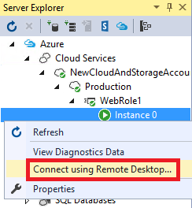

<properties 
   pageTitle="对 Azure 角色使用远程桌面 | Azure"
   description="将远程桌面与 Azure 角色一起使用"
   services="visual-studio-online"
   documentationCenter="na"
   authors="TomArcher"
   manager="douge"
   editor="" />
<tags 
   ms.service="multiple"
   ms.date="04/18/2016"
   wacn.date="05/16/2016" />

# 将远程桌面与 Azure 角色一起使用

使用 Azure SDK 和远程桌面服务，可以访问 Azure 托管的 Azure 角色和虚拟机。在 Visual Studio 中，可以从 Azure 项目配置远程桌面服务。若要启用远程桌面服务，必须创建一个包含一个或多个角色的有效的项目，然后将其发布到 Azure 中。

>[AZURE.IMPORTANT] 仅在进行故障排除或开发时才应访问 Azure 角色。每个虚拟机都是用于运行 Azure 应用程序中的特定角色，而不是运行其他客户端应用程序。若要使用 Azure 来托管通用的虚拟机，请参阅“Accessing Azure Virtual Machines from Server Explorer”（从服务器资源管理器访问 Azure 虚拟机）。

## 为 Azure 角色启用和使用远程桌面

1. 在解决方案资源管理器中，打开项目的快捷菜单，然后选择“发布”。

    此时将显示“发布 Azure 应用程序”向导。

    

1. 在向导的“Microsoft Azure 发布设置”页底部，选中“为所有角色启用远程桌面”复选框。

    此时将显示“远程桌面配置”对话框。

1. 在“远程桌面配置”对话框底部，选择“更多选项”按钮。
 
    此时将显示一个下拉列表框，让你创建或选择证书，以便在通过远程桌面连接时可以加密凭据信息。

1. 在下拉列表中，选择“&lt;创建>”，或从选择列表中现有证书。

    如果选择现有证书，请跳过后续步骤。

    >[AZURE.NOTE] 用于建立远程桌面连接的证书与用于其他 Azure 操作的证书不同。远程访问证书必须有一个私钥。

    此时将显示“创建证书”对话框。

    1. 为新证书提供友好名称，然后选择“确定”按钮。新证书将出现在下拉列表框中。

    1. 在“远程桌面配置”对话框中，提供用户名和密码。
    
        不能使用现有帐户。请勿指定 Administrator 作为新帐户的用户名。

        >[AZURE.NOTE] 如果密码不符合复杂性要求，密码文本框旁边将显示一个红色图标。密码必须包含大写字母、小写字母和数字或符号。

    1. 选择帐户的过期日期，在此日期之后，远程桌面连接将被阻止。

    1. 提供所有所需的信息后，选择“确定”按钮。
    
        启用远程访问服务的若干设置已添加到 .cscfg 和 .csdef 文件。

1. 准备好发布云服务时，请在“Microsoft Azure 发布设置”向导中选择“确定”按钮。

    如果尚未准备好发布，请选择“取消”按钮。将保存远程桌面配置，可以日后发布云服务。

## 使用远程桌面连接到 Azure 角色

发布云服务后，可以使用服务器资源管理器登录到 Azure 托管的虚拟机。

1. 在服务器资源管理器中，展开“Azure”节点，然后展开云服务及其角色之一的节点，以显示实例列表。

1. 打开实例节点的快捷菜单，然后选择“使用远程桌面连接”。

    

1. 输入前面创建的用户名和密码。现在你已登录到远程会话。

<!---HONumber=Mooncake_0509_2016-->