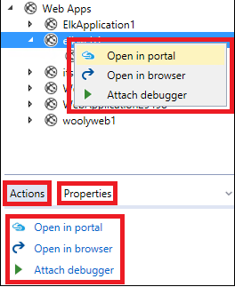

<properties 
   pageTitle="使用云资源管理器管理 Azure 资源 | Azure"
   description="了解如何使用云资源管理器来浏览和管理 Visual Studio 中的 Azure 资源。"
   services="visual-studio-online"
   documentationCenter="na"
   authors="TomArcher"
   manager="douge"
   editor="" />
<tags 
   ms.service="multiple"
   ms.date="08/15/2016"
   wacn.date="09/19/2016" />

# 使用云资源管理器管理 Azure 资源

##概述

云资源管理器旨在让你更轻松快速地在 Visual Studio IDE 中浏览和管理 Azure 资源。例如，它可让你在 Azure 门户预览或浏览器中打开 Web 应用、在其中附加调试工具，或者查看 Blob 容器的属性并在 Blob 容器编辑器中打开它。

与 Azure 门户预览一样，云资源管理器基于 Azure Resource Manager 堆栈。若要查看已添加或更改的 Azure 资源，请在云资源管理器工具栏上选择“刷新”按钮。

在安装 Visual Studio Tools for Azure SDK 2.7 的过程中会安装云资源管理器。

## 先决条件

- Visual Studio 2015 RTM。

- Visual Studio Tools for Azure SDK。
- 你还必须有一个 Azure 帐户并登录，才能在云资源管理器中查看 Azure 资源。如果你没有帐户，只需几分钟的时间就能创建一个帐户。请参阅[创建试用帐户](/pricing/1rmb-trial/)。

- 如果看不到云资源管理器，可以在菜单栏上依次选择“查看”、“其他窗口”、“云资源管理器”。

## 管理 Azure 帐户和订阅

若要在云资源管理器中查看 Azure 资源，需要登录到包含一个或多个有效订阅的 Azure 帐户。如果有多个 Azure 帐户，可将它们添加到云资源管理器，然后选择想要包含在云资源管理器资源视图中的订阅。

如果你未曾使用过 Azure，或尚未将必要的帐户添加到 Visual Studio，系统将提示你这样做。

## 将 Azure 帐户添加到云资源管理器

1. 在云资源管理器工具栏上选择“设置”图标。

1. 选择“添加帐户”链接。登录到你要浏览其资源的 Azure 帐户。帐户选择器下拉列表中应已选择刚刚添加的帐户。该帐户的订阅出现在帐户条目下。

    

    

1. 选中要浏览的帐户订阅的复选框，然后选择“应用”按钮。

    所选订阅的 Azure 资源将出现在云资源管理器中。

## 删除 Azure 帐户

1. 在菜单栏上选择“文件”、“帐户设置”。

1. 在“帐户设置”对话框的“所有帐户”部分中，选择想要删除的帐户旁边的“删除”命令。请注意，此命令只从 Visual Studio 中删除帐户，而不影响 Azure 帐户本身。

## 查看资源类型或组

若要查看 Azure 资源，可以选择“资源类型”或“资源组”视图。

- “资源类型”视图（也是 Azure 门户预览上使用的通用视图）按类型分类来显示 Azure 资源，例如 Web 应用、存储帐户和虚拟机。这类似于 Azure 资源在服务器资源管理器中的显示方式。

- “资源组”视图按关联的 Azure 资源组将 Azure 资源分类。

 
	资源组是通常由特定应用程序使用的 Azure 资源组合。若要了解有关 Azure 资源组的详细信息，请参阅 [Azure Resource Manager Overview](/documentation/articles/resource-group-overview/)（Azure Resource Manager 概述）。

## 查看和导航资源

若要在云资源管理器中导航到 Azure 资源并查看其信息，请展开项的类型或关联的资源组，然后选择该资源。当你选择资源时，信息将显示在云资源管理器底部的两个选项卡中。

- “操作”选项卡显示用户可以在云资源管理器中针对所选资源执行的操作。还可以在资源的快捷菜单中查看可用的操作。

- “属性”选项卡显示资源的属性，例如其类型、区域设置和关联的资源组。

每个资源都有“在门户中打开”操作。选择此操作时，云资源管理器将在 Azure 门户预览中显示所选的资源。在导航到深度嵌套的资源时，此功能特别方便。

根据 Azure 资源，还可能会显示其他操作和属性值。例如，除了“在门户中打开”，Web Apps 和 Logic Apps 还提供“在浏览器中打开”和“附加调试器”操作。当你选择存储帐户 Blob、队列或表时，将显示用于打开编辑器的操作。Azure 应用具有“URL”和“状态”属性，而存储资源具有键和连接字符串属性。

## 搜索资源

若要在 Azure 帐户订阅中查找具有特定名称的资源，请在云资源管理器的“搜索”框中输入该名称。

当你在“搜索”框中输入字符时，只有符合这些字符的资源才会显示在资源树中。

<!---HONumber=Mooncake_0912_2016-->