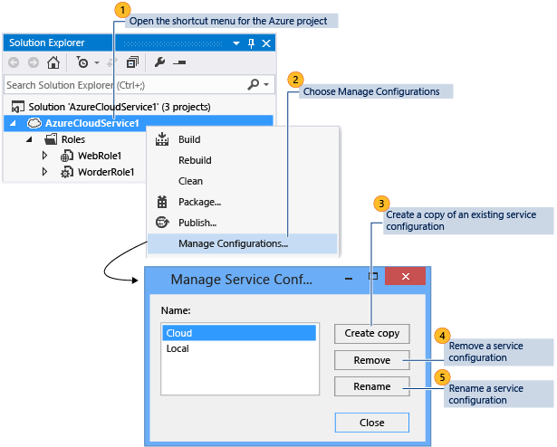
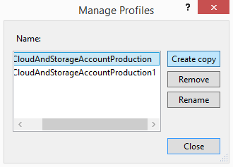

<properties
    pageTitle="如何管理服务配置和配置文件 | Azure"
    description="了解如何使用服务配置和配置文件，这两种配置文件将存储云服务的部署环境设置和发布设置。"
    services="visual-studio-online"
    documentationcenter="na"
    author="TomArcher"
    manager="douge"
    editor="" />
<tags
    ms.assetid="7da8c551-fb06-4057-b5c7-c77f4b39d803"
    ms.service="multiple"
    ms.devlang="dotnet"
    ms.topic="article"
    ms.tgt_pltfrm="na"
    ms.workload="multiple"
    ms.date="11/11/2016"
    wacn.date="03/30/2017"
    ms.author="tarcher" />  

# 如何管理服务配置和配置文件
## 概述
发布云服务时，Visual Studio 将配置信息存储在两种配置文件中：服务配置和配置文件。服务配置（.cscfg 文件）存储 Azure 云服务的部署环境设置。Azure 在管理云服务时，使用这些配置文件。另一方面，配置文件（.azurePubxml 文件）存储云服务的发布设置。这些设置是你在使用发布向导时所选内容的记录，并由 Visual Studio 在本地使用。本主题说明如何使用这两种类型的配置文件。

## 服务配置
你可以创建多个服务配置，以用于每个部署环境。例如，你可以为本地环境创建用于运行和测试 Azure 应用程序的服务配置，而为生产环境创建另一个服务配置。

你可以根据需求添加、删除、重命名和修改这些服务配置。你可以在 Visual Studio 中管理这些服务配置，如以下插图中所示。

你还可以从角色的属性页打开“管理配置”对话框。若要打开 Azure 项目中角色的属性，请打开该角色的快捷菜单，然后选择“属性”。在“设置”选项卡上，展开“服务配置”列表，然后选择“管理”以打开“管理配置”对话框。

### 添加服务配置
1. 在解决方案资源管理器中，打开 Azure 项目的快捷菜单，然后选择“管理配置”。
   
    此时将显示“管理服务配置”对话框。
2. 若要添加服务配置，必须创建现有配置的副本。为此，请从“名称”列表中选择想要复制的配置，然后选择“创建副本”。
3. （可选）若要为服务配置指定其他名称，请从“名称”列表中选择新的服务配置，然后选择“重命名”。在“名称”文本框中，键入要用于此服务配置的名称，然后选择“确定”。
   
    此时名为 ServiceConfiguration.[New Name].cscfg 的新服务配置文件将添加到解决方案资源管理器的 Azure 项目中。

### 删除服务配置
1. 在解决方案资源管理器中，打开 Azure 项目的快捷菜单，然后选择“管理配置”。
   
    此时将显示“管理服务配置”对话框。
2. 若要删除服务配置，请从“名称”列表中选择要删除的配置，然后选择“删除”。此时将显示一个对话框框以确认要删除此配置。
3. 选择“删除”。
   
     此时该服务配置文件将从解决方案资源管理器的 Azure 项目中删除。

### 重命名服务配置
1. 在解决方案资源管理器中，打开 Azure 项目的快捷菜单，然后选择“管理配置”。
   
    此时将显示“管理服务配置”对话框。
2. 若要重命名服务配置，请从“名称”列表中选择新的服务配置，然后选择“重命名”。在“名称”文本框中，键入要用于此服务配置的名称，然后选择“确定”。
   
    此时该服务配置文件的名称将在解决方案资源管理器的 Azure 项目中更改。

### 更改服务配置
- 如果要更改服务配置，请在 Azure 项目中打开要更改的特定角色的快捷菜单，然后选择“属性”。有关详细信息，请参阅[如何：使用 Visual Studio 配置 Azure 云服务的角色](https://msdn.microsoft.com/zh-cn/library/azure/hh369931.aspx)。

## 使用配置文件指定不同的设置组合
使用配置文件，可以为不同目的使用不同的设置组合自动填写“发布向导”。例如，你可以有一个配置文件用于调试，有另一个配置文件用于发布版本。在这种情况下，你的**调试**配置文件应已启用 **IntelliTrace** 并选择了“调试”配置，你的**发布**配置文件应已禁用 **IntelliTrace** 并选择了“发布”配置。你还可以使用不同配置文件通过不同存储帐户来部署服务。

第一次运行向导时，将创建默认配置文件。Visual Studio 将该配置文件存储在扩展名为 .azurePubXml 的文件中，该文件将添加到 Azure 项目的 **Profiles** 文件夹下。如果你稍后运行向导时手动指定其他选项，则将自动更新该文件。在运行以下过程之前，你应该至少已发布云服务一次。

### 添加配置文件
1. 打开 Azure 项目的快捷菜单，然后选择“发布”。
2. 选择“目标配置文件”列表旁边的“保存配置文件”按钮，如下图所示。这将为你创建一个配置文件。
   
    
3. 创建配置文件后，请选择“目标配置文件”列表中的“<管理…>”。
   
    此时将显示“管理配置文件”对话框，如下图所示。
   
    
4. 在“名称”列表中，选择一个配置文件，然后选择“创建副本”。
5. 选择“关闭”按钮。
   
    此时新的配置文件将出现在“目标配置文件”列表中。
6. 在“目标配置文件”列表中，选择刚创建的配置文件。将使用所选配置文件中的选项填充“发布向导”设置。
7. 选择“上一页”和“下一页”按钮以显示发布向导的每一页，然后自定义此配置文件的设置。有关信息，请参阅 [Publish Azure Application Wizard](http://go.microsoft.com/fwlink/p/?LinkID=623085)（发布 Azure 应用程序向导）。
8. 完成自定义设置后，请选择“下一步”以返回到“设置”页。当你使用这些设置发布服务时，或者如果你选择配置文件列表旁边的“保存”，将保存该配置文件。

### 重命名或删除配置文件
1. 打开 Azure 项目的快捷菜单，然后选择“发布”。
2. 在“目标配置文件”列表中，选择“管理”。
3. 在“管理配置文件”对话框中，选择要删除的配置文件，然后选择“删除”。
4. 在出现的确认对话框中，选择“确定”。
5. 选择“关闭”。

### 更改配置文件
1. 打开 Azure 项目的快捷菜单，然后选择“发布”。
2. 在“目标配置文件”列表中，选择要更改的配置文件。
3. 选择“上一页”和“下一页”按钮以显示发布向导的每一页，然后更改所需的设置。有关信息，请参阅 [Publish Azure Application Wizard](http://go.microsoft.com/fwlink/p/?LinkID=623085)（发布 Azure 应用程序向导）。
4. 完成更改设置后，请选择“下一步”以返回到“设置”页。
5. （可选）选择“发布”以使用新设置发布云服务。如果你现在不需要发布云服务，并且关闭发布向导，Visual Studio 会询问你是否要将更改保存到配置文件。

## 后续步骤
若要了解如何在 Visual Studio 中配置 Azure 项目的其他部分，请参阅[配置 Azure 项目](http://go.microsoft.com/fwlink/p/?LinkID=623075)

<!---HONumber=Mooncake_0320_2017-->
