<properties
    pageTitle="将存储资源管理器（预览版）与 Azure 文件存储配合使用 | Microsoft 文档"
    description="了解如何使用存储资源管理器（预览版）来处理文件共享和文件。"
    services="storage"
    documentationcenter="na"
    author="cawaMS"
    manager="paulyuk"
    editor="" />
<tags
    ms.assetid=""
    ms.service="storage"
    ms.workload="na"
    ms.tgt_pltfrm="na"
    ms.devlang="na"
    ms.topic="get-started-article"
    ms.date="03/09/2017"
    ms.author="cawa"
    wacn.date="05/22/2017"
    ms.translationtype="Human Translation"
    ms.sourcegitcommit="8fd60f0e1095add1bff99de28a0b65a8662ce661"
    ms.openlocfilehash="fe4ef750a18fc2cfd9946e7ee5e93aaba49040f0"
    ms.contentlocale="zh-cn"
    ms.lasthandoff="05/12/2017" />

# 将存储资源管理器（预览版）与 Azure 文件存储配合使用

Azure 文件存储是一种使用标准服务器消息块 (SMB) 协议在云中提供文件共享的服务。 支持 SMB 2.1 和 SMB 3.0。 通过 Azure 文件存储，你可以将依赖文件共享的旧版应用程序快速迁移到 Azure 且无成本高昂的重写。 可以使用文件存储向外公开数据，或者私下存储应用程序数据。 本文介绍如何使用存储资源管理器（预览版）来处理文件共享和文件。

## 先决条件

若要完成本文中的步骤，需要满足以下先决条件：

- [下载并安装存储资源管理器（预览版）](http://www.storageexplorer.com/)

- [连接到 Azure 存储帐户或服务](/documentation/articles/vs-azure-tools-storage-manage-with-storage-explorer#connect-to-a-storage-account-or-service)

## 创建文件共享

所有文件都必须驻留在文件共享中。文件共享就是对文件进行逻辑分组。 一个帐户可以包含无限数量的文件共享，一个共享可以存储无限数量的文件。

以下步骤演示了如何在存储资源管理器（预览版）中创建文件共享。

1. 打开存储资源管理器（预览版）。

2. 在左窗格中，展开需要在其中创建文件共享的存储帐户。

3. 右键单击“文件共享”，然后从上下文菜单中选择“创建文件共享”。

    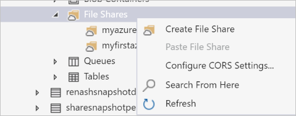

4. 此时会在“文件共享”文件夹下显示一个文本框。 输入文件共享的名称。 如需文件共享命名规则和限制的列表，请参阅[共享命名规则](/documentation/articles/storage-dotnet-how-to-use-blobs#create-a-container)部分。

    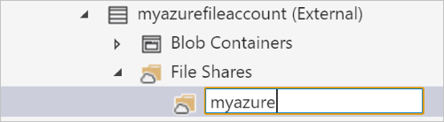

5. 可以在完成时按 **Enter** 创建文件共享，也可以按 **Esc** 取消。 成功创建文件共享后，该共享将显示在所选存储帐户的“文件共享”文件夹下。

    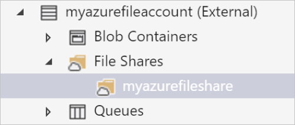

## 查看文件共享的内容

文件共享包含文件和文件夹（文件夹中也可能包含文件）。

以下步骤演示了如何在存储资源管理器（预览版）中查看文件共享的内容：

1. 打开存储资源管理器（预览版）。

2. 在左窗格中，展开其中包含要查看的文件共享的存储帐户。

3. 展开该存储帐户的“文件共享”。

4. 右键单击要查看的文件共享，然后从上下文菜单中选择“打开”。 也可双击要查看的文件共享。

    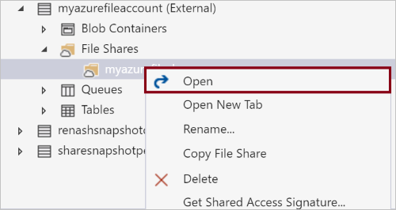

5. 主窗格将显示该文件共享的内容。
    
    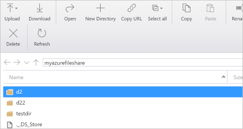

## 删除文件共享

可以根据需要轻松地创建和删除文件共享。 （若要了解如何删除各个文件，请参阅[管理文件共享中的文件](/documentation/articles/vs-azure-tools-storage-explorer-blobs#managing-blobs-in-a-blob-container)部分。）

以下步骤演示了如何在存储资源管理器（预览版）中删除文件共享：

1. 打开存储资源管理器（预览版）。

2. 在左窗格中，展开其中包含要查看的文件共享的存储帐户。

3. 展开该存储帐户的“文件共享”。

4. 右键单击要删除的文件共享，然后从上下文菜单中选择“删除”。 也可通过按“删除”来删除当前选定的文件共享。

    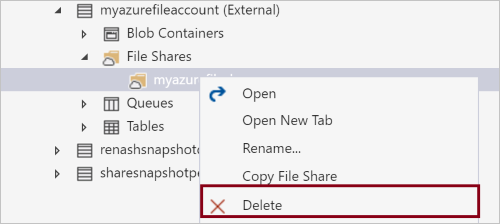

5. 出现确认对话框时，选择“是”。
    
    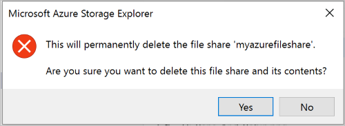

## 复制文件共享

可以通过存储资源管理器（预览版）将文件共享复制到剪贴板，然后再将该文件共享粘贴到另一存储帐户中。 （若要了解如何复制各个文件，请参阅[管理文件共享中的文件](/documentation/articles/vs-azure-tools-storage-explorer-blobs#managing-blobs-in-a-blob-container)部分。）

以下步骤演示了如何将文件共享从一个存储帐户复制到另一个存储帐户。

1. 打开存储资源管理器（预览版）。

2. 在左窗格中，展开其中包含要复制的文件共享的存储帐户。

3. 展开该存储帐户的“文件共享”。

4. 右键单击要复制的文件共享，然后从上下文菜单中选择“复制文件共享”。

    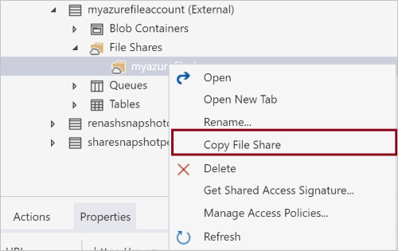

5. 右键单击要将文件共享粘贴到其中的“目标”存储帐户，然后从上下文菜单中选择“粘贴文件共享”。

    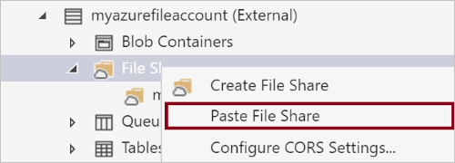

## 获取文件共享的 SAS

[共享访问签名 (SAS)](/documentation/articles/storage-dotnet-shared-access-signature-part-1) 用于对存储帐户中的资源进行委托访问。 这意味着你可以授权客户端在指定时间段内，以一组指定权限有限地访问你的存储帐户中的对象，而不必共享你的帐户访问密钥。

以下步骤演示了如何为文件共享创建 SAS：

1. 打开存储资源管理器（预览版）。

2. 在左窗格中，展开要获取其 SAS 的文件共享所在的存储帐户。

3. 展开该存储帐户的“文件共享”。

4. 右键单击所需文件共享，然后从上下文菜单中选择“获取共享访问签名”。

    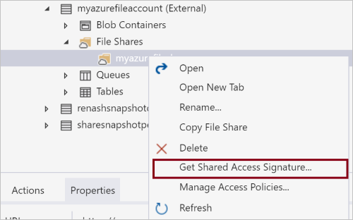

5. 在“共享访问签名”对话框中，根据需要为资源指定策略、开始和过期日期、时区以及访问级别。

    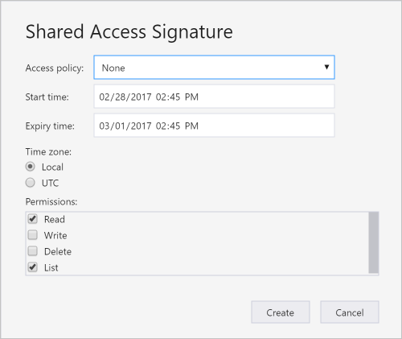

6. 指定完 SAS 选项以后，选择“创建”。

7. 然后会显示第二个“共享访问签名”对话框，其中列出了可用来访问存储资源的文件共享以及 URL 和 QueryString。 选择要复制到剪贴板的 URL 旁边的“复制”。
    
    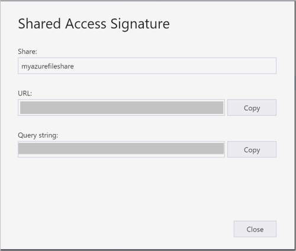

8. 完成后，选择“关闭”。

## 管理文件共享的访问策略

以下步骤演示了如何管理（添加和删除）文件共享的访问策略。 访问策略用于创建 SAS URL，用户可以通过该 URL 在定义的时段访问存储文件资源。

1. 打开存储资源管理器（预览版）。

2. 在左窗格中，展开要管理其访问策略的文件共享所在的存储帐户。

3. 展开该存储帐户的“文件共享”。

4. 选择所需文件共享，然后从上下文菜单中选择“管理访问策略”。

    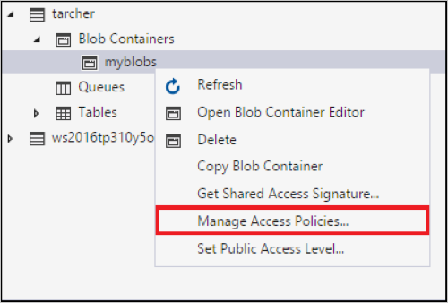

5. “访问策略”对话框将列出为所选文件共享创建的任何访问策略。
    
    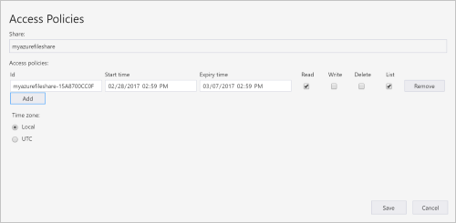

6. 根据访问策略管理任务完成以下步骤：
    
    - **添加新的访问策略** - 选择“添加”。 生成后，“访问策略”对话框将显示新添加的访问策略（以及默认设置）。

    - **编辑访问策略** - 进行需要的编辑，然后选择“保存”。

    - **删除访问策略** - 在要删除的访问策略旁边选择“删除”。

7. 使用以前创建的访问策略创建新的 SAS URL：
    
    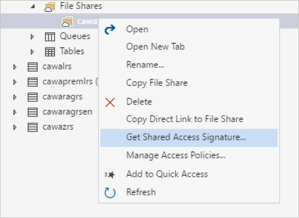
    
    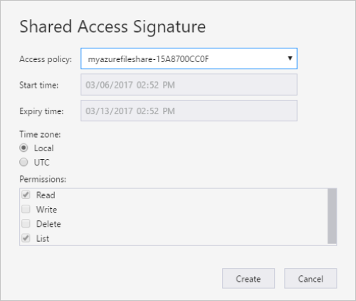

## 管理文件共享中的文件

创建文件共享以后，即可将文件上载到该文件共享、将文件下载到本地计算机、在本地计算机上打开文件，等等。

以下步骤演示如何管理文件共享中的文件（和文件夹）。

1.  打开存储资源管理器（预览版）。

2.  在左窗格中，展开其中包含要管理的文件共享的存储帐户。

3.  展开该存储帐户的“文件共享”。

4.  双击要查看的文件共享。

5.  主窗格将显示该文件共享的内容。

    

6.  主窗格将显示该文件共享的内容。

7.  根据所要执行的任务完成以下步骤：

    - **将文件上载到文件共享**

        a.在“解决方案资源管理器”中，右键单击项目文件夹下的“引用”文件夹，然后单击“添加引用”。  在主窗格的工具栏上选择“上载”，然后从下拉菜单中选择“上载文件”。

        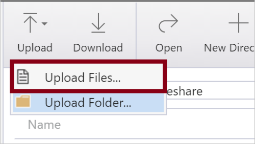
        
        b.保留“数据库类型”设置，即设置为“共享”。 在“上载文件”对话框中，选择“文件”文本框右侧的省略号 (**…**) 按钮，以选择要上载的文件。

        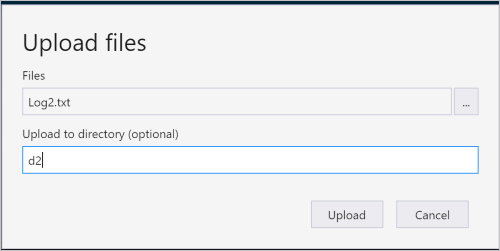

        c. 选择“上载”。

    - **将文件夹上载到文件共享**
        
        a.在“解决方案资源管理器”中，右键单击项目文件夹下的“引用”文件夹，然后单击“添加引用”。 在主窗格的工具栏上选择“上载”，然后从下拉菜单中选择“上载文件夹”。

        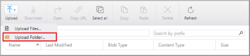

        b.保留“数据库类型”设置，即设置为“共享”。 在“上载文件夹”对话框中，选择“文件夹”文本框右侧的省略号 (**…**) 按钮，以选择要上载其内容的文件夹。

        c. （可选）指定要将选定文件夹的内容上载到其中的目标文件夹。 如果目标文件夹不存在，系统将会创建一个。

        d.单击“下一步”。 选择“上载”。

    - **将文件下载到本地计算机**
        
        a.在“解决方案资源管理器”中，右键单击项目文件夹下的“引用”文件夹，然后单击“添加引用”。 选择要下载的文件。
        
        b.保留“数据库类型”设置，即设置为“共享”。 在主窗格的工具栏上，选择“下载”。
        
        c. 在“指定已下载文件的保存位置”对话框中，指定要将文件下载到其中的位置，以及要为文件提供的名称。

        d. 选择“保存”。

    - **在本地计算机上打开文件**
        
        a.在“解决方案资源管理器”中，右键单击项目文件夹下的“引用”文件夹，然后单击“添加引用”。  选择要打开的文件。
        
        b.保留“数据库类型”设置，即设置为“共享”。  在主窗格的工具栏上，选择“打开”。
        
        c.  将使用与文件的基础文件类型相关联的应用程序下载和打开文件。

    - **将文件复制到剪贴板**

        a.在“解决方案资源管理器”中，右键单击项目文件夹下的“引用”文件夹，然后单击“添加引用”。 选择要复制的文件。

        b.保留“数据库类型”设置，即设置为“共享”。 在主窗格的工具栏上，选择“复制”。

        c. 在左窗格中导航到另一文件共享，然后通过双击在主窗格中查看它。

        d.单击“下一步”。 在主窗格的工具栏上选择“粘贴”，创建文件的副本。

    - **删除文件**

        a.在“解决方案资源管理器”中，右键单击项目文件夹下的“引用”文件夹，然后单击“添加引用”。 选择要删除的文件。

        b.保留“数据库类型”设置，即设置为“共享”。 在主窗格的工具栏上，选择“删除”。

        c. 出现确认对话框时，选择“是”。

## 后续步骤

- 查看[最新的存储资源管理器（预览版）发行说明和视频](http://www.storageexplorer.com/)。

- 了解如何[使用 Azure Blob、表、队列和文件创建应用程序](/documentation/services/storage/)。

