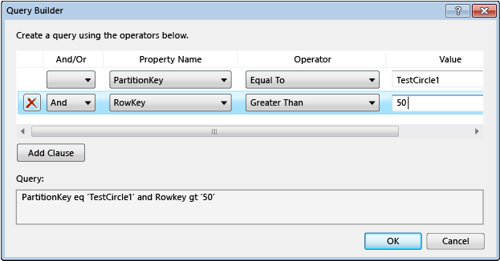

<properties
   pageTitle="使用服务器资源管理器浏览和管理存储资源 | Azure"
   description="使用服务器资源管理器浏览和管理存储资源"
   services="visual-studio-online"
   documentationCenter="na"
   authors="TomArcher"
   manager="douge"
   editor="" />
<tags
   ms.service="storage"
   ms.date="07/18/2016"
   wacn.date="09/19/2016" />

# 使用服务器资源管理器浏览和管理存储资源

## 概述
如果你已安装 Azure Tools for Microsoft Visual Studio，可以从 Azure 的存储帐户中查看 Blob、队列和表数据。服务器资源管理器中的“Azure 存储空间”节点显示了位于本地存储模拟器帐户和其他 Azure 存储帐户中的数据。

若要在 Visual Studio 中查看服务器资源管理器，请在菜单栏上选择“查看”>“服务器资源管理器”。存储节点显示用户要连接到的每个 Azure 订阅/证书下的所有存储帐户

从 Azure SDK 2.7 开始，你也可以使用新的云资源管理器来查看和管理 Azure 资源。有关详细信息，请参阅 [Managing Azure Resources with Cloud Explorer](/documentation/articles/vs-azure-tools-resources-managing-with-cloud-explorer/)（使用云资源管理器管理 Azure 资源）。

## 在 Visual Studio 中查看和管理存储资源

服务器资源管理器自动在存储模拟器帐户中显示 Blob、队列和表的列表。存储模拟器帐户在服务器资源管理器中的“存储”节点下以“开发”节点列出。

若要查看存储模拟器帐户的资源，请展开“开发”节点。展开“开发”节点时，如果尚未启动存储模拟器，它将自动启动。这可能需要数秒钟的时间。当存储模拟器启动时，你可以继续在 Visual Studio 的其他区域中工作。

若要查看存储帐户中的资源，请在服务器资源管理器中展开存储帐户的节点。将出现以下子节点：

- Blob

- 队列

- 表

## 处理 Blob 资源

Blob 节点显示所选存储帐户的容器列表。Blob 容器包含 Blob 文件，可以将这些 Blob 组织成文件夹和子文件夹。有关详细信息，请参阅[如何通过 .NET 使用 Blob 存储](/documentation/articles/storage-dotnet-how-to-use-blobs/)。

### 创建 Blob 容器

1. 打开“Blob”节点的快捷菜单，然后选择“创建 Blob 容器”。

1. 在“创建 Blob 容器”对话框中输入新容器的名称，然后选择“确定”。

    

    >[AZURE.NOTE] Blob 容器名称必须以数字 (0-9) 或小写字母 (a-z) 开头。

### 删除 Blob 容器

- 打开要删除的 Blob 容器的快捷菜单，然后选择“删除”。

### 显示 Blob 容器中包含的项目列表

- 打开列表中 Blob 容器名称的快捷菜单，然后选择“查看 Blob 容器”。

    查看 Blob 容器的内容时，该内容显示在称为“Blob 容器视图”的选项卡中。

    

    使用 Blob 容器视图右上角的各个按钮，可以对 Blob 执行以下操作：

    - 输入筛选器值并应用它

    - 刷新容器中的 Blob 列表

    - 上载文件

    - 删除 Blob

      >[AZURE.NOTE] 从 Blob 容器中删除文件不会删除基础文件，而只是将它从 Blob 容器删除。

    - 打开 Blob

    - 将 Blob 保存到本地计算机

### 在 Blob 容器中创建文件夹或子文件夹

1. 在服务器资源管理器中选择 Blob 容器。在容器窗口中，选择“上载 Blob”按钮。

    

1. 在“上载新文件”对话框中，选择“浏览”按钮并指定要上载的文件，然后在“文件夹(可选)”框中输入文件夹名称。

    可以遵循相同的过程将子文件夹添加到容器文件夹。如果未指定文件夹名称，文件将上载到 Blob 容器的顶层。文件将出现在容器中指定的文件夹内。

    

1. 双击文件夹或按 Enter 以查看文件夹的内容。位于容器的文件夹中时，可以通过选择“打开父目录”（向上箭头）按钮导航回到容器的根目录。

### 删除容器文件夹

 - 删除文件夹中的所有文件

    >[AZURE.NOTE] 由于 Blob 容器中的文件夹是一个虚拟文件夹，因此无法创建空文件夹，也无法删除文件夹并删除其文件内容。只有删除了文件夹的整个内容才能删除该文件夹。

### 在容器中筛选 Blob

可以通过指定常用前缀来筛选显示的 Blob。

例如，如果在筛选文字框中输入前缀 `hello`，然后选择“执行”(**!**) 按钮，则只会显示以“hello”开头的 Blob。

>[AZURE.NOTE] 筛选字段区分大小写，并且不支持使用通配符筛选。只能按前缀筛选 Blob。如果你使用分隔符以虚拟分层结构形式组织 Blob，则前缀可能包含分隔符。例如，针对前缀 HelloFabric/ 进行筛选将返回以该字符串开头的所有 Blob。

### 下载 Blob 数据

- 在“服务器资源管理器”中，打开一个或多个 Blob 的快捷菜单，然后选择“打开”，或者选择 Blob 名称并选择“打开”按钮，或者双击 Blob 名称。

    Blob 下载的进度将显示在“Azure 活动日志”窗口中。

    在此文件类型的默认编辑器中打开该 Blob。如果操作系统识别出文件类型，则在本地安装的应用程序中打开文件；否则将提示你选择适合该 Blob 文件类型的应用程序。下载 Blob 时创建的本地文件将标记为只读。

    Blob 数据在本地缓存，并且对照 Blob 服务中 Blob 的最后修改时间检查此类数据。如果 Blob 自上次下载以来已进行了更新，则将再次下载它；否则，将从本地磁盘中加载 Blob。默认情况下，Blob 下载到临时目录中。若要将 Blob 下载到一个特定的目录，请打开所选 Blob 名称的快捷菜单，然后选择“另存为”。当通过这种方式保存 Blob 时，将不会打开 Blob 文件，并且创建具有读写特性的本地文件。

### 上载 Blob

- 当容器处于打开状态，可以在 Blob 容器视图中查看时，选择“上载 Blob”按钮。

    可以选择一个或多个文件进行上载，可以上载任何类型的文件。“Azure 活动日志”将显示上载进度。有关处理 Blob 数据的详细信息，请参阅 [How to use the Azure Blob Storage Service in .NET](http://go.microsoft.com/fwlink/p/?LinkId=267911)（如何在 .NET 中使用 Azure Blob 存储服务）。

### 查看传输到 Blob 的日志

- 如果你正在使用 Azure 诊断来记录 Azure 应用程序中的数据，并且已将日志传输到存储帐户，则会看到 Azure 为这些日志创建的容器。在服务器资源管理器中查看这些日志是一种简便的确定应用程序问题的方法，尤其是当应用程序已部署到 Azure 时。有关 Azure 诊断的详细信息，请参阅 [Collect Logging Data by Using Azure Diagnostics](https://msdn.microsoft.com/zh-cn/library/azure/gg433048.aspx)（使用 Azure 诊断收集日志记录数据）。

### 获取 Blob 的 URL

- 打开 Blob 的快捷菜单，然后选择“复制 URL”。

### 编辑 Blob

- 选择 Blob，然后选择“打开 Blob”按钮。

    文件将下载到临时位置，在本地计算机上打开。进行更改之后，必须再次上载 Blob。

## 处理队列资源

存储服务队列在存储帐户中托管，你可以使用它们允许云服务角色通过消息传递机制互相通信以及与其他服务通信。可以用编程方式，通过云服务以及面向外部客户端的 Web 服务来访问队列。还可以使用 Visual Studio 中的服务器资源管理器直接访问队列。

开发使用队列的云服务时，可能希望使用 Visual Studio 来创建队列，然后在开发和测试代码时，以交互方式使用它们。

在服务器资源管理器中，可以查看存储帐户中的队列、创建和删除队列、打开队列以查看其消息，以及将消息添加到队列。打开队列进行查看时，可以查看各条消息，还可以使用左上角的按钮，对队列执行以下操作：

- 刷新队列的视图

- 将消息添加到队列

- 取消顶部消息的排队。

- 清除整个队列

下图显示了包含两条消息的队列。

有关存储服务队列的详细信息，请参阅 [如何：使用队列存储服务](/documentation/articles/storage-dotnet-how-to-use-queues/)。有关存储服务队列的 Web 服务的详细信息，请参阅 [队列服务的概念](https://msdn.microsoft.com/zh-cn/library/azure/dd179353.aspx)。

>[AZURE.NOTE] 存储服务队列不同于服务总线队列。有关服务总线队列的详细信息，请参阅“Service Bus Queues, Topics, and Subscriptions”（服务总线队列、主题和订阅）。

## 处理表资源

Azure 表存储服务可存储大量结构化数据。该服务是一个 NoSQL 数据存储，接受来自 Azure 云内部和外部的通过验证的呼叫。Azure 表最适合存储结构化非关系型数据。

### 创建表

1. 在服务器资源管理器中，选择存储帐户的“表”节点，然后选择“创建表”。

1. 在“创建表”对话框中，输入表的名称。

### 查看表数据

1. 在服务器资源管理器中，打开“Azure”节点，然后打开“存储”节点。

1. 打开所需的存储帐户节点，然后打开“表”节点以查看存储帐户的表列表。

1. 打开表的快捷菜单，然后选择“查看表”。

    

按实体（在行中所示）和属性（在列中所示）组织的表。例如，下图显示了“表设计器”中列出的实体：

### 编辑表数据

1. 在“表设计器”中，打开实体（单行）或属性（单个单元格）的快捷菜单，然后选择“编辑”。

    

    单个表中不同实体不需要具有相同的属性集（列）。在查看和编辑表数据时，请记住以下限制。
    - 不能查看或编辑二进制数据（byte 类型），但可以将它们存储在表中。

    - 无法编辑 **PartitionKey** 或 **RowKey** 值，因为 Azure 中的表存储不支持该操作。

    - 无法创建名为 Timestamp 的属性，因为 Azure 存储空间服务使用了同名属性。

    - 如果输入日期时间值，必须使用适合计算机区域和语言设置的格式（例如，对于美国英语，必须使用 MM/DD/YYYY HH:MM:SS [AM|PM]）。

### 添加实体

1. 在“表设计器”中，选择靠近表视图右上角的“添加实体”按钮。

    

1. 在“添加实体”对话框中，输入 **PartitionKey** 和 **RowKey** 属性的值。

    

    输入值时应小心，因为关闭此对话框后便无法更改它们，除非删除此实体，再次添加。

### 筛选实体

如果使用查询生成器，则可以自定义表中显示的实体集。

1. 若要打开查询生成器，请打开要查看的表。

1. 选择表视图工具栏上最右侧的按钮。

    随后将出现“查询生成器”对话框。下图显示了正在查询生成器中进行生成的查询。

    

1. 查询生成完毕后，关闭该对话框。所生成文本格式的查询将以 WCF 数据服务筛选器的形式显示在文本框中。

1. 若要运行查询，请选择绿色三角形图标。

    如果在筛选器字段中直接输入 WCF 数据服务筛选器字符串，还可以筛选“表设计器”中显示的实体数据。此类字符串类似 SQL WHERE 语句，但它以 HTTP 请求的形式发送到服务器。

    下图显示了有效筛选器字符串的示例：

    

### 刷新存储数据

当服务器资源管理器连接到存储帐户或从存储帐户获取数据时，它可能需要长达一分钟的时间来完成操作。如果无法连接，则操作可能会超时。在数据检索时，你可以继续在 Visual Studio 的其他部分工作。若要在花费太长时间时取消操作，请选择服务器资源管理器工具栏上的“停止刷新”按钮。

#### 刷新 Blob 容器数据

- 选择“存储”下的“Blob”节点，然后选择服务器资源管理器工具栏上的“刷新”按钮。

- 若要刷新显示的 Blob 列表，请选择“执行”按钮。

#### 刷新表数据

- 选择“存储”下的“表”节点，然后选择“刷新”按钮。

- 若要刷新“表设计器”中显示的实体列表，请在“表设计器”中选择“执行”按钮。

#### 刷新队列数据

- 选择“队列”节点，然后选择“刷新”按钮。

#### 刷新存储帐户中的所有项

- 选择帐户名称，然后选择服务器资源管理器工具栏上的“刷新”按钮。

### 使用服务器资源管理器添加存储帐户

可以使用两种方法在服务器资源管理器中添加存储帐户。可以在 Azure 订阅中创建新的存储帐户，也可以附加现有的存储帐户。

#### 使用服务器资源管理器创建新的存储帐户

1. 在服务器资源管理器中，打开“存储”节点的快捷菜单，然后选择“创建存储帐户”。

    

1. 在“创建存储帐户”对话框中选择或输入新存储帐户的以下信息。

    - 要将存储帐户添加到的 Azure 订阅。

    - 要用于新存储帐户的名称。

    - 区域或地缘组（例如“中国北部”或“中国东部”）。

    - 要用于存储帐户的复制类型，如“异地冗余”。

1. 选择“创建”。

    新的存储帐户随即出现在解决方案资源管理器的“存储”列表中。

#### 使用服务器资源管理器附加现有的存储帐户

1. 在服务器资源管理器中，打开 Azure 存储节点的快捷菜单，然后选择“附加外部存储”。

    

1. 在“创建存储帐户”对话框中选择或输入新存储帐户的以下信息。

    - 要附加的现有存储帐户的名称。可以输入名称或从列表中选择名称。

    - 所选存储帐户的密钥。此当你选择存储帐户时，通常会为你提供此值。如果你想要 Visual Studio 记住存储帐户密钥，请选中“记住帐户密钥”框。

    - 将用于连接到存储帐户的协议，如 HTTP、HTTPS 或自定义终结点。有关自定义终结点的详细信息，请参阅 [如何配置连接字符串](https://msdn.microsoft.com/zh-cn/library/azure/ee758697.aspx)。

### 查看辅助终结点

- 如果使用“读取访问权限异地冗余”复制选项创建了存储帐户，可以查看该帐户的辅助终结点。打开帐户名称的快捷菜单，然后选择“属性”。

    

### 从服务器资源管理器中删除存储帐户

- 在服务器资源管理器中，打开帐户名称的快捷菜单，然后选择“删除”。如果删除某个存储帐户，则也会删除该帐户的所有已保存密钥信息。

    >[AZURE.NOTE] 从服务器资源管理器中删除存储帐户不会影响到存储帐户或其所包含的任何数据，它只是将引用从服务器资源管理器中删除了。若要永久删除存储帐户，请使用 Azure 经典管理门户。

<!---HONumber=Mooncake_0912_2016-->