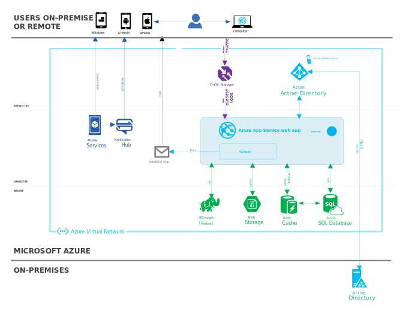

<properties 
	pageTitle="在 Azure Web 应用上创建业务线 Web 应用" 
	description="本指南提供如何使用 Azure Web 应用创建 Intranet 业务线应用程序的技术概述。这包括身份验证策略、Service Bus 中继和监视。" 
	editor="jimbe" 
	manager="wpickett" 
	authors="cephalin" 
	services="app-service\web" 
	documentationCenter=""/>

<tags
	ms.service="app-service-web"
	ms.date="02/26/2016" 
	wacn.date="04/26/2016"/>

# 在 Azure Web 应用上创建业务线 Web 应用

[Azure Web 应用](/documentation/services/web-sites/) Web 应用是业务线应用程序的极佳选择。这些应用程序属于 Intranet 应用程序，应确保这些应用程序的安全以便用于内部业务。它们通常要求身份验证（往往是针对企业目录），并要求对本地数据和服务进行某种访问或集成。

将业务线应用程序转移到 Azure Web 应用可以带来很大的优势，例如：

-  根据动态工作负荷向上和向下缩放，例如，使用一个应用程序来处理年度绩效审查。在审查期间，对于大型公司而言流量将会突增到较高的水平。Azure 提供缩放选项，使公司能够在高流量审核期间进行扩展以便处理负荷，而对于一年中的其他时间能够收缩以便节约资金。 
-  更关注应用程序开发，而更少关注基础结构添置和管理
-  为员工和合作伙伴从任何地点使用应用程序提供更好的支持用户无需连接到公司网络以便使用应用程序，并且 IT 部门能够避免复杂的反向代理解决方案。有几种身份验证选项以便确保保护对公司应用程序的访问。

以下是在 Azure Web 应用上运行的业务线应用程序的示例。该示例演示了只需少量的技术投资，就能结合 Web 应用和其他服务来完成任务。**单击拓扑中的元素可阅读更多相关详细信息。**

<object type="image/svg+xml" data="./media/web-sites-business-application-solution-overview/web-app-notitle.svg" width="100%" height="100%"></object>

> [AZURE.NOTE]
> 本指南演示了与业务线应用程序相关的一些最常见领域和任务。但是，还有可在特定实施中使用的其他一些 Azure Web 应用功能。若要查看这些功能，另请参阅[全球网络影响力](/documentation/articles/web-sites-global-web-presence-solution-overview/)和[数字市场营销活动](/documentation/articles/web-sites-digital-marketing-application-solution-overview/)中的其他指导。

## 引入现有资产

将使用各种语言和框架的现有 Web 资产引入 Azure Web 应用。

无论你的现有 Web 资产是 .NET、PHP、Java、Node.js 还是 Python，现在都可在 Azure  Web 应用中运行。你可以使用熟悉的 [FTP] 工具或源代理管理系统将它们移到 Web 应用。 Web 应用支持使用流行的源代码管理选项直接发布，如 [Visual Studio] 和 本地 [Git]、GitHub、Mercurial 等。

## 保护资产

以加密的方式保护资产，验证企业用户是在现场还是在远程，以及授权他们使用资产。

使用 [HTTPS] 保护内部资产，以防止窃听。SSL 证书随附 ***.chinacloudsites.cn** 域名，如果你使用自定义域，可以在 Azure 中引入该域的 SSL 证书。存在与每个 SSL 证书相关联的每月费用（每小时按比例分摊）。有关详细信息，请参阅 [Azure Web 应用定价详细信息]。

根据企业目录[对用户进行身份验证]。Azure Web 应用可以使用本地标识提供者（例如，Active Directory 联合身份验证服务 (AD FS)），或者已同步到企业 Active Directory 部署的 Azure Active Directory 租户来对用户进行身份验证。当用户在办公室或者外出时，可以通过单一登录访问网站中的 Web 属性。现有的服务（例如 Office 365 或 Microsoft Intune）已在使用 Azure Active Directory。

[为用户授权]，以便他们能够使用 Web 属性。只需编写少量的附加代码，就能使用 `[Authorize]` 等装饰将相同的本地 ASP.NET 代码模式引入 Azure Web 应用。你可以像在本地维护应用程序一样，保留精细的访问控制灵活性。

## 连接到本地资源 ##

可以连接到 Web 应用数据或资源，不管它们是在云中（出于性能考虑）还是在本地（出于合规性考虑）。有关在 Azure 中保存数据的详细信息，请参阅 [Azure 信任中心]。

你可以在 Azure 中的各种数据库后端（包括 [Azure SQL 数据库]和 [MySQL]）中选择，以满足 Web 应用的需求。通过将数据安全保存在 Azure 中，可以使数据在地理位置上靠近 Web 应用，进而优化其性能。

## 优化

业务线应用程序可通过使用“自动缩放”进行自动缩放，使用 Azure Redis 缓存进行缓存，使用 Web 作业运行后台任务以及使用 Azure 流量管理器维护高可用性达到优化目的。

Azure Web 应用具有[向上和向外缩放]功能，不论工作负荷的大小如何，都能满足业务线应用程序的需求。通过 [Azure 经典管理门户]手动扩大，通过[服务管理 API] 或 [PowerShell 脚本]以编程方式扩大 Web 应用，或者通过自动缩放功能自动扩大。在“标准”层，自动缩放功能使你可以基于 CPU 使用率自动扩大 Web 应用。有关最佳实践，请参阅 [Troy Hunt] 的[我所了解的有关使用 Azure 快速缩放 Web 应用的十大事项]。

使用 [Azure Redis 缓存]让你的 Web 应用响应更快。可以利用它从后端数据库和其他操作。

使用 [Azure 流量管理器] 维护 Web 应用的高可用性。使用“故障转移”方法，当主站点出现问题时，流量管理器可以自动将流量路由到辅助站点。

## 监视和分析

使用 Azure 或第三方工具让 Web 应用的性能保持最新状态。接收关于关键 Web 应用事件的警报。使用 Application Insight 或 HDInsight 中的 Web 日志分析，让用户可以轻松地深入了解。

在“标准”层，当应用无法响应时，监视器应用程序响应能力会收到电子邮件通知。

## 更多资源

- [Azure Web 应用文档](/home/features/web-site/)
- [Azure Web 博客](/blog/tags/网站/)

[Azure Websites]: /home/features/web-site/

[FTP]: /documentation/articles/web-sites-deploy/#ftp
[Visual Studio]: /documentation/articles/web-sites-dotnet-get-started/
[Git]: /documentation/articles/web-sites-publish-source-control/
[HTTPS]: /documentation/articles/web-sites-configure-ssl-certificate/
[Azure Web 应用定价详细信息]: /home/features/web-site/pricing/
[对用户进行身份验证]: /documentation/articles/web-sites-authentication-authorization/
[简易身份验证]: https://azure.microsoft.com/zh-cn/blog/2014/11/13/azure-websites-authentication-authorization/
[为用户授权]: /documentation/articles/web-sites-authentication-authorization/
[Azure 信任中心]: /support/trust-center/
[MySQL]: /documentation/articles/web-sites-php-mysql-deploy-use-git/
[Azure SQL 数据库]: /documentation/articles/web-sites-dotnet-deploy-aspnet-mvc-app-membership-oauth-sql-database/
[向上和向外缩放]: /documentation/articles/web-sites-scale/
[Azure 经典管理门户]: http://manage.windowsazure.cn/
[服务管理 API]: http://msdn.microsoft.com/zh-cn/library/azure/ee460799.aspx
[PowerShell 脚本]: http://msdn.microsoft.com/zh-cn/library/azure/jj152841.aspx
[Troy Hunt]: https://twitter.com/troyhunt
[我所了解的有关使用 Azure 快速缩放 Web 应用的十大事项]: http://www.troyhunt.com/2014/09/10-things-i-learned-about-rapidly.html
[Azure Redis 缓存]: https://azure.microsoft.com/zh-cn/blog/2014/06/05/mvc-movie-app-with-azure-redis-cache-in-15-minutes/

[quick glance]: /documentation/articles/web-sites-monitor/
[Azure Application Insights]: http://blogs.msdn.com/b/visualstudioalm/archive/2015/01/07/application-insights-and-azure-websites.aspx

 

<!---HONumber=79-->