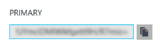
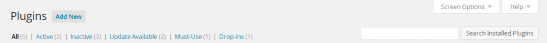
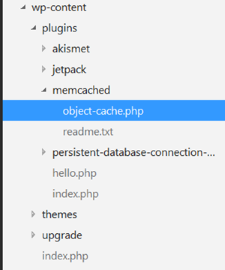
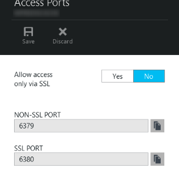

<properties
   pageTitle="通过 Memcache 协议将 Azure App Service 中的 Web 应用连接到 Redis Cache"
   description="使用 Memcache 协议将 Azure App Service 中的 Web 应用连接到 Redis Cache"
   services="app-service\web"
   documentationCenter="php"
   authors="SyntaxC4"
   manager="wpickett"
   editor="riande"/>

<tags
   ms.service="app-service-web"
   ms.date="06/30/2015"
   wacn.date="08/29/2015"/>

# 通过 Memcache 协议将 Azure App Service 中的 Web 应用连接到 Redis Cache

在本文中，您将学习如何使用 [Memcache][13] 协议将 <!--[-->Azure App Service<!--](http://go.microsoft.com/fwlink/?LinkId=529714)--> 中的 WordPress Web 应用连接到 [Azure Redis Cache][12]。如果您有一个将 Memcached 服务器用于内存缓存的现有 Web 应用，您可以将其迁移到 Azure App Service，并使用 Microsoft Azure 中第一方的缓存解决方案，其中对您的应用程序代码进行少量更改或无更改。此外，您可以利用现有的 Memcache 专业知识在 Azure App Service （带有用于内部缓存的 Azure Redis Cache）中创建高度可缩放、分布式应用，同时使用常用的应用程序框架，例如 .NET、PHP、Node.js、Java 和 Python。

App Service Web Apps 使用 Web Apps Memcache 填充码启用该应用程序方案，这是充当 Memcache 代理服务器的本地 Memcached 服务器，用于缓存对 Azure Redis Cache 的调用。这使得使用 Memcache 协议通信的任何应用可以使用 Redis Cache 缓存数据。此 Memcache 填充码在协议级别运行，因此只要它使用 Memcached 协议通信，就可以供任何应用程序或应用程序框架使用。

## 先决条件

Web Apps Memcache 填充码可以与任何应用程序一起使用，前提是使用 Memcached 协议通信。就此特定示例来说，引用应用程序是一个可缩放的 WordPress 站点，它可以从 Azure 应用商店设置。

请按照以下文章中所述的步骤操作：

* [在 Azure 中部署可缩放的 WordPress 站点][0]
* [设置 Azure Redis Cache Service 的实例][1]
* [在 Azure 中部署可缩放的 WordPress 站点][0]

部署可缩放的 WordPress 站点并设置 Redis Cache 实例后，您随时可以启用 Azure App Service Web Apps 中的 Memcache 填充码。

## 启用 Web Apps Memcache 填充码

若要配置 Memcache 填充码，您必须创建三项应用设置。这可以使用多种方法来完成，其中包括 [Azure 门户](https://manage.windowsazure.cn)、[旧门户][3]、[Azure PowerShell Cmdlet][5] 或 [ Azure 命令行界面][5]。在本文中，我将使用 [Azure 门户][4] 来进行应用设置。从 Redis Cache 实例中的**设置**边栏选项卡，可以检索以下值。


### 添加 REDIS_HOST 应用设置

您需要创建的第一个应用设置是 **REDIS_HOST** 应用设置。此设置将对该填充码将缓存信息转发到的目的地进行设置。REDIS_HOST 应用设置所需的值可以从 Redis Cache 实例的**属性**边栏选项卡检索。


将应用设置的项设置为 **REDIS_HOST**，将应用设置的值设置为 Redis Cache 实例的**主机名**。


### 添加 REDIS_KEY 应用设置

您需要创建的第二个应用设置是 **REDIS_HOST** 应用设置。此设置提供了安全访问 Redis Cache 实例所需的身份验证令牌。REDIS_KEY 应用设置所需的值可以从 Redis Cache 实例的**访问密钥**边栏选项卡检索。



将应用设置的项设置为 **REDIS_KEY**，将应用设置的值设置为 Redis Cache 实例的**主键**。


### 添加 MEMCACHESHIM_REDIS_ENABLE 应用设置

最后一个应用设置用于启用 Web Apps 中的 Memcache 填充码，以便使用 REDIS_HOST 和 REDIS_KEY 来连接 Azure Redis Cache 和转发缓存调用。将应用设置的项设置为 **MEMCACHESHIM\_REDIS\_ENABLE**，并将其值设置为 **true**。


添加完这三 (3) 项应用设置以后，单击**保存**。

## 启用针对 PHP 的 Memcache 扩展

若要让应用程序使用 Memcache 协议进行沟通，必须将 Memcache 扩展安装到 PHP（用于您的 WordPress 站点的语言框架）。

### 下载 php_memcache 扩展

浏览到 [PECL][6]，在缓存类别下单击 [memcache][7]。在下载列中，单击 DLL 链接。


下载 Web Apps 中启用的 PHP 版本的非线性安全 (NTS) x86 链接。（默认为 PHP 5.4）


### 启用 php_memcache 扩展

下载文件之后，将 **php\_memcache.dll** 解压缩并上载到 **d:\\home\\site\\wwwroot\\bin\\ext\\** 目录。php_memcache.dll 上载到 Web 应用之后，需要启用扩展，使之成为 PHP Runtime 的扩展。若要启用 Azure 门户中的 Memcache 扩展，请打开 Web 应用的**应用程序设置**边栏选项卡，然后添加一个项为 **PHP\_EXTENSIONS**、值为 **bin\\ext\\php_memcache.dll** 的新应用设置。


> 如果 Web 应用需要加载多个 PHP 扩展，则 PHP_EXTENSIONS 的值应该是一个由逗号分隔的 DLL 文件相对路径的列表。


完成后，单击**保存**。

## 安装 Memcache WordPress 插件

> 您也可以从 WordPress.org 下载 [Memcached 对象缓存插件](https://wordpress.org/plugins/memcached/)。

在 WordPress 插件页上，单击**添加新项**按钮。



在搜索框中，键入 **memcached**，然后按 **Enter** 键。


在列表中查找 **Memcached 对象缓存**，然后单击**立即安装**按钮。


### 启用 Memcache WordPress 插件

>[AZURE.NOTE]按照此博客中关于[如何启用 Web Apps 中的站点扩展][8]的说明，安装 Visual Studio Online。

在 `wp-config.php` 文件中，将以下代码段添加到该文件末尾附近停止编辑备注的上方。

```php
$memcached_servers = array(
	'default' => array('localhost:' . getenv("MEMCACHESHIM_PORT"))
);
```

粘贴此代码段后，monaco 将自动保存该文档。

下一步是启用对象缓存插件。这可通过以下操作实现：将 **object-cache.php** 从 **wp-content/memcached** 文件夹拖放到 **wp-content** 文件夹，以启用 Memcache 对象缓存功能。



现在，**object-cache.php** 文件位于 **wp-content** 文件夹中，Memcached 对象缓存已启用。


## 验证 Memcache 对象缓存插件正常运行

启用 Web Apps Memcache 填充码的所有步骤现已完成。剩下的唯一一件事是，验证正在填充您的 Redis Cache 实例的数据。

### 启用 Azure Redis Cache 中的非 SSL 端口支持

>[AZURE.NOTE]撰写本文档时，Redis CLI 尚不支持 SSL 连接，因此以下步骤是必需的。

在 Azure 门户中，浏览到为 Web 应用创建的 Redis Cache 实例。打开缓存边栏选项卡后，单击**设置**图标。


从列表中选择**访问端口**。


单击**否**以**允许仅通过 SSL 访问**。


您将看到非 SSL 端口现在已设置。单击**保存**。



### 从 redis-cli 连接到 Azure Redis Cache

>[AZURE.NOTE]此步骤假定 redis 已通过本地方式安装在您的开发计算机上。[按以下说明本地安装 Redis][9]。

打开您选择的命令行控制台并键入以下命令：

```shell
redis-cli –h <hostname-for-redis-cache> –a <primary-key-for-redis-cache> –p 6379
```

将 **<hostname-for-redis-cache>** 替换为实际的 xxxxx.redis.cache.windows.net 主机名，将 **<primary-key-for-redis-cache>** 替换为缓存的访问密钥，然后按 **Enter**。一旦 CLI 连接到 Redis Cache 实例，将发出任何 Redis 命令。在下面的屏幕截图中，我已选择列出密钥。


列出密钥的调用应返回一个值。如果没有，请尝试导航到 Web 应用，然后再重试。

## 结束语

祝贺您！ WordPress 应用现在有了一个集中式的内存中缓存，这将有助于吞吐量的提高。请记住，Web Apps Memcache 填充码可以用于任何 Memcache 客户端，无需考虑编程语言或应用程序框架。若要提供反馈或者提问有关 Web Apps Memcache 填充码的问题，请在 [MSDN 论坛][10]或 [Stackoverflow][11] 上发布相关文章。

<!--[AZURE.NOTE]如果您想要在注册 Azure 帐户之前开始使用 Azure App Service，请转到[试用 App Service](http://go.microsoft.com/fwlink/?LinkId=523751)，您可以通过它在 App Service 中创建一个生存期较短的入门 Web 应用。您不需要使用信用卡，也不需要做出承诺。-->

<!--## 发生的更改
* 有关从网站更改为 App Service 的指南，请参阅：[Azure App Service 及其对现有 Azure 服务的影响](http://go.microsoft.com/fwlink/?LinkId=529714)
* 有关从旧门户更改为新门户的指南，请参阅：[有关在预览门户中导航的参考](http://go.microsoft.com/fwlink/?LinkId=529715)-->


[0]: https://msdn.microsoft.com/zh-cn/library/dn690516.aspx
[1]: http://azure.microsoft.com/zh-cn/blog/how-to-host-a-scalable-and-optimized-wordpress-for-azure-in-minutes/
[2]: https://manage.windowsazure.cn
[3]: https://manage.windowsazure.cn
[4]: /documentation/articles/powershell-install-configure
[5]: #
[6]: http://pecl.php.net
[7]: http://pecl.php.net/package/memcache
[8]: http://blog.syntaxc4.net/post/2015/02/05/how-to-enable-a-site-extension-in-azure-websites.aspx
[9]: http://redis.io/download#installation
[10]: https://social.msdn.microsoft.com/Forums/zh-cn/home?forum=windowsazurewebsitespreview
[11]: http://stackoverflow.com/questions/tagged/azure-web-sites
[12]: /documentation/services/redis-cache/
[13]: http://memcached.org
 

<!---HONumber=67-->