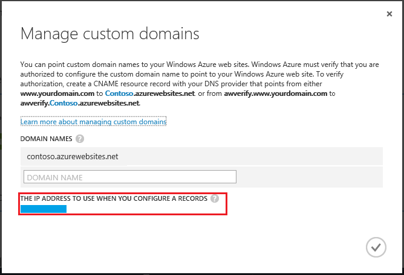

<properties
	pageTitle="在 Azure 中配置自定义域名"
	description="了解如何在 Azure 中结合使用自定义域名和 Web 应用。"
	services="app-service"
	documentationCenter=""
	authors="cephalin"
	manager="wpickett"
	editor="jimbe"
	tags="top-support-issue"/>

<tags
	ms.service="app-service"
	ms.date="02/16/2016"
	wacn.date="05/24/2016"/>

# 在 Azure 中配置自定义域名

> [AZURE.SELECTOR]
- [使用外部域名的 Web 应用](/documentation/articles/web-sites-custom-domain-name/)
- [使用流量管理器的 Web 应用](/documentation/articles/web-sites-traffic-manager-custom-domain-name/)

当你创建 Web 应用时，Azure 会将其分配给 chinacloudsites.cn 的子域。例如，如果你的 Web 应用名为 **contoso**，则 URL 为 **contoso.chinacloudsites.cn**。Azure 还会将分配一个虚拟 IP 地址。

对于生产型 Web 应用，你可能希望用户看到自定义域名。本文介绍如何使用 [Azure Web 应用](/documentation/services/web-sites/)配置自定义域。

如果你对本文中的任何观点存在疑问，可以联系 [MSDN Azure 和 CSDN Azure](/support/forums/) 上的 Azure 专家。或者，你也可以提出 Azure 支持事件。请转到 [Azure 支持站点](/support/contact/)并单击“获取支持”。

[AZURE.INCLUDE [introfooter](../includes/custom-dns-web-site-intro-notes.md)]

## 概述

如果你已有域名，或想要保留来自其他域注册机构的域，以下是为 Web 应用引入自定义域的常规步骤：

1. 保留你的域名。本文不涉及该过程。有很多域注册机构可供选择。当你注册时，其站点将引导你完成该过程。
1. 创建将域映射到你的 Azure Web 应用的 DNS 记录。
1. 在 [Azure 经典管理门户](https://manage.windowsazure.cn/)中添加域名。

在此基本大纲中，有一些需要注意的特定情况：

- 映射根域。根域是你通过域注册机构保留的域。例如 **contoso.com**。
- 映射子域。例如 **blogs.contoso.com**。可以将不同的子域映射到不同的 Web 应用。
- 映射通配符。例如 ***.contoso.com**。通配符条目会应用到域的所有子域。

[AZURE.INCLUDE [模式](../includes/custom-dns-web-site-modes.md)]

## DNS 记录类型

域名系统 (DNS) 使用数据记录将域名映射到 IP 地址。有几种类型的 DNS 记录。对于 Web 应用，将创建 *A* 记录或 *CNAME* 记录。

- A**（地址）**记录会将域名映射到 IP 地址。
- **CNAME（规范名称）**记录会将域名映射到其他域名。DNS 使用第二个名称来查找地址。用户仍然可以在浏览器中看到第一个域名。例如，你可以将 contoso.com 映射到 *&lt;yourwebapp&gt;*.chinacloudsites.cn。

如果 IP 地址更改，CNAME 条目仍然有效，但 A 记录就必须更新。不过，有些域注册机构不允许 CNAME 记录使用根域或通配符域。在这种情况下，必须使用 A 记录。

> [AZURE.NOTE]如果你删除 Web 应用后再重新创建，或是将 Web 应用模式更改回免费，则 IP 地址可能会更改。

## 查找虚拟 IP 地址

如果你要创建 CNAME 记录，可跳过此步骤。若要创建 A 记录，你需要 Web 应用的虚拟 IP 地址。获取该 IP 地址：

1.	在你的浏览器中，打开 [Azure 经典管理门户](https://manage.windowsazure.cn)。
2.	在“ Web 应用”选项卡中，单击站点的名称并选择“仪表板”。
3.	从页面底部选择“管理域”。（如果此选项已禁用，请确保你使用的模式为“共享”、“基本”或“标准”。有关详细信息，请参阅[如何缩放 Web 应用](/documentation/articles/web-sites-scale/)。） 

	

4.	IP 地址列在接近对话框底部的地方。

	
## 创建 DNS 记录

登录域注册机构，并使用他们的工具添加 A 记录或 CNAME 记录。每个注册机构的 Web 应用都会稍有不同，但以下是一些通用准则。

1.	查找管理 DNS 记录的页面。查找站点中标签为“域名”、“DNS”或“名称服务器管理”的链接或区域。通过查看你的帐户信息，然后找到诸如“我的域”之类的链接，通常就可以找到链接。
2.	找到管理页后，请查找可让你添加或编辑 DNS 记录的链接。此链接可能作为“区域文件”、“DNS 记录”或“高级”配置链接列出。

页面可能会分别列出 A 记录与 CNAME 记录，或提供选择记录类型的下拉列表。此外，页面也可能会使用其他名称做为记录类型，例如 **IP 地址记录**而不是 A 记录，或使用**别名记录**而不是 CNAME 记录。注册机构通常会为你创建一些记录，所以可能已经有根域或一般子域的记录，例如 **www**。

当你创建或编辑记录时，可使用字段将域名映射至 IP 地址（针对 A 记录），或映射至其他域（针对 CNAME 记录）。对于 CNAME 记录，你需要*从*你的自定义域映射*到*你的 chinacloudsites.cn 子域。

在许多注册机构的工具中，你只要输入域的子域部分即可，不必输入整个域名。此外，许多工具都会使用“@”表示根域。例如：

<table cellspacing="0" border="1">
  <tr>
    <th>主机</th>
    <th>记录类型</th>
    <th>IP 地址或 URL</th>
  </tr>
  <tr>
    <td>@</td>
    <td>A（地址）</td>
    <td>42.159.132.179</td>
  </tr>
  <tr>
    <td>www</td>
    <td>CNAME（别名）</td>
    <td>contoso.chinacloudsites.cn</td>
  </tr>
</table>

假设自定义域名为 contoso.com，则会创建以下记录：

- **contoso.com** 映射到 42.159.132.179。
- **www.contoso.com** 映射到 **contoso.chinacloudsites.cn**。

## 创建 awverify 记录（仅 A 记录）

如果创建 A 记录， Web 应用还需要特殊的 CNAME 记录，用于验证你是否拥有尝试要使用的域。此 CNAME 记录必须采用以下形式。

- *如果 A 记录映射根域或通配符域：*创建从 **awverify.&lt;yourdomain&gt;** 映射到 **awverify.&lt;yourwebappname&gt;.chinacloudsites.cn** 的 CNAME 记录。例如，如果 A 记录适用于 **contoso.com**，则为 **awverify.contoso.com** 创建 CNAME 记录。
- *如果 A 记录映射特定子域：*创建从 **awverify.&lt;subdomain&gt;** 映射到 **awverify.&lt;yourwebappname&gt;.chinacloudsites.cn** 的 CNAME 记录。例如，如果 A 记录适用于 **blogs.contoso.com**，则为 **awverify.blogs.contoso.com** 创建 CNAME 记录。

你的 Web 应用的访客不会看到 awverify 子域；这只供 Azure 验证域使用。

## 在 Web 应用上启用域名

[AZURE.INCLUDE [模式](../includes/custom-dns-web-site-enable-on-web-site.md)]

<!-- Anchors. -->
[概述]: #overview
[DNS 记录类型]: #dns-record-types
[查找虚拟 IP 地址]: #find-the-virtual-ip-address
[创建 DNS 记录]: #create-the-dns-records
[在 Web 应用上启用域名]: #enable-the-domain-name-on-your-web-app

<!-- Images -->
[subdomain]: ./media/web-sites-custom-domain-name/azurewebsites-subdomain.png

<!---HONumber=Mooncake_1207_2015-->