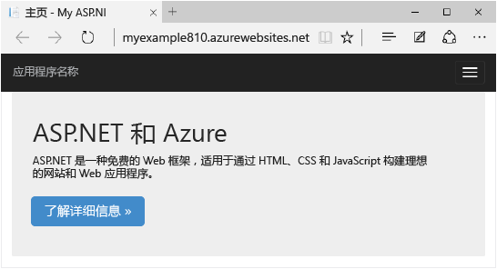
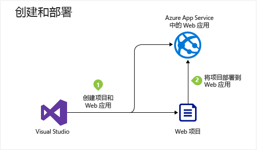
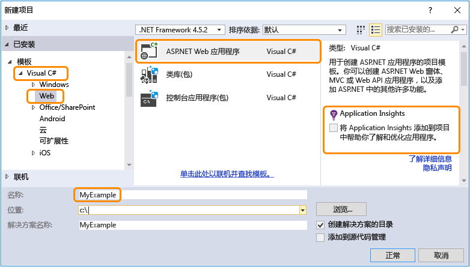
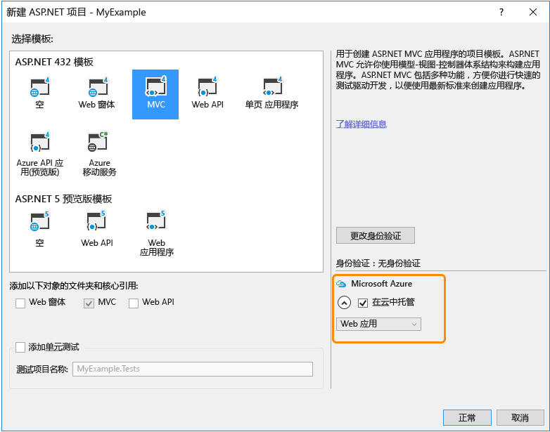
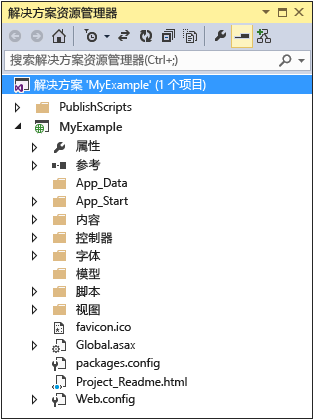

<properties
	pageTitle="ASP.NET 和 Azure 入门 | Azure"
	description="了解如何在 Visual Studio 中创建 ASP.NET Web 项目，并将其部署到 Azure 中的新 Web 应用。"
	services="app-service\web"
	documentationCenter=".net"
	authors="tdykstra"
	manager="wpickett"
	editor=""/>

<tags
	ms.service="app-service-web"
	ms.date="03/02/2016"
	wacn.date="05/16/2016"/>

# 配合 Visual Studio 使用 Azure 中的 ASP.NET Web 应用入门

> [AZURE.SELECTOR]
- [.Net](/documentation/articles/web-sites-dotnet-get-started)
- [Node.js](/documentation/articles/app-service-web-nodejs-get-started)
- [Java](/documentation/articles/web-sites-java-get-started)
- [PHP - Git](/documentation/articles/web-sites-php-mysql-deploy-use-git)
- [PHP - FTP](/documentation/articles/web-sites-php-mysql-deploy-use-ftp)
- [Python](/documentation/articles/web-sites-python-ptvs-django-mysql)

## 概述

本教程将向你介绍如何使用 Visual Studio 2015 将 ASP.NET Web 应用程序部署到 [Azure 中的 Web 应用](/home/features/web-site)。本教程假定你是此前没有 Azure 使用经验的 ASP.NET 开发人员。完成本教程之后，你将能够在云中启动并运行简单的 Web 应用程序。

下图演示了完整的应用程序：

学习内容：

* 在 Visual Studio 中，如何在创建新的 Web 项目的同时创建新的 Azure Web 应用。
* 如何使用 Visual Studio 将 Web 项目部署到 Azure Web 应用。
* 如何使用 [Azure 管理门户](https://manage.windowsazure.cn/)监视和管理 Web 应用。

教程末尾的[后续步骤](#next-steps)部分提供了其他教程的链接，方便用户更深入地了解如何使用 Azure Web 应用。

## 先决条件

[AZURE.INCLUDE [先决条件](../includes/app-service-web-dotnet-get-started-prereqs.md)]

## 在 Azure 中创建 Web 项目和 Web 应用

第一步是在 Visual Studio 中创建一个 Web 项目，并在 Azure 中创建一个 Web 应用。完成时，将项目部署到 Web 应用，以使其在 Internet 上可用。

下图演示了在创建和部署步骤中要执行的操作。

1. 打开 Visual Studio 2015。

2. 单击“文件”>“新建”>“项目”。

3. 在“新建项目”对话框中，单击“Visual C#”>“Web”>“ASP.NET Web 应用程序”。（如果需要，可以选择“Visual Basic”。）

3. 确保选择 **.NET Framework 4.5.2** 作为目标框架。

4. 将应用程序命名为 **MyExample**。

5. 单击**“确定”**。

	

5. 在“新建 ASP.NET 项目”对话框中，选择“MVC”模板。

	[MVC](http://www.asp.net/mvc) 是用于开发 Web 应用的 ASP.NET 框架。

5. 在“新建 ASP.NET 项目”对话框中，确保“在云中托管”处于未选中状态，然后单击“确定”。

	

	Azure 中国区目前不支持在 Visual Studio 中创建或管理网站。因此，你需要转到[管理门户](https://manage.windowsazure.cn/)创建新的 Azure 网站

	“解决方案资源管理器”窗口将显示新项目中的文件和文件夹。

	

## 将 Web 项目部署到 Azure Web 应用

在本部分中，你需要将 Web 项目部署到 Web 应用，如关系图中的第 2 步所示。

1. 在[管理门户](https://manage.windowsazure.cn/)中创建新网站或选择已退出的网站。

2. 单击网站的“仪表板”。在“速览”下，单击“下载发布配置文件”。

3. 在 Visual Studio 中，右键单击你的项目并选择“发布”

	

	几秒钟后，将显示“发布 Web”向导。

4. 在“发布配置文件”中单击“导入”，然后选择前面下载的发布配置文件。

	Visual Studio 将项目部署到 Azure 所需的设置随即已导入。可以使用该向导查看和更改这些设置。

8. 在“发布 Web”向导的“连接”选项卡中，单击“下一步”。

	

10. 在“设置”选项卡中，单击“下一步”。

	你可以接受“配置”和“文件发布选项”的默认值。

	你可以通过“配置”下拉列表部署用于远程调试的调试版本。[后续步骤](#next-steps)部分链接到了说明如何在调试模式下远程运行 Visual Studio 的教程。

	

11. 在“预览”选项卡中，单击“发布”。

	

	单击“发布”后，Visual Studio 开始执行将文件复制到 Azure 服务器的过程。这可能需要一到两分钟。

	“输出”和“Azure 活动”窗口将显示已执行的部署操作并报告已成功完成部署。

	

	成功完成部署后，默认浏览器将自动打开指向已部署 Web 应用的 URL。你创建的应用程序现在运行于云中。浏览器地址栏中的 URL 显示正在从 Internet 加载该 Web 应用。

	

> [AZURE.TIP] 可以启用“Web 单键发布”工具栏以快速完成部署。单击“视图”>“工具栏”，然后选择“Web 单键发布”。你可以通过工具栏选择一个配置文件，然后单击相关按钮进行发布，或者单击相关按钮以打开“发布 Web”向导。
> 

## 在服务器资源管理器中打开远程文件

对 Web 应用进行测试和调试时，可以在“服务器资源管理器”中打开和编辑文件，以便在远程站点上进行快速的临时更改。

1.  在“服务器资源管理器”中导航到“Azure > Azure > MyExampleGroup”，然后展开 Web 应用的节点。

2. 展开“文件 > 视图 > 主页”，然后双击 *Index.cshtml* 文件。

	

3. 将 `<h1>ASP.NET</h1>` 更改为 `<h1>Azure Web App</h1>`。

4. 保存文件。

5. 刷新有站点在 Azure 中运行的浏览器窗口。

	

此更改现在会出现在已部署站点中，但不会出现在本地项目中。如果重新部署项目，站点将恢复到进行该更改之前的状态。

此功能适用于[临时关闭 Web.config 文件中的 customErrors 以获取详细的错误消息](/documentation/articles/web-sites-dotnet-troubleshoot-visual-studio)。

在“服务器资源管理器”中，你还可以右键单击 Azure 节点并访问 Visual Studio 窗口中的 Web 应用设置，可以启动远程调试会话，还可以在应用程序写入日志时实时查看应用程序日志。

有关详细信息，请参阅[在 Visual Studio 中对 Azure Web 应用进行故障故障](/documentation/articles/web-sites-dotnet-troubleshoot-visual-studio)。

## 在 Azure 管理门户中监视和管理 Web 应用

[Azure 管理门户](https://manage.windowsazure.cn/)是一个 Web 界面，可用于管理和监视 Azure 服务，例如刚刚创建的 Web 应用。在本教程的本部分，你将了解可在该门户中执行的某些操作。

1. 在浏览器中，转到 [https://manage.windowsazure.cn](https://manage.windowsazure.cn)，然后使用你的 Azure 凭据登录。

	门户将显示你的 Azure 服务的列表。

2. 单击你的网站的名称。

	
  
3. 单击“仪表板”选项卡。

	“仪表板”选项卡显示使用统计信息的概述，以及许多常用站点管理功能的链接。在“速览”下，还可以找到应用程序主页的链接。

	
  
	此时，站点没有过多的通信，因此可能不会在图形中显示任何内容。如果浏览到应用程序，刷新页面几次，然后刷新门户“仪表板”页的话，你将会看到显示了一些统计信息。单击“监视”选项卡可查看更多详细信息。

4. 单击“配置”选项卡。

	“[配置](/documentation/articles/web-sites-configure//)”选项卡可让你控制用于站点的 .NET 版本、启用 [WebSockets](http://www.windowsazure.cn/blog/2013/11/14/introduction-to-websockets-on-windows-azure-web-sites/) 和[诊断日志记录](/documentation/articles/web-sites-enable-diagnostic-log)等功能、设置[连接字符串值](http://azure.microsoft.com/blog/2013/07/17/windows-azure-web-sites-how-application-strings-and-connection-strings-work/)，等等。

	
  
5. 单击“缩放”选项卡。

	对于网站服务的付费层，“缩放”选项卡允许你控制为网站提供服务的计算机的大小和数量，以处理流量的变化。

	你可以手动缩放或配置条件或计划以进行自动缩放。

	

这只是门户的一部分功能。你还可以创建新 Web 应用、删除现有 Web 应用、停止和重新启动 Web 应用，以及管理其他类型的 Azure 服务，如数据库和虚拟机。

##后续步骤

在本教程中，你已了解如何创建简单的 Web 应用程序并将其部署到 Azure Web 应用。你可以通过以下相关主题和资源来详细了解 Azure Web 应用：

* 创建 Web 应用的其他方法

	还可以通过[适用于 Windows PowerShell 的 Azure cmdlet](/documentation/articles/powershell-install-configure) 或[跨平台命令行界面](/documentation/articles/xplat-cli-install)来创建 Web 应用。

* 如何创建 API 应用

	你已经了解如何创建主要用于托管网站的 Azure 实例。此类实例称为 Web 应用。此外，Azure 还将功能设计为方便 API 的开发、测试和托管。主要用于托管 API 的 Azure 实例称为 API 应用。

* 部署 Web 项目的其他方法

	有关通过 Visual Studio 或通过[源代码管理系统](http://www.asp.net/aspnet/overview/developing-apps-with-windows-azure/building-real-world-cloud-apps-with-windows-azure/source-control)的[自动部署](http://www.asp.net/aspnet/overview/developing-apps-with-windows-azure/building-real-world-cloud-apps-with-windows-azure/continuous-integration-and-continuous-delivery)功能以其他方式将 Web 项目部署到 Web 应用的信息，请参阅[如何部署 Azure Web 应用](/documentation/articles/web-sites-deploy)。

* 如何添加自定义域名和 SSL

	有关如何使用 SSL 和你自己的域（例如 www.contoso.com 而不是 contoso.chinacloudsites.cn）的信息，请参阅以下资源：

	* [在 Azure Web 应用中配置自定义域名](/documentation/articles/web-sites-custom-domain-name)
	* [为 Azure 网站启用 HTTPS](/documentation/articles/web-sites-configure-ssl-certificate)

* 如何添加聊天之类的实时功能

	对于实时功能（如聊天服务、游戏或股票行情），你可以使用 [ASP.NET SignalR](http://www.asp.net/signalr) 和 [WebSockets](https://azure.microsoft.com/zh-cn/blog/introduction-to-websockets-on-windows-azure-web-sites/) 传输方法来获得最佳性能。有关详细信息，请参阅[将 SignalR 与 Azure Web Apps 配合使用](http://www.asp.net/signalr/overview/signalr-20/getting-started-with-signalr-20/using-signalr-with-windows-azure-web-sites)。

* 如何针对 Web 应用程序在 Azure Web 应用、Azure 云服务和 Azure 虚拟机之间做出选择

	在 Azure 中，你可以根据本教程中所述在 Azure Web Apps 中运行 Web 应用程序，也可以在云服务或虚拟机中运行 Web 应用程序。有关详细信息，请参阅 [Azure Web Apps、云服务和 VM：何时使用何种产品](/documentation/articles/choose-web-site-cloud-service-vm/)。

<!---HONumber=Mooncake_0509_2016-->