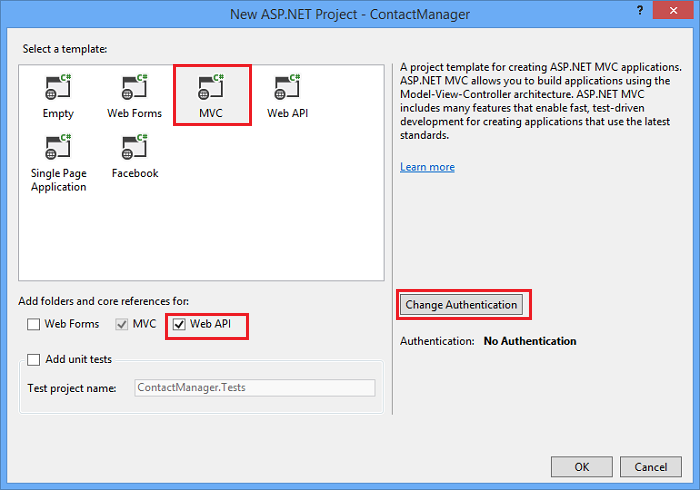
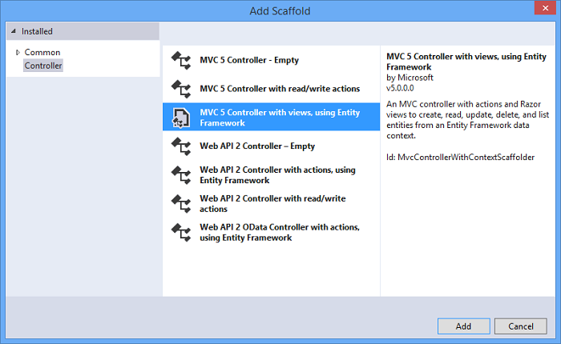

<properties 
	pageTitle="在 Azure Web 应用中使用 ASP.NET Web API 和 SQL 数据库创建 REST 服务" 
	description="本教程将向您介绍如何通过使用 Visual Studio 将使用 ASP.NET Web API 的应用程序部署到 Azure Web 应用。" 
	services="app-service\web" 
	documentationCenter=".net" 
	authors="Rick-Anderson" 
	writer="Rick-Anderson" 
	manager="wpickett" 
	editor=""/>

<tags
	ms.service="app-service-web"
	ms.date="02/29/2016"
	wacn.date="05/30/2016"/>

# 在 Azure Web 应用中使用 ASP.NET Web API 和 SQL 数据库创建 REST 服务

本教程介绍如何使用 Visual Studio 2013 或 Visual Studio 2013 Community Edition 中的“发布 Web”向导将 ASP.NET Web 应用部署到 [Azure Web 应用](/documentation/services/web-sites/)。

你可以免费注册一个 Azure 帐户，而且，如果你还没有 Visual Studio 2013，则此 SDK 会自动安装 Visual Studio 2013 for Web Express。这样你就能够完全免费地开始针对 Azure 进行开发了。

本教程假定你之前未使用过 Azure。完成本教程之后，你将能够在云中启动并运行简单的 Web 应用。
 
学习内容：

* 如何通过安装 Azure SDK 来让你的计算机可以进行 Azure 开发。
* 如何创建 Visual Studio ASP.NET MVC 5 项目并将其发布到 Azure 应用。
* 如何使用 ASP.NET Web API 实现 Restful API 调用。
* 如何使用 SQL 数据库在 Azure 中存储数据。
* 如何将应用程序更新发布到 Azure。

你将生成一个简单的联系人列表 Web 应用，该 Web 应用基于 ASP.NET MVC 5 构建并使用 ADO.NET Entity Framework 进行数据库访问。下图演示了完整的应用程序：

![ Web 应用屏幕截图][intro001]

[AZURE.INCLUDE [create-account-and-websites-note](../includes/create-account-and-websites-note.md)]

### 创建项目

1. 启动 Visual Studio 2013。
1. 在“文件”菜单中，单击“新建项目”。
3. 在“新建项目”对话框中，展开“Visual C#”并选择“Web”，然后选择“ASP.NET Web 应用”。将该应用程序命名为 **ContactManager**，然后单击“确定”。

	

1. 在“新建 ASP.NET 项目”对话框中，选择“MVC”模板，选中“Web API”，确保“在云中托管”处于未选中状态，然后单击“确定”。

	

如果你在 Azure 中还没有 Web 应用，则可以转到 [Azure 经典管理门户](http://manage.windowsazure.cn)创建一个。创建 Web 应用后，请转到“仪表板”，在“速览”下可以下载发布配置文件。在本文的发布部分中，你将需要它。

如果你有数据库服务器，请使用它来创建新的数据库。数据库服务器是非常宝贵的资源，而且你通常会想要在同一台服务器上创建多个数据库来进行测试和开发，而不是在每个数据库中各创建一个数据库服务器。请确保你的 Web 应用和数据库位于相同区域中。

### 设置页眉和页脚

1. 在“解决方案资源管理器”中，展开 *Views\\Shared* 文件夹并打开 *\_Layout.cshtml* 文件。

	![\_Layout.cshtml in Solution Explorer][newapp004]

1. 将 *Views\\Shared\_Layout.cshtml* 文件的内容替换为以下代码：

		<!DOCTYPE html>
		<html lang="en">
		<head>
		    <meta charset="utf-8" />
		    <title>@ViewBag.Title - Contact Manager</title>
		    <link href="~/favicon.ico" rel="shortcut icon" type="image/x-icon" />
		    <meta name="viewport" content="width=device-width" />
		    @Styles.Render("~/Content/css")
		    @Scripts.Render("~/bundles/modernizr")
		</head>
		<body>
		    <header>
		        

		            

		                
@Html.ActionLink("Contact Manager", "Index", "Home")

		            

		        

		    </header>
		    

		        @RenderSection("featured", required: false)
		        <section class="content-wrapper main-content clear-fix">
		            @RenderBody()
		        </section>
		    

		    <footer>
		        

		            

		                
&copy; @DateTime.Now.Year - Contact Manager

		            

		        

		    </footer>
		    @Scripts.Render("~/bundles/jquery")
		    @RenderSection("scripts", required: false)
		</body>
		</html>
			
上面的标记会将应用程序名称从 "My ASP.NET App" 更改为 "Contact Manager"，并移除到“主页”、“关于”以及“联系人”的链接。

### 在本地运行应用程序

1. 按 Ctrl+F5 运行应用程序。
随后在默认浏览器中显示该应用程序主页。

	

这就是你创建将要部署到 Azure 的应用程序目前所需的全部操作。稍后你将添加数据库功能。

## 将应用程序部署到 Azure

1. 在 Visual Studio 中，在“解决方案资源管理器”中右键单击该项目，从上下文菜单中选择“发布”。

	![项目上下文菜单中的“发布”][PublishVSSolution]

	“发布 Web”向导将打开。

12. 单击“发布”。点击“导入”，并选择之前下载的“发布配置文件”。

	

	Visual Studio 开始执行将文件复制到 Azure 服务器的过程。“输出”窗口将显示已执行的部署操作并报告已成功完成部署。

14. 默认浏览器会自动打开，并指向所部署站点的 URL。

	你创建的应用程序现在在云中运行。
	
	![在 Azure 中运行的待办事项列表主页][rxz2]

## 向应用程序添加数据库

接下来，你将更新 MVC 应用程序以添加显示和更新联系人以及在数据库中存储数据的功能。应用程序将使用 Entity Framework 创建数据库并读取和更新数据库中的数据。

### 为联系人添加数据模型类

首先，使用代码创建一个简单的数据模型。

1. 在“解决方案资源管理器”中，右键单击 Models 文件夹，单击“添加”，然后单击“类”。

	![Models 文件夹上下文菜单中的“添加类”][adddb001]

2. 在“添加新项”对话框中，将新的类文件命名为 *Contact.cs* ，然后单击“添加”。

	![“添加新项”对话框][adddb002]

3. 将 Contacts.cs 文件的内容替换为以下代码。

		using System.Globalization;
		namespace ContactManager.Models
		{
    		public class Contact
   			{
        		public int ContactId { get; set; }
				public string Name { get; set; }
				public string Address { get; set; }
	        	public string City { get; set; }
				public string State { get; set; }
				public string Zip { get; set; }
				public string Email { get; set; }
				public string Twitter { get; set; }
				public string Self
        		{
            		get { return string.Format(CultureInfo.CurrentCulture,
				         "api/contacts/{0}", this.ContactId); }
            		set { }
        		}
    		}
		}

**Contact** 类定义你将为每个联系人存储的数据以及数据库需要的主键 ContactID。你可以在本教程末尾的[后续步骤](#nextsteps)部分中获取有关数据模型的详细信息。

### 创建使应用程序用户可以使用联系人的网页

ASP.NET MVC 基架功能可以自动生成用于执行创建、读取、更新和删除 (CRUD) 操作的代码。

## 为数据添加控制器和视图

1. 在“解决方案资源管理器”中，展开“控制器”文件夹。

3. 生成项目 **(Ctrl+Shift+B)**。（在使用基架机制前必须生成项目。）

4. 右键单击“控制器”文件夹，单击“添加”，然后单击“控制器”。

	![Controllers 文件夹上下文菜单中的“添加控制器”][addcode001]

1. 在“添加基架”对话框中，选择“包含视图的 MVC 控制器(使用 Entity Framework)”并单击“添加”。

	

6. 将控制器名设置为 **HomeController**。选择“联系人”作为模型类。单击“新建数据上下文”按钮并接受默认的“ContactManager.Models.ContactManagerContext”为“新的数据上下文类型”。单击**“添加”**。

	将出现一个提示对话框：“名为 HomeController 的文件已存在。是否希望将其替换？”。单击**“是”**。我们正在覆盖使用新项目创建的主控制器。我们将为联系人列表使用新的主控制器。

	Visual Studio 将为 **Contact** 对象的 CRUD 数据库操作创建控制器方法和视图。

## 启用迁移、创建数据库、添加示例数据和数据初始值设定项 ##

接下来的任务是启用 [Code First 迁移](http://curah.microsoft.com/55220)功能以便基于你创建的数据模型创建数据库。

1. 在“工具”菜单中，依次选择“库包管理器”和“包管理器控制台”。

	![“工具”菜单中的“程序包管理器控制台”][addcode008]

2. 在“包管理器控制台”窗口中，输入以下命令：

		enable-migrations 
  
	**enable-migrations** 命令将创建一个 *Migrations* 文件夹，并在该文件夹中放入一个可编辑以配置 Migrations 的 *Configuration.cs* 文件。

2. 在“包管理器控制台”窗口中，输入以下命令：

		add-migration Initial

	**add-migration Initial** 命令将生成一个创建数据库的名为 **&lt;date\_stamp&gt;Initial** 的类。第一个参数 (*Initial*) 是任意参数并将用于创建文件名称。你可以在“解决方案资源管理器”中查看新的类文件。

	在 **Initial** 类中，**Up** 方法用于创建 Contacts 表，而 **Down** 方法（在你想要返回到以前的状态时使用）用于删除该表。

3. 打开 *Migrations\\Configuration.cs* 文件。

4. 添加以下命名空间。

    	 using ContactManager.Models;

5. 将 *Seed* 方法替换为以下代码：
		
        protected override void Seed(ContactManager.Models.ContactManagerContext context)
        {
            context.Contacts.AddOrUpdate(p => p.Name,
               new Contact
               {
                   Name = "Debra Garcia",
                   Address = "1234 Main St",
                   City = "Redmond",
                   State = "WA",
                   Zip = "10999",
                   Email = "debra@example.com",
                   Twitter = "debra_example"
               },
                new Contact
                {
                    Name = "Thorsten Weinrich",
                    Address = "5678 1st Ave W",
                    City = "Redmond",
                    State = "WA",
                    Zip = "10999",
                    Email = "thorsten@example.com",
                    Twitter = "thorsten_example"
                },
                new Contact
                {
                    Name = "Yuhong Li",
                    Address = "9012 State st",
                    City = "Redmond",
                    State = "WA",
                    Zip = "10999",
                    Email = "yuhong@example.com",
                    Twitter = "yuhong_example"
                },
                new Contact
                {
                    Name = "Jon Orton",
                    Address = "3456 Maple St",
                    City = "Redmond",
                    State = "WA",
                    Zip = "10999",
                    Email = "jon@example.com",
                    Twitter = "jon_example"
                },
                new Contact
                {
                    Name = "Diliana Alexieva-Bosseva",
                    Address = "7890 2nd Ave E",
                    City = "Redmond",
                    State = "WA",
                    Zip = "10999",
                    Email = "diliana@example.com",
                    Twitter = "diliana_example"
                }
                );
        }

	上面这段代码将用联系人信息初始化数据库。有关对数据库进行种子设定的更多信息，请参阅调试 [Entity Framework (EF) 数据库](http://blogs.msdn.com/b/rickandy/archive/2013/02/12/seeding-and-debugging-entity-framework-ef-dbs.aspx)。

1. 在“包管理器控制台”中输入以下命令：

		update-database

	![“程序包管理器控制台”命令][addcode009]

	**update-database** 用于运行将创建数据库的初始迁移。默认情况下，将以 SQL Server Express LocalDB 数据库的形式创建数据库。

1. 按 Ctrl+F5 运行应用程序。

应用程序将显示种子数据并提供编辑、详细信息和删除链接。

![数据的 MVC 视图][rxz3]

## 编辑视图

1. 打开 *Views\\Home\\Index.cshtml* 文件。在下一步中，我们将生成的标记替换为使用 [jQuery](http://jquery.com/) 和 [Knockout.js](http://knockoutjs.com/) 的代码。此新代码将使用 Web API 和 JSON 检索联系人列表，然后使用 knockout.js 将联系人数据绑定至 UI。有关详细信息，请参阅本教程末尾的[后续步骤](#nextsteps)部分。 

2. 将文件的内容替换为以下代码。

		@model IEnumerable<ContactManager.Models.Contact>
		@{
		    ViewBag.Title = "Home";
		}
		@section Scripts {
		    @Scripts.Render("~/bundles/knockout")
		    
		}
		<ul id="contacts" data-bind="foreach: contacts">
		    <li class="ui-widget-content ui-corner-all">
		        <h1 data-bind="text: Name" class="ui-widget-header"></h1>
		        

		        

		            ,
		            
		            
		        

		        

		        
Email?

		        

		        
Twitter?

		        
<a data-bind="attr: { href: Self }, click: $root.removeContact" class="removeContact ui-state-default ui-corner-all">Remove</a>

		    </li>
		</ul>
		<form id="addContact" data-bind="submit: addContact">
		    <fieldset>
		        <legend>Add New Contact</legend>
		        <ol>
		            <li>
		                <label for="Name">Name</label>
		                <input type="text" name="Name" />
		            </li>
		            <li>
		                <label for="Address">Address</label>
		                <input type="text" name="Address" >
		            </li>
		            <li>
		                <label for="City">City</label>
		                <input type="text" name="City" />
		            </li>
		            <li>
		                <label for="State">State</label>
		                <input type="text" name="State" />
		            </li>
		            <li>
		                <label for="Zip">Zip</label>
		                <input type="text" name="Zip" />
		            </li>
		            <li>
		                <label for="Email">E-mail</label>
		                <input type="text" name="Email" />
		            </li>
		            <li>
		                <label for="Twitter">Twitter</label>
		                <input type="text" name="Twitter" />
		            </li>
		        </ol>
		        <input type="submit" value="Add" />
		    </fieldset>
		</form>

3. 右键单击 Content 文件夹并单击“添加”，然后单击“新建项...”。

	![在 Content 文件夹上下文菜单中添加样式表][addcode005]

4. 在“添加新项”对话框中，在右上的搜索框中输入 **Style**，然后选择“样式表”。
	![“添加新项”对话框][rxStyle]

5. 将文件命名为 *Contacts.css* 并单击“添加”。将文件的内容替换为以下代码。
    
        .column {
            float: left;
            width: 50%;
            padding: 0;
            margin: 5px 0;
        }
        form ol {
            list-style-type: none;
            padding: 0;
            margin: 0;
        }
        form li {
            padding: 1px;
            margin: 3px;
        }
        form input[type="text"] {
            width: 100%;
        }
        #addContact {
            width: 300px;
            float: left;
            width:30%;
        }
        #contacts {
            list-style-type: none;
            margin: 0;
            padding: 0;
            float:left;
            width: 70%;
        }
        #contacts li {
            margin: 3px 3px 3px 0;
            padding: 1px;
            float: left;
            width: 300px;
            text-align: center;
            background-image: none;
            background-color: #F5F5F5;
        }
        #contacts li h1
        {
            padding: 0;
            margin: 0;
            background-image: none;
            background-color: Orange;
            color: White;
            font-family: Trebuchet MS, Tahoma, Verdana, Arial, sans-serif;
        }
        .removeContact, .viewImage
        {
            padding: 3px;
            text-decoration: none;
        }

	该样式表将用作联系人管理器应用程序的布局、颜色和样式。

6. 打开 *App\_Start\\BundleConfig.cs* 文件。

7. 添加以下代码以注册 [Knockout](http://knockoutjs.com/index.html "KO") 插件。

		bundles.Add(new ScriptBundle("~/bundles/knockout").Include(
		            "~/Scripts/knockout-{version}.js"));
	此示例使用 knockout 来简化处理屏幕模板的动态 JavaScript 代码。

8. 修改 contents/css 条目以注册 *contacts.css* 样式表。将以下行

                 bundles.Add(new StyleBundle("~/Content/css").Include(
                   "~/Content/bootstrap.css",
                   "~/Content/site.css"));
更改为：

        bundles.Add(new StyleBundle("~/Content/css").Include(
                   "~/Content/bootstrap.css",
                   "~/Content/contacts.css",
                   "~/Content/site.css"));

1. 在“程序包管理器控制台”中运行以下命令以安装 Knockout。

		Install-Package knockoutjs

## 为 Web API Restful 接口添加控制器

1. 在“解决方案资源管理器”中，右键单击“控制器”，然后依次单击“添加”和“控制器....”。 

1. 在“添加基架”对话框中，进入“包含操作的 Web API 2 控制器(使用 Entity Framework)”并单击“添加”。

	

4. 在“添加控制器”对话框中，输入“ContactsController”作为控制器名称。为“模型类”选择“Contact (ContactManager.Models)”。保留“数据上下文类”的默认值。

6. 单击**“添加”**。

### 在本地运行应用程序

1. 按 Ctrl+F5 运行应用程序。

	![索引页面][intro001]

2. 输入联系人信息并单击“添加”。该应用程序将返回主页并显示刚才输入的联系人信息。

	![包含待办事项列表项的索引页面][addwebapi004]

3. 在浏览器中，将 **/api/contacts** 追加到 URL。

	生成的 URL 将类似于 http://localhost:1234/api/contacts。添加的 RESTful Web API 将返回存储的联系人。Firefox 和 Chrome 将以 XML 格式显示数据。

	![包含待办事项列表项的索引页面][rxFFchrome]
	

	IE 将提示你打开或保存联系人。

	![Web API 保存对话框][addwebapi006]
	
	
	你可以在记事本或浏览器中打开返回的联系人。
	
	此输出可由另一个应用程序（如移动 Web 页面或应用程序）使用。

	![Web API 保存对话框][addwebapi007]

	**安全警告**：此时，你的应用程序是不安全的，而且容易受到 CSRF 攻击。本教程稍后部分将将解决这一漏洞。有关详细信息，请参阅[防止跨站点请求伪造 (CSRF) 攻击][prevent-csrf-attacks]。
## 添加 XSRF 保护

跨站点请求伪造（也称为 XSRF 或 CSRF）是一种针对 Web 托管型应用程序的攻击，恶意 Web 应用凭此可以影响客户端浏览器与受该浏览器信任的 Web 应用之间的交互。这些攻击出现的原因可能是 Web 浏览器针对每一个对 Web 应用的请求自动发送身份验证令牌。典型示例是身份验证 cookie，如 ASP.NET 的表单身份验证票证。然而，使用任何持久身份验证（如 Windows Authentication、Basic 等）的 Web 应用也可能成为受攻击目标。

XSRF 攻击不同于网络钓鱼攻击。网络钓鱼攻击需要与受害者进行交互。在网络钓鱼攻击中，恶意 Web 应用将仿冒目标 Web 应用，受到欺骗的受害者会向攻击者提供敏感信息。在 XSRF 攻击中，通常不必与受害者进行交互。相反，浏览器自动向目标 Web 应用发送所有相关 Cookie 为攻击者提供了可乘之机。

有关详细信息，请参阅[打开 Web 应用安全项目](https://www.owasp.org/index.php/Main_Page) (OWASP) [XSRF](https://www.owasp.org/index.php/Cross-Site_Request_Forgery_(CSRF))。

1. 在“解决方案资源管理器”中，右键单击“ContactManager”项目并单击“添加”，然后单击“类”。

2. 将文件命名为 *ValidateHttpAntiForgeryTokenAttribute.cs* 并添加以下代码：

        using System;
        using System.Collections.Generic;
        using System.Linq;
        using System.Net;
        using System.Net.Http;
        using System.Web.Helpers;
        using System.Web.Http.Controllers;
        using System.Web.Http.Filters;
        using System.Web.Mvc;
        namespace ContactManager.Filters
        {
            public class ValidateHttpAntiForgeryTokenAttribute : AuthorizationFilterAttribute
            {
                public override void OnAuthorization(HttpActionContext actionContext)
                {
                    HttpRequestMessage request = actionContext.ControllerContext.Request;
                    try
                    {
                        if (IsAjaxRequest(request))
                        {
                            ValidateRequestHeader(request);
                        }
                        else
                        {
                            AntiForgery.Validate();
                        }
                    }
                    catch (HttpAntiForgeryException e)
                    {
                        actionContext.Response = request.CreateErrorResponse(HttpStatusCode.Forbidden, e);
                    }
                }
                private bool IsAjaxRequest(HttpRequestMessage request)
                {
                    IEnumerable<string> xRequestedWithHeaders;
                    if (request.Headers.TryGetValues("X-Requested-With", out xRequestedWithHeaders))
                    {
                        string headerValue = xRequestedWithHeaders.FirstOrDefault();
                        if (!String.IsNullOrEmpty(headerValue))
                        {
                            return String.Equals(headerValue, "XMLHttpRequest", StringComparison.OrdinalIgnoreCase);
                        }
                    }
                    return false;
                }
                private void ValidateRequestHeader(HttpRequestMessage request)
                {
                    string cookieToken = String.Empty;
                    string formToken = String.Empty;
					IEnumerable<string> tokenHeaders;
                    if (request.Headers.TryGetValues("RequestVerificationToken", out tokenHeaders))
                    {
                        string tokenValue = tokenHeaders.FirstOrDefault();
                        if (!String.IsNullOrEmpty(tokenValue))
                        {
                            string[] tokens = tokenValue.Split(':');
                            if (tokens.Length == 2)
                            {
                                cookieToken = tokens[0].Trim();
                                formToken = tokens[1].Trim();
                            }
                        }
                    }
                    AntiForgery.Validate(cookieToken, formToken);
                }
            }
        }

1. 将以下 *using* 语句添加到联系人控制器以便你可以访问 **[ValidateHttpAntiForgeryToken]** 属性。

		using ContactManager.Filters;

1. 将 **[ValidateHttpAntiForgeryToken]** 属性添加到 **ContactsController** 的 Post 方法以保护其免受 XSRF 威胁。将其添加到 "PutContact"、"PostContact" 和 **DeleteContact** 操作方法。

		[ValidateHttpAntiForgeryToken]
	        public IHttpActionResult PutContact(int id, Contact contact)
	        {

1. 更新 *Views\\Home\\Index.cshtml* 文件的 *Scripts* 部分以包含代码，从而获取 XSRF 令牌。

         @section Scripts {
            @Scripts.Render("~/bundles/knockout")
            
		 }

## 将应用程序更新发布到 Azure 和 SQL 数据库

若要发布应用程序，可重复之前遵循的过程。

1. 在“解决方案资源管理器”中，右键单击项目并选择“发布”。

	![发布][rxP]

5. 单击“导入”，然后选择上面下载的发布配置文件。
	
1. 在 **ContactsManagerContext(ContactsManagerContext)** 之下，单击 **v** 图标将*远程连接字符串*更改为联系人数据库的连接字符串。单击“ContactDB”。

	

7. 选中“执行代码优先迁移(应用程序启动时运行)”复选框。

1. 单击“下一步”，然后单击“预览”。Visual Studio 将显示一个需要添加或更新的文件列表。

8. 单击“发布”。
部署完成后，浏览器将打开该应用程序的主页。

	![没有任何联系人的索引页面][intro001]

	Visual Studio 发布过程自动将部署的 *Web.config* 文件中的连接字符串配置为指向 SQL 数据库。其还配置了代码优先迁移，以在部署后应用程序首次访问数据库时自动将数据库升级至最新版本。

	由于这种配置，通过运行之前创建的 **Initial** 类中的代码，代码优先创建了数据库。其会在应用程序在部署后首次尝试访问数据库时进行。

9. 在本地运行应用程序时按之前所做输入一个联系人以验证数据库部署是否成功。

当看到输入的项得到了保存并显示在联系人管理器页面，你就可以知晓其已存储在数据库中。

![包含联系人的索引页面][addwebapi004]

该应用程序现在是运行在云中，使用 SQL 数据库存储其数据。在 Azure 中测试应用程序完成后，将其删除。该应用程序是公开的并且没有限制访问的机制。

##后续步骤

实际的应用程序需要身份验证和授权，你可以使用成员资格数据库实现此目的。教程[使用 OAuth、成员资格以及 SQL 数据库部署安全的 ASP.NET MVC 应用程序](/documentation/articles/web-sites-dotnet-deploy-aspnet-mvc-app-membership-oauth-sql-database/)基于本教程，其中介绍了如何部署包含成员资格数据库的 Web 应用。

另一种在 Azure 应用程序中存储数据的方法是使用 Azure 存储，该方法以 Blob 和表的形式提供非关系数据存储。以下链接提供了更多有关 Web API、ASP.NET MVC 以及 Window Azure 的信息。
 

* [使用 MVC 的 Entity Framework 入门][EFCodeFirstMVCTutorial]
* [ASP.NET MVC 5 简介](http://www.asp.net/mvc/tutorials/mvc-5/introduction/getting-started)
* [你的第一个 ASP.NET Web API](http://www.asp.net/web-api/overview/getting-started-with-aspnet-web-api/tutorial-your-first-web-api)

本教程和示例应用程序由 [Rick Anderson](http://blogs.msdn.com/b/rickandy/) 在 Tom Dykstra 和 Barry Dorrans 的帮助下编写完成。

请提供有关你喜欢的内容或者你希望看到改善的内容的反馈，不仅关于教程本身，也关于它所演示的产品。你的反馈将帮助我们确定优先改进哪些方面。我们特别希望确定大家对于对配置和部署成员资格数据库的流程进行更多自动化的兴趣有多大。

<!-- bookmarks -->
[Add an OAuth Provider]: #addOauth
[Add Roles to the Membership Database]: #mbrDB
[Create a Data Deployment Script]: #ppd
[Update the Membership Database]: #ppd2
[setupdbenv]: #bkmk_setupdevenv
[setupwindowsazureenv]: #bkmk_setupwindowsazure
[createapplication]: #bkmk_createmvc4app
[deployapp1]: #bkmk_deploytowindowsazure1
[adddb]: #bkmk_addadatabase
[addcontroller]: #bkmk_addcontroller
[addwebapi]: #bkmk_addwebapi
[deploy2]: #bkmk_deploydatabaseupdate

<!-- links -->
[EFCodeFirstMVCTutorial]: http://www.asp.net/mvc/tutorials/getting-started-with-ef-using-mvc/creating-an-entity-framework-data-model-for-an-asp-net-mvc-application
[dbcontext-link]: http://msdn.microsoft.com/zh-cn/library/system.data.entity.dbcontext(v=VS.103).aspx

<!-- images-->
[rxE]: ./media/web-sites-dotnet-rest-service-aspnet-api-sql-database/rxE.png
[rxP]: ./media/web-sites-dotnet-rest-service-aspnet-api-sql-database/rxP.png
[rx22]: ./media/web-sites-dotnet-rest-service-aspnet-api-sql-database/
[rxb2]: ./media/web-sites-dotnet-rest-service-aspnet-api-sql-database/rxb2.png
[rxz]: ./media/web-sites-dotnet-rest-service-aspnet-api-sql-database/rxz.png
[rxzz]: ./media/web-sites-dotnet-rest-service-aspnet-api-sql-database/rxzz.png
[rxz2]: ./media/web-sites-dotnet-rest-service-aspnet-api-sql-database/rxz2.png
[rxz3]: ./media/web-sites-dotnet-rest-service-aspnet-api-sql-database/rxz3.png
[rxStyle]: ./media/web-sites-dotnet-rest-service-aspnet-api-sql-database/rxStyle.png
[rxz4]: ./media/web-sites-dotnet-rest-service-aspnet-api-sql-database/rxz4.png
[rxz44]: ./media/web-sites-dotnet-rest-service-aspnet-api-sql-database/rxz44.png
[rxNewCtx]: ./media/web-sites-dotnet-rest-service-aspnet-api-sql-database/rxNewCtx.png
[rxPrevDB]: ./media/web-sites-dotnet-rest-service-aspnet-api-sql-database/rxPrevDB.png
[rxOverwrite]: ./media/web-sites-dotnet-rest-service-aspnet-api-sql-database/rxOverwrite.png
[rxPWS]: ./media/web-sites-dotnet-rest-service-aspnet-api-sql-database/rxPWS.png
[rxNewCtx]: ./media/web-sites-dotnet-rest-service-aspnet-api-sql-database/rxNewCtx.png
[rxAddApiController]: ./media/web-sites-dotnet-rest-service-aspnet-api-sql-database/rxAddApiController.png
[rxFFchrome]: ./media/web-sites-dotnet-rest-service-aspnet-api-sql-database/rxFFchrome.png
[intro001]: ./media/web-sites-dotnet-rest-service-aspnet-api-sql-database/dntutmobil-intro-finished-web-app.png
[rxCreateWSwithDB]: ./media/web-sites-dotnet-rest-service-aspnet-api-sql-database/rxCreateWSwithDB.png
[setup007]: ./media/web-sites-dotnet-rest-service-aspnet-api-sql-database/dntutmobile-setup-azure-site-004.png
[setup009]: ../Media/dntutmobile-setup-azure-site-006.png
[newapp002]: ./media/web-sites-dotnet-rest-service-aspnet-api-sql-database/dntutmobile-createapp-002.png
[newapp004]: ./media/web-sites-dotnet-rest-service-aspnet-api-sql-database/dntutmobile-createapp-004.png
[firsdeploy007]: ./media/web-sites-dotnet-rest-service-aspnet-api-sql-database/dntutmobile-deploy1-publish-005.png
[firsdeploy009]: ./media/web-sites-dotnet-rest-service-aspnet-api-sql-database/dntutmobile-deploy1-publish-007.png
[adddb001]: ./media/web-sites-dotnet-rest-service-aspnet-api-sql-database/dntutmobile-adddatabase-001.png
[adddb002]: ./media/web-sites-dotnet-rest-service-aspnet-api-sql-database/dntutmobile-adddatabase-002.png
[addcode001]: ./media/web-sites-dotnet-rest-service-aspnet-api-sql-database/dntutmobile-controller-add-context-menu.png
[addcode002]: ./media/web-sites-dotnet-rest-service-aspnet-api-sql-database/dntutmobile-controller-add-controller-dialog.png
[addcode004]: ./media/web-sites-dotnet-rest-service-aspnet-api-sql-database/dntutmobile-controller-modify-index-context.png
[addcode005]: ./media/web-sites-dotnet-rest-service-aspnet-api-sql-database/dntutmobile-controller-add-contents-context-menu.png
[addcode007]: ./media/web-sites-dotnet-rest-service-aspnet-api-sql-database/dntutmobile-controller-modify-bundleconfig-context.png
[addcode008]: ./media/web-sites-dotnet-rest-service-aspnet-api-sql-database/dntutmobile-migrations-package-manager-menu.png
[addcode009]: ./media/web-sites-dotnet-rest-service-aspnet-api-sql-database/dntutmobile-migrations-package-manager-console.png
[addwebapi004]: ./media/web-sites-dotnet-rest-service-aspnet-api-sql-database/dntutmobile-webapi-added-contact.png
[addwebapi006]: ./media/web-sites-dotnet-rest-service-aspnet-api-sql-database/dntutmobile-webapi-save-returned-contacts.png
[addwebapi007]: ./media/web-sites-dotnet-rest-service-aspnet-api-sql-database/dntutmobile-webapi-contacts-in-notepad.png
[Add XSRF Protection]: #xsrf
[WebPIAzureSdk20NetVS12]: ./media/web-sites-dotnet-rest-service-aspnet-api-sql-database/WebPIAzureSdk20NetVS12.png
[添加 XSRF 保护]: #xsrf
[ImportPublishSettings]: ./media/web-sites-dotnet-rest-service-aspnet-api-sql-database/ImportPublishSettings.png
[ImportPublishProfile]: ./media/web-sites-dotnet-rest-service-aspnet-api-sql-database/ImportPublishProfile.png
[PublishVSSolution]: ./media/web-sites-dotnet-rest-service-aspnet-api-sql-database/PublishVSSolution.png
[ValidateConnection]: ./media/web-sites-dotnet-rest-service-aspnet-api-sql-database/ValidateConnection.png
[WebPIAzureSdk20NetVS12]: ./media/web-sites-dotnet-rest-service-aspnet-api-sql-database/WebPIAzureSdk20NetVS12.png
[prevent-csrf-attacks]: http://www.asp.net/web-api/overview/security/preventing-cross-site-request-forgery-(csrf)-attacks
 

<!---HONumber=Mooncake_0118_2016-->