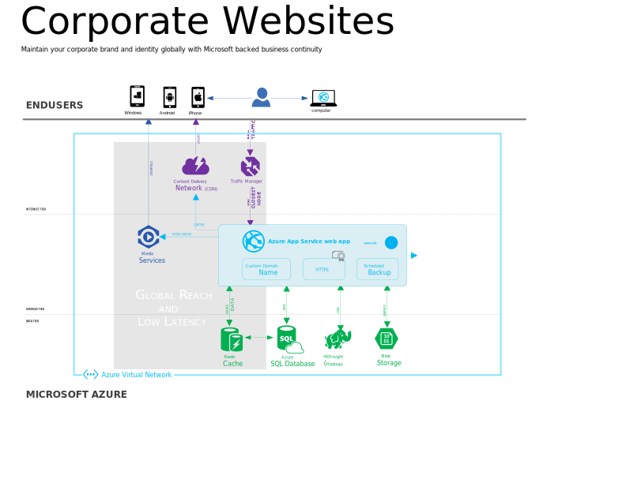

<properties 
	pageTitle="在 Azure Web 应用上打造全球网络影响力" 
	description="本指南提供了如何在 Azure Web 应用上托管您的组织的 (.COM) Web 应用的技术概述。内容包括部署、自定义域、SSL 和监视。" 
	editor="jimbe" 
	manager="wpickett" 
	authors="cephalin" 
	services="app-service\web" 
	documentationCenter=""/>

<tags
	ms.service="app-service-web"
	ms.date="02/26/2016" 
	wacn.date="04/26/2016"/>

# 在 Azure Web 应用上打造全球网络影响力

[Azure Web 应用](/documentation/services/web-sites/) Web 应用提供建立 .COM 站点全球网络影响力所需的全部功能。无论你的组织规模如何，都需要一个稳健、安全且可缩放的平台，以促成业务、品牌认知和客户沟通。Azure Web 应用可以通过 Microsoft 支持的业务连续性，帮助你维护企业的品牌与认知。

以下是在 Azure Web 应用上运行的 .COM Web 应用的示例。该示例演示了只需少量的技术投资，就能结合 Web 应用和其他服务来完成任务。**单击拓扑中的元素可阅读更多相关详细信息。**

<object type="image/svg+xml" data="./media/web-sites-global-web-presence-solution-overview/corp-website-visio.svg" width="100%" height="100%"></object>

> [AZURE.NOTE]本指南介绍了一些与在 Azure 中运行面向公众的 .COM 站点相一致的最常见领域和任务。但是，还有其他你可以在 Azure 中实现的常见解决方案。若要查看这些解决方案，请参阅[数字市场营销活动](/documentation/articles/web-sites-digital-marketing-application-solution-overview/)和[业务应用程序](/documentation/articles/web-sites-business-application-solution-overview/)中的其他指导。

## 从头开始创建或引入现有资产

快速从库中的常用 CMS 创建新的站点或者从各种语言和框架将现有 Web 资产引入到 Azure Web 应用。

你可以使用你最喜欢的 CMS 风格创建 Web 应用。你可以从各种数据库后端选择以满足你的需要，包括 [Azure SQL 数据库]和 [MySQL].

无论你的现有 Web 资产是 .NET、PHP、Java、Node.js 还是 Python，现在都可在 Azure 中运行。你可以使用熟悉的 [FTP] 工具或源代理管理系统将它们移到 Web 应用。 Web 应用支持使用流行的源代码管理选项直接发布，如 [Visual Studio] 和 [Git] - 本地、GitHub、BitBucket、DropBox、Mercurial 等。

## 可靠发布

从现有的原始文件控制系统并实时测试内容，持续地直接发布，可靠地发布 Web 应用。

在站点的计划、原型制作和早期部署过程中，你可以通过[将其部署到 Azure Web 应用上你的站点的过渡槽]，在市场活动应用正式运行前查看该 Web 应用的实际工作版本。通过将源控件与 Web 应用相集成，你可以[连续发布]到过渡槽，并且在准备就绪时，将其切换到生产环境且无需停机。如果生产站点发生问题，你还可以立即换回旧版的站点。

此外，在对实时 Web 应用进行更改规划时，可以轻松地使用生产测试中的功能对建议更新[运行 A/B 测试]，分析真实用户行为，以帮助你对站点设计做出明智的决策。

## 品牌与安全

免费使用 Azure Web 应用域或映射到注册的域名，然后使用 CA 签名的 SSL 证书保护品牌的安全。

当在 Web 应用运行 Web 应用时，可免费使用 ***.chinacloudsites.cn** 域。或者，可以将 Web 应用映射到从任何 DNS 登录获取（如 GoDaddy）的[自定义域] - 例如 contoso.com。

如果收集任何用户信息、执行电子商务或管理任何其他机密数据，可以使用 [HTTPS] 来保护品牌信誉和客户。SSL 证书随附 ***.chinacloudsites.cn** 域名，如果你使用自定义域，可以在 Web 应用中引入该域的 SSL 证书。存在与每个 SSL 证书相关联的每月费用（每小时按比例分摊）。有关详细信息，请参阅 [Azure Web 应用定价详细信息]。

## 转到全局

通过为区域站点提供 Azure 流量管理器服务以及使用 Azure CDN 快速传递内容来转到全局。

若要为在各自区域的全局客户提供服务，使用 [Azure 流量管理器]将站点访问者路由到可以提供最佳性能的地区站点。或者，你可以在多个区域托管的站点的多个副本中均衡分布负载。

通过[将 Web 应用与 Azure CDN 集成]向全局用户快速传递静态内容。Azure CDN 可以缓存离用户最近的 [CDN 节点]中的静态内容，从而最大程度减少了滞后时间和连接到 Web 应用的时间。

## 优化

.COM 站点可通过使用 Autoscale 进行自动缩放，使用 Azure Redis 缓存进行缓存，使用 WebJobs 运行后台任务以及使用 Azure 流量管理器维护高可用性达到优化目的。

Azure Web 应用具有[向上和向外缩放]功能，不论工作负荷的大小如何，都能满足 .COM 站点的需求。通过 [Azure 经典管理门户](https://manage.windowsazure.cn/)手动扩大，通过[服务管理 API] 或 [PowerShell 脚本]以编程方式扩大 Web 应用，或者通过自动缩放功能自动扩大。在“标准”托管计划中，自动缩放功能使你可以基于 CPU 使用率自动扩大 Web 应用。有关最佳实践，请参阅 [Troy Hunt] 的[我所了解的有关使用 Azure 快速缩放 Web 应用的十大事项]。

使用 [Azure Redis 缓存]让你的 Web 应用响应更快。可以利用它从后端数据库和其他操作（如 [ASP.NET 会话状态]和[输出缓存]）缓存数据。

使用 [Azure 流量管理器]维护 Web 应用的高可用性。使用“故障转移”方法，当主站点出现问题时，流量管理器可以自动将流量路由到辅助站点。

## 监视和分析

使用 Azure 或第三方工具让 Web 应用的性能保持最新状态。接收关于关键 Web 应用事件的警报。使用 Application Insight 或 HDInsight 中的 Web 日志分析，让用户可以轻松地深入了解。

可以[快速浏览] Web 应用的当前性能指标以及[Azure 经典管理门户](https://manage.windowsazure.cn/)中 Web 应用边栏选项卡中的资源配额。有关应用程序的可用性、性能和使用情况的全面概述，可使用 [Azure Application Insights] 提供的快速且功能强大的故障排除、诊断和使用情况见解进行了解。或者，使用第三方工具提供对 Web 应用的高级数据监视。

在“标准”托管计划中，当站点无法响应时，监视器站点响应能力会收到电子邮件通知。有关详细信息，请参阅[如何：在 Azure 中接收警报通知和管理警报规则]。

## 使用富媒体访问所有设备

使用富媒体改进 .COM 站点的外观，例如：

-  使用 [Azure 媒体服务]全局上载并流式处理视频

## 更多资源

- [Azure Web 应用文档](/home/features/web-site/)
- [Azure Web 博客](/blog/tags/ Web 应用/)

[AZURE.INCLUDE [app-service-web-whats-changed](../includes/app-service-web-whats-changed.md)]

[Azure Websites]: /home/features/web-site/

[MySQL]: /documentation/articles/web-sites-php-mysql-deploy-use-git/
[Azure SQL 数据库]: /documentation/articles/web-sites-dotnet-deploy-aspnet-mvc-app-membership-oauth-sql-database/
[FTP]: /documentation/articles/web-sites-deploy/#ftp
[Visual Studio]: /documentation/articles/web-sites-dotnet-get-started/
[Git]: /documentation/articles/web-sites-publish-source-control/

[将其部署到 Azure Web 应用上你的站点的过渡槽]: /documentation/articles/web-sites-staged-publishing/
[连续发布]: http://rickrainey.com/2014/01/21/continuous-deployment-github-with-azure-web-sites-and-staged-publishing/
[运行 A/B 测试]: http://blogs.msdn.com/b/tomholl/archive/2014/11/10/a-b-testing-with-azure-websites.aspx

[自定义域]: /documentation/articles/web-sites-custom-domain-name/
[HTTPS]: /documentation/articles/web-sites-configure-ssl-certificate/
[Azure Web 应用定价详细信息]: /home/features/web-site/pricing/

[Azure 流量管理器]: http://www.hanselman.com/blog/CloudPowerHowToScaleAzureWebsitesGloballyWithTrafficManager.aspx
[将 Web 应用与 Azure CDN 集成]: /documentation/articles/cdn-websites-with-cdn/
[CDN 节点]: https://msdn.microsoft.com/zh-cn/library/azure/gg680302.aspx

[向上和向外缩放]: /documentation/articles/web-sites-scale/
[Azure Management Portal]: http://manage.windowsazure.cn/
[服务管理 API]: https://msdn.microsoft.com/zh-cn/library/azure/ee460799.aspx
[PowerShell 脚本]: https://msdn.microsoft.com/zh-cn/library/azure/jj152841.aspx
[Troy Hunt]: https://twitter.com/troyhunt
[我所了解的有关使用 Azure 快速缩放 Web 应用的十大事项]: http://www.troyhunt.com/2014/09/10-things-i-learned-about-rapidly.html
[Azure Redis 缓存]: /blog/2014/06/05/mvc-movie-app-with-azure-redis-cache-in-15-minutes/
[ASP.NET 会话状态]: https://msdn.microsoft.com/zh-cn/library/azure/dn690522.aspx
[输出缓存]: https://msdn.microsoft.com/zh-cn/library/azure/dn798898.aspx

[快速浏览]: /documentation/articles/web-sites-monitor/
[Azure Application Insights]: http://blogs.msdn.com/b/visualstudioalm/archive/2015/01/07/application-insights-and-azure-websites.aspx
[如何：在 Azure 中接收警报通知和管理警报规则]: http://msdn.microsoft.com/zh-cn/library/azure/dn306638.aspx

[Azure 媒体服务]: http://blogs.technet.com/b/cbernier/archive/2013/09/03/windows-azure-media-services-and-web-sites.aspx

 

<!---HONumber=82-->