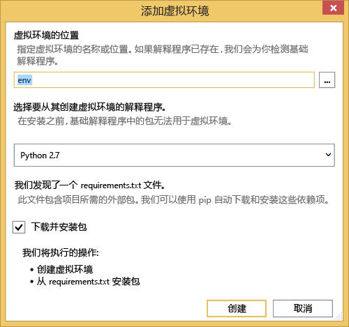
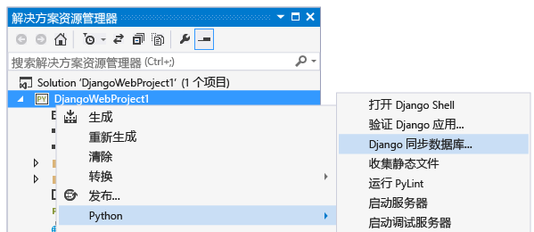
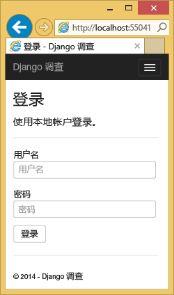
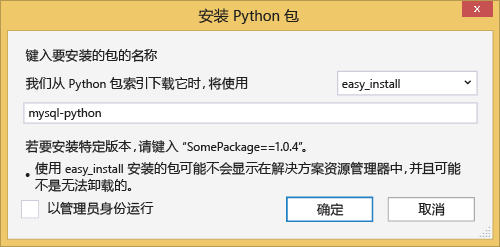
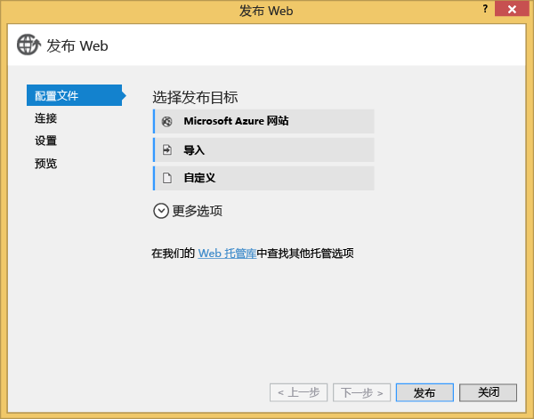
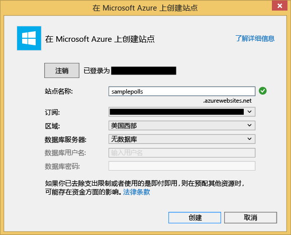

<properties 
	pageTitle="具有 Python Tools 2.1 for Visual Studio 的 Azure 上的 Django 和 MySQL" 
	description="了解如何使用 Python Tools for Visual Studio 来创建在 MySQL 数据库实例中存储数据的 Django Web 应用，以及将应用部署到 Azure 网站中。" 
	services="app-service\web" 
	documentationCenter="python" 
	authors="huguesv" 
	manager="wpickett" 
	editor=""/>

<tags 
	ms.service="app-service-web" 
	ms.date="08/30/2015"
	wacn.date="11/02/2015"/>
# 具有 Python Tools 2.2 for Visual Studio 的 Azure 上的 Django 和 MySQL 

> [AZURE.SELECTOR]
- [.Net](/documentation/articles/web-sites-dotnet-get-started)
- [Node.js](/documentation/articles/web-sites-nodejs-develop-deploy-mac)
- [Java](/documentation/articles/web-sites-java-get-started)
- [PHP - Git](/documentation/articles/web-sites-php-mysql-deploy-use-git)
- [PHP - FTP](/documentation/articles/web-sites-php-mysql-deploy-use-ftp)
- [Python](/documentation/articles/web-sites-python-ptvs-django-mysql)

在本教程中，我们将使用 [Python Tools for Visual Studio] 通过一个 PTVS 样本模板创建简单的轮询 Web 应用。

我们将了解如何使用在 Azure 上托管的 MySQL 服务、如何将 Web 应用配置为使用 MySQL，以及如何将 Web 应用发布到 [Azure 网站](/documentation/services/web-sites/)中。

请参阅 [Python 开发人员中心]以获取更多文章，这些文章介绍了如何通过 PTVS（使用 Bottle、Flask 和 Django Web 框架）、MongoDB、Azure 表存储、MySQL 和 SQL 数据库服务来开发 Azure 网站。虽然本文将着重介绍 Azure 网站，但 [Azure 云服务]的开发步骤也是类似的。

+ [先决条件](#prerequisites)
+ [创建项目](#create-the-project)
+ [创建 MySQL 数据库](#create-a-mysql-database)
+ [配置项目](#configure-the-project)
+ [发布到 Azure 网站](#publish-to-an-azure-website)
+ [后续步骤](#next-steps)

##先决条件

 - Visual Studio 2013 或 2015
 - [Python Tools 2.2 for Visual Studio]
 - [Python Tools 2.2 for Visual Studio 示例 VSIX]
 - [Azure SDK Tools for VS 2013] 或 [Azure SDK Tools for VS 2015]
 - [Python 2.7（32 位）]

[AZURE.INCLUDE [create-account-and-websites-note](../includes/create-account-and-websites-note.md)]

## 创建项目

在此部分中，我们将使用样本模板创建 Visual Studio 项目。我们将创建虚拟环境并安装所需软件包。我们将创建一个使用 sqlite 的本地数据库。然后我们将在本地运行应用程序。

1.  在 Visual Studio 中，依次选择“文件”和“新建项目”。

1.  您可以在“Python”>“样本”下获得 PTVS 样本 VSIX 中的项目模板。选择“轮询 Django Web 项目”，然后单击“确定”创建项目。

  	

1.  系统将提示您安装外部软件包。选择**安装到虚拟环境**。

  	

1.  选择“Python 2.7”作为基础解释器。

  	

1.  右键单击项目节点，然后依次选择“Python”和“Django 同步数据库”。

  	

1.  这将打开 Django 管理控制台。按照提示操作以创建一个用户。

    这将在项目文件夹中创建一个 sqlite 数据库。

  	

1.  按 <kbd>F5</kbd> 确认应用程序能否正常运行。

1.  单击顶部导航栏中的“登录”。

  	

1.  输入您同步数据库时创建的用户的凭证。

  	

1.  单击“创建样本轮询”。

  	

1.  单击轮询并进行投票。

  	

## 创建 MySQL 数据库

对于数据库，我们将在 Azure 上创建 ClearDB MySQL 托管数据库。

作为替代方法，可以在 Azure 上创建自己的虚拟机，然后亲自安装和管理 MySQL。

可以通过执行以下步骤以免费计划创建数据库。

1.  登录 [Azure 门户]。

1.  在导航窗格的底部，单击**新建**。

1.  依次单击“数据服务”、“Azure 上的 MySQL 数据库”和“快速创建”。

1.  使用名称、版本等进行填充，然后单击“创建”。

## 配置项目

在此部分中，我们将把 Web 应用配置为使用我们刚刚创建的 MySQL 数据库。我们还将安装使用具有 Django 的 MySQL 数据库所需的其他 Python 软件包。然后，我们将在本地运行 Web 应用。

1.  在 Visual Studio 中，打开“项目名称” 文件夹中的 **settings.py**。暂时将连接字符串粘贴在编辑器中。连接字符串是按以下格式：

        Database=<NAME>;Data Source=<HOST>;User Id=<USER>;Password=<PASSWORD>

    将默认数据库**引擎**更改为使用 MySQL，然后在“连接字符串”中设置“名称”、“用户”、“密码”和“主机”的值。

        DATABASES = {
            'default': {
                'ENGINE': 'django.db.backends.mysql',
                'NAME': '<Database>',
                'USER': '<User Id>',
                'PASSWORD': '<Password>',
                'HOST': '<Data Source>',
                'PORT': '',
            }
        }

1.  在“解决方案资源管理器”的“Python 环境”下，右键单击虚拟环境，然后选择“安装 Python 包”。

1. 使用 **easy_install** 安装包 `mysql-python`。

  	

1.  右键单击项目节点，然后依次选择“Python”和“Django 同步数据库”。

    这将创建我们在上一节中创建的 MySQL 数据库的表。按照提示操作以创建用户，其并不一定要匹配第一节中创建的 sqlite 数据库中的用户。

  	

1.  使用 `F5` 运行应用程序。使用“创建样本轮询”创建的轮询以及通过投票提交的数据会在 MySQL 数据库中进行序列化。

## 将 Web 应用发布到 Azure 网站

借助 Azure.NET SDK，你可以轻松地将 Web 应用部署到 Azure 网站中。

1.  在“解决方案资源管理器”中，右键单击项目节点，然后选择“发布”。

  	

1.  单击“Windows Azure Web 应用”。

1.  单击“新建”，新建一个 Web 应用。

1.  填写以下字段，然后单击“创建”。
	-	**Web 应用名称**
	-	**Azure 网站计划**
	-	**资源组**
	-	**区域**
	-	保持“数据库服务器”的“无数据库”设置不变

  	<!--  -->

1.  接受其他所有默认值，然后单击**发布**。

1.  此时，您的 Web 浏览器会自动打开已发布的 Web 应用。您应该会看到 Web 应用使用在 Azure 上托管的 **MySQL** 数据库按预期方式运行。

    祝贺你！

  	

## 后续步骤

请按照下面的链接以了解有关 Python Tools for Visual Studio、Django 和 MySQL 的更多信息。

- [Python Tools for Visual Studio 文档]
  - [Web 项目]
  - [云服务项目]
  - [在 Windows Azure 上进行远程调试]
- [Django 文档]
- [MySQL]

<!--Link references-->
[Python 开发人员中心]: /develop/python/
[Azure 云服务]: /documentation/articles/cloud-services-python-ptvs
<!--External Link references-->
[Azure 门户]: https://manage.windowsazure.cn
[Python Tools for Visual Studio]: http://aka.ms/ptvs
[Python Tools 2.2 for Visual Studio]: http://go.microsoft.com/fwlink/?LinkID=624025
[Python Tools 2.2 for Visual Studio 示例 VSIX]: http://go.microsoft.com/fwlink/?LinkID=624025
[Azure SDK Tools for VS 2013]: http://go.microsoft.com/fwlink/?LinkId=323510
[Azure SDK Tools for VS 2015]: http://go.microsoft.com/fwlink/?LinkId=518003
[Python 2.7（32 位）]: http://go.microsoft.com/fwlink/?LinkId=517190
[Python Tools for Visual Studio 文档]: http://pytools.codeplex.com/documentation
[在 Windows Azure 上进行远程调试]: http://pytools.codeplex.com/wikipage?title=Features%20Azure%20Remote%20Debugging
[Web 项目]: http://pytools.codeplex.com/wikipage?title=Features%20Web%20Project
[云服务项目]: http://pytools.codeplex.com/wikipage?title=Features%20Cloud%20Project
[Django 文档]: https://www.djangoproject.com/
[MySQL]: http://www.mysql.com/
 

<!---HONumber=76-->