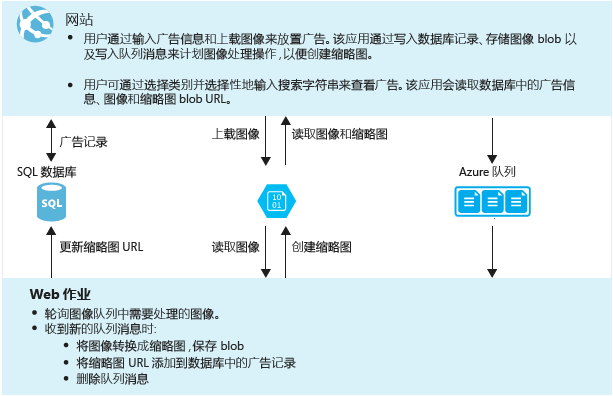
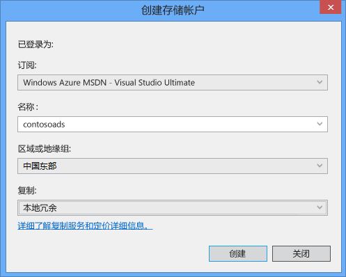
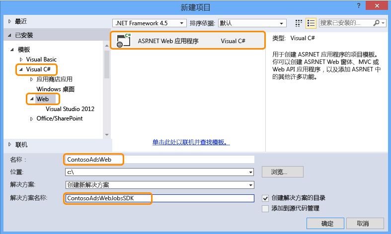

<properties
	pageTitle="在 Azure 中创建 .NET Web 作业 | Azure"
	description="使用 ASP.NET MVC 和 Azure 创建多层应用。前端在 Azure 中的 Web 应用中运行，后端以 Web 作业的形式运行。应用程序使用实体框架、SQL 数据库和 Azure 存储队列和 Blob。"
	services="app-service"
	documentationCenter=".net"
	authors="tdykstra"
	manager="wpickett"
	editor="mollybos"/>

<tags
	ms.service="app-service"
	ms.date="06/01/2016"
	wacn.date="07/04/2016"/>

# 在 Azure Web 应用中创建 .NET Web 作业

本教程说明了如何为使用 [WebJobs SDK](/documentation/articles/websites-dotnet-webjobs-sdk/) 的简单多层 ASP.NET MVC 5 应用程序编写代码。

[WebJobs SDK](/documentation/articles/websites-webjobs-resources/) 的用途是简化针对 Web 作业可以执行的常见任务（例如，图像处理、队列处理、RSS 聚合、文件维护和发送电子邮件）编写的代码。WebJobs SDK 中的内置功能使用 Azure 存储空间和 Service Bus，用于计划任务和处理错误，以及用于许多其他常见方案。此外，它还设计为可扩展并且有[用于扩展的开源存储库](https://github.com/Azure/azure-webjobs-sdk-extensions/wiki/Binding-Extensions-Overview)。

示例应用程序是一个广告公告板。用户可以上载广告的图像，后端进程会将图像转换成缩略图。广告列表页将显示缩略图，而广告详细信息页则显示完整大小的图像。下面是屏幕快照：

此示例应用程序可以处理 [Azure 队列](http://www.asp.net/aspnet/overview/developing-apps-with-windows-azure/building-real-world-cloud-apps-with-windows-azure/queue-centric-work-pattern) 和 [Azure blob](http://www.asp.net/aspnet/overview/developing-apps-with-windows-azure/building-real-world-cloud-apps-with-windows-azure/unstructured-blob-storage)。本教程说明了如何将应用程序部署到 [Azure Web 应用](/documentation/services/web-sites/)和 [Azure SQL 数据库](/documentation/articles/sql-database-technical-overview/)。

## 先决条件

本教程假设你知道如何处理 Visual Studio 中的 [ASP.NET MVC 5](http://www.asp.net/mvc/tutorials/mvc-5/introduction/getting-started) 项目。

本教程是针对 Visual Studio 2013 编写的。如果你尚未安装 Visual Studio，当你安装 Azure SDK for .NET 时会自动安装 Visual Studio。

本教程可以配合 Visual Studio 2015 使用，但在本地运行应用程序之前，必须将 Web.config 和 App.config 文件中 SQL Server LocalDB 连接字符串的 `Data Source` 部分从 `Data Source=(localdb)\v11.0` 更改为 `Data Source=(LocalDb)\MSSQLLocalDB`。

> [AZURE.NOTE]  你需要一个 Azure 帐户才能完成本教程：
  >
  > + 可以[注册一个 Azure 帐户](/pricing/1rmb-trial/?WT.mc_id=A261C142F)：获取可用来试用付费版 Azure 服务的信用额度，甚至在用完信用额度后，你仍可以保留帐户和使用免费的 Azure 服务（如网站）。你的信用卡将永远不会付费，除非你显式更改设置并要求付费。

## 学习内容

本教程说明如何执行以下任务：

* 通过安装 Azure SDK 来使计算机进行 Azure 开发。
* 创建一个控制台应用程序项目，当你部署关联的 Web 项目时，该应用程序项目将自动部署为 Azure Web 作业。
* 在开发计算机上本地测试 WebJobs SDK 后端。
* 将包含 Web 作业后端的应用程序发布到 Azure 中的 Web 应用。
* 上载文件并将其存储在 Azure Blob 服务中。
* 使用 Azure WebJobs SDK 来处理 Azure 存储队列和 Blob。

## 应用程序体系结构

示例应用程序使用[以队列为中心的工作模式](http://www.asp.net/aspnet/overview/developing-apps-with-windows-azure/building-real-world-cloud-apps-with-windows-azure/queue-centric-work-pattern)来减轻创建缩略图到后端进程的 CPU 密集型工作。

该应用程序将广告存储在 SQL 数据库中，通过使用实体框架 Code First 创建表和访问数据。对于每个广告，数据库存储两个 URL，一个用于完全尺寸的图像，一个用于缩略图。

当用户上载一个图像时，Web 应用将在 [Azure Blob](http://www.asp.net/aspnet/overview/developing-apps-with-windows-azure/building-real-world-cloud-apps-with-windows-azure/unstructured-blob-storage) 中存储图像，并将广告信息存储在带有指向 Blob 的 URL 的数据库中。同时，它将一条消息写入 Azure 队列。在作为 Azure Web 作业运行的后端进程中，WebJobs SDK 将轮询新消息的队列。显示新消息时，Web 作业将创建该图像的缩略图，并为该广告更新缩略图 URL 数据库字段。下图介绍应用程序各部分之间如何交互：

[AZURE.INCLUDE [install-sdk](../includes/install-sdk-2015-2013.md)]

本教程中的说明不适用于 Azure SDK for .NET 2.7.1 或更高版本。

## 创建 Azure 存储帐户

Azure 存储帐户提供在云中存储队列和 Blob 数据的资源。它还由 WebJobs SDK 用来存储仪表板的日志记录数据。

在实际应用程序中，你通常会为记录数据的应用程序数据创建单独的帐户，并且为生产数据的测试数据创建单独帐户。对于本教程，你将只使用一个帐户。

1. 在 Visual Studio 中打开“服务器资源管理器”窗口。

2. 右键单击“Azure”节点，然后单击“连接到 Azure”。

	

3. 使用你的 Azure 凭据登录。

5. 在 Azure 节点下右键单击“存储”，然后单击“创建存储帐户”。

	

3. 在“创建存储帐户”对话框中，输入存储帐户的名称。

	该名称必须是唯一的（其他 Azure 存储帐户都不可以使用该名称）。如果输入的名称已被使用，你可以进行更改。

	用于访问存储帐户的 URL 为 {名称}.core.chinacloudapi.cn。

5. 将“区域或地缘组”设置为离你最近的区域。

	此设置指定哪个 Azure 数据中心将托管你的存储帐户。对于本教程，你做的选择不会带来明显的差异。但是，对于生产 Web 应用，你希望 Web 服务器和存储帐户处于同一区域，以最大程度地减少延迟和数据传出费用。（稍后要创建的）Web 应用数据中心应尽可能靠近访问 Web 应用的浏览器，以最大程度地减少延迟。

6. 将“复制”下拉列表设置为“本地冗余”。

	为存储帐户启用地域复制时，会将存储内容复制到辅助数据中心，这样就能够在主要位置发生重大灾难时将故障转移到该位置。地域复制可能会产生额外的成本。对于测试和开发帐户，你通常不希望因为地域复制而付款。有关详细信息，请参阅[创建、管理或删除存储帐户](/documentation/articles/storage-create-storage-account/#replication-options)。

5. 单击“创建”。

	

## 下载应用程序

1. 下载并解压缩[已完成的解决方案](http://code.msdn.microsoft.com/Simple-Azure-Website-with-b4391eeb)。

2. 启动 Visual Studio。

3. 从“文件”菜单中，选择“打开”>“项目/解决方案”，导航到下载解决方案的位置，然后打开解决方案文件。

4. 按 CTRL+SHIFT+B 生成解决方案。

	默认情况下，Visual Studio 会自动还原 NuGet 包的内容，它未包括在 *.zip* 文件中。如果包未还原，请转到“管理解决方案的 NuGet 程序包”对话框并单击右上角的“还原”按钮手动进行安装。

5. 在“解决方案资源管理器”中，请确保选择“ContosoAdsWeb”作为启动项目。

## 将应用程序配置为使用你的存储帐户

1. 打开 ContosoAdsWeb 项目中的应用程序 *Web.config* 文件。

	该文件包含一个用于处理 Blob 和队列的 SQL 连接字符串和 Azure 存储连接字符串。

	SQL 连接字符串指向 [SQL Server Express LocalDB](http://msdn.microsoft.com/zh-cn/library/hh510202.aspx) 数据库。

	存储连接字符串是一个示例，其中包含存储帐户名称和访问密钥的占位符。你需要将此字符串替换为包含你的存储帐户的名称和密钥的连接字符串。

	<pre class="prettyprint">&lt;connectionStrings>
	  &lt;add name="ContosoAdsContext" connectionString="Data Source=(localdb)\v11.0; Initial Catalog=ContosoAds; Integrated Security=True; MultipleActiveResultSets=True;" providerName="System.Data.SqlClient" />
	  &lt;add name="AzureWebJobsStorage" connectionString="DefaultEndpointsProtocol=https;AccountName=<mark>[accountname]</mark>;AccountKey=<mark>[accesskey]</mark>"/>
	&lt;/connectionStrings></pre>

	存储连接字符串命名为 AzureWebJobsStorage，因为这是 WebJobs SDK 默认情况下使用的名称。此处之所以使用相同的名称，是因为你只需在 Azure 环境中设置一个连接字符串值。

2. 在“服务器资源管理器”中，右键单击存储帐户下的“存储”节点，然后单击“属性”。

	

3. 在“属性”窗口中，单击“存储帐户密钥”，然后单击省略号。

	

4. 复制“连接字符串”。

	

5. 将 *Web.config* 文件中的存储连接字符串替换为你刚刚复制的连接字符串。在粘贴之前，请确保选择引号括住的所有内容，但不包括引号本身。

6. 打开 ContosoAdsWebJob 项目中的 *App.config* 文件。

	此文件包含两个存储连接字符串，一个用于应用程序数据，另一个用于日志记录。可以对应用程序数据和日志记录使用单独的存储帐户，并且可以[对数据使用多个存储帐户](https://github.com/Azure/azure-webjobs-sdk/blob/master/test/Microsoft.Azure.WebJobs.Host.EndToEndTests/MultipleStorageAccountsEndToEndTests.cs)。对于本教程，你将使用单个存储帐户。连接字符串包含存储帐户密钥的占位符。

  	<pre class="prettyprint">&lt;configuration>
	&lt;connectionStrings>
	    &lt;add name="AzureWebJobsDashboard" connectionString="DefaultEndpointsProtocol=https;AccountName=<mark>[accountname]</mark>;AccountKey=<mark>[accesskey]</mark>"/>
	    &lt;add name="AzureWebJobsStorage" connectionString="DefaultEndpointsProtocol=https;AccountName=<mark>[accountname]</mark>;AccountKey=<mark>[accesskey]</mark>"/>
	    &lt;add name="ContosoAdsContext" connectionString="Data Source=(localdb)\v11.0; Initial Catalog=ContosoAds; Integrated Security=True; MultipleActiveResultSets=True;"/>
	&lt;/connectionStrings>
	    &lt;startup>
	        &lt;supportedRuntime version="v4.0" sku=".NETFramework,Version=v4.5" />
	&lt;/startup>
	&lt;/configuration></pre>

	默认情况下，WebJobs SDK 将查找名为 AzureWebJobsStorage 和 AzureWebJobsDashboard 的连接字符串。作为替代方法，你可以根据需要[存储该连接字符串，并显式将它传递给 `JobHost` 对象](/documentation/articles/websites-dotnet-webjobs-sdk-storage-queues-how-to/#config)。

7. 将两个存储连接字符串替换为先前复制的连接字符串。

8. 保存所做更改。

## 在本地运行应用程序

1. 若要启动应用程序的 Web 前端，请按 CTRL+F5。

	默认浏览器将打开主页。（Web 项目将会运行，因为你已将它设为启动项目。）

	

2. 若要启动应用程序的 Web 作业后端，请在“解决方案资源管理器”中右键单击 ContosoAdsWebJob 项目，然后单击“调试”>“启动新实例”。

	此时将打开一个控制台应用程序窗口，其中显示了指示 WebJobs SDK JobHost 对象已开始运行的日志记录消息。

	

3. 在浏览器中，单击“创建一个广告”。

4. 输入一些测试数据并选择一个要上载的图像，然后单击“创建”。

	

	该应用程序转到索引页，但它不显示新广告的缩略图，因为该处理尚未发生。

	在经过片刻等待后，控制台应用程序窗口中的日志记录消息将显示已收到并已处理某个队列消息。

	

5. 在查看控制台应用程序窗口中的日志记录消息后，请刷新“索引”页以查看缩略图。

	

6. 单击广告的“详细信息”查看实际尺寸的图像。

	

你已在本地计算机上运行应用程序，并且该应用程序正在使用计算机上的 SQL Server 数据库，但在处理云中的队列和 Blob。在下一部分，你将使用云数据库以及云 Blob 和队列在云中运行该应用程序。

## 在云中运行应用程序

你将执行以下步骤，以便在云中运行应用程序：

* 部署到 Web Apps。Visual Studio 将自动在 Azure 中创建一个新的 Web 应用，并创建一个 SQL 数据库实例。
* 将 Web 应用配置为使用你的 Azure SQL 数据库和存储帐户。

在云中运行时创建一些广告后，请查看 WebJobs SDK 仪表板，以了解该仪表板提供的丰富功能。

### 部署到 Web Apps

1. 关闭浏览器和控制台应用程序窗口。

2. 转到 [Azure 经典管理门户](http://manage.windowsazure.cn/)，然后单击具有数据库的 Web 应用。

3. 转到 Web 应用的**仪表板**，下载发布配置文件

2. 在“解决方案资源管理器”中，右键单击 ContosoAdsWeb 项目，然后单击“发布”。

3. 在“发布 Web”向导的“配置文件”步骤中，单击“导入”。选择在上一步中下载的配置文件。

14. 在“发布 Web”向导的“连接”步骤中，单击“下一步”。

	

15. 在“设置”步骤中，清除“在运行时使用此连接字符串”复选框，然后单击“下一步”。

	

	你不需要使用发布对话框来设置 SQL 连接字符串，因为你稍后将在 Azure 环境中设置该值。

	你可以忽略此页上的警告。

	* 通常，在 Azure 中运行时使用的存储帐户不同于在本地运行时使用的存储帐户，但对于本教程，你将在两个环境中使用相同的存储帐户。因此，不需要转换 AzureWebJobsStorage 连接字符串。即使你确实想要在云中使用不同的存储帐户，也无需转换连接字符串，因为应用程序在 Azure 中运行时将使用 Azure 环境设置。稍后你将在教程中看到这种情况。

	* 对于本教程，你不需要用于 ContosoAdsContext 数据库的数据模型进行更改，因此，无需使用 Entity Framework Code First 迁移进行部署。当应用程序首次尝试访问 SQL 数据时，Code First 将自动创建一个新的数据库。

	对于本教程，“文件发布选项”下的选项默认值是合适的。

16. 在“预览”步骤中，单击“开始预览”。

	

	你可以忽略有关未发布数据库的警告。Entity Framework Code First 将创建数据库；不需要发布该数据库。

	预览窗口显示 Web 作业项目中的二进制文件和配置文件将复制到 Web 应用的 *app\_data\\jobs\\continuous* 文件夹。

	

17. 单击“发布”。

	Visual Studio 将部署该应用程序，并在浏览器中打开主页 URL。

	只有在学习下一部分时在 Azure 环境中设置了连接字符串后，你才可以使用该 Web 应用。你将会看到错误页或主页，具体取决于你在前面选择的 Web 应用和数据库创建选项。

### 将 Web 应用配置为使用你的 Azure SQL 数据库和存储帐户。

最佳安全做法是[避免将敏感信息（如连接字符串）放置在源代码存储库中存储的文件内](http://www.asp.net/aspnet/overview/developing-apps-with-windows-azure/building-real-world-cloud-apps-with-windows-azure/source-control#secrets)。Azure 提供了一种方法来做到这一点：你可以在 Azure 环境中设置连接字符串和其他设置值，在 Azure 中运行应用程序时，ASP.NET 配置 API 将自动提取这些值。你可以使用**服务器资源管理器**、Azure 经典管理门户、Windows PowerShell 或跨平台命令行接口在 Azure 中设置这些值。

在本部分中，你将使用**服务器资源管理器**在 Azure 中设置连接字符串值。

7. 在“服务器资源管理器”中，右键单击“Azure”>“App Service”>“{你的资源组}”下的 Web 应用，然后单击“查看设置”。

	“应用程序服务”窗口将在“配置”选项卡上打开。

9. 将 DefaultConnection 连接字符串的名称更改为 ContosoAdsContext。

	当你使用关联的数据库创建 Web 应用时，Azure 已自动创建此连接字符串，因此它已具有正确的连接字符串值。你只需将名称更改为代码将要查找的值。

9. 添加名为 AzureWebJobsStorage 和 AzureWebJobsDashboard 的两个新连接字符串。将类型设置为“自定义”，并将连接字符串值设置为你前面针对 *Web.config* 和 *App.config* 文件使用的相同值。（确保包括整个连接字符串而不仅仅是访问密钥，并且不要包括引号。）

	WebJobs SDK 将使用这些连接字符串，一个用于应用程序数据，另一个用于日志记录。如前面所看到的，用于应用程序数据的连接字符串也由 Web 前端代码使用。

9. 单击“保存”。

	

10. 在“服务器资源管理器”中右键单击该 Web 应用，然后单击“停止”。

12. Web 应用停止后，请再次右键单击该 Web 应用，然后单击“启动”。

	Web 作业在你发布时会自动启动，但在你进行配置更改时会停止。若要重新启动它，可以重新启动 Web 应用或者在 [Azure 经典管理门户](https://manage.windowsazure.cn/)中重新启动 Web 作业。一般而言，建议你在进行配置更改后重新启动 Web 应用。

9. 刷新地址栏中包含 Web 应用 URL 的浏览器窗口。

	此时将显示主页。

10. 就像在本地运行应用程序时一样创建一个广告。

	“索引”页一开始不会显示缩略图。

11.	几秒钟后请刷新页面，随后将会显示缩略图。

	如果未显示缩略图，你可能需要等待一分钟左右，让 Web 作业重新启动。如果经过一段时间后刷新页面时仍未显示缩略图，原因可能是 Web 作业未自动启动。在此情况下，转到[经典管理门户](https://manage.windowsazure.cn)页中 Web 应用的“Web 作业”选项卡，然后单击“启动”。

###查看 Web 作业 SDK 仪表板

1. 在[经典管理门户](https://manage.windowsazure.cn)中，选择你的 Web 应用。

2. 单击“Web 作业”选项卡。

3. 单击 Web 作业“日志”列中的 URL。

	

	WebJobs SDK 仪表板中将打开一个新的浏览器选项卡。仪表板显示 Web 作业正在运行，并显示 WebJobs SDK 触发的代码中的函数列表。

4. 单击某个函数可以查看有关其执行的详细信息。

	

	

	单击此页上的“重放函数”会导致 WebJobs SDK 框架再次调用该函数，使你可以首先更改传递给该函数的数据。

>[AZURE.NOTE] 完成测试后，请删除 Web 应用和 SQL 数据库实例。Web 应用是免费的，但 SQL 数据库实例和存储帐户是计费的（由于较小，因此费用很低）。此外，如果保持 Web 应用运行，则找到你的 URL 的任何人都可以创建和查看广告。在经典管理门户中，转到 Web 应用的“仪表板”选项卡，然后单击页面底部的“删除”按钮。然后，你可以选中用于同时删除 SQL 数据库实例的复选框。如果你只是想要暂时防止其他人访问 Web 应用，请单击“停止”。在这种情况下，SQL 数据库和存储帐户会继续计费。当你不再需要 SQL 数据库和存储帐户时，可以遵循类似的过程将其删除。

## 从头开始创建应用程序

在本节中，你将执行以下任务：

* 创建一个包含 Web 项目的 Visual Studio 解决方案。
* 为前端和后端之间共享的数据访问层添加一个类库项目。
* 在启用 Web 作业部署的情况下，为后端添加一个控制台应用程序项目。
* 添加 NuGet 包。
* 设置项目引用。
* 从你在学习本教程前面部分时使用的已下载应用程序中复制应用程序代码和配置文件。
* 查看用于处理 Azure Blob 和队列及 WebJobs SDK 的代码部分。

### 创建一个包含 Web 项目的 Visual Studio 解决方案和类库项目

1. 在 Visual Studio 的“文件”菜单中选择“新建”>“项目”。

2. 在“新建项目”对话框中，选择“Visual C#”>“Web”>“ASP.NET Web 应用程序”。

3. 将项目命名为 ContosoAdsWeb，将解决方案命名为 ContosoAdsWebJobsSDK（如果你要将解决方案放置在与下载的解决方案相同的文件夹中，请更改此解决方案名称），然后单击“确定”。

	

5. 在“新建 ASP.NET 项目”对话框中选择 MVC 模板，然后清除“Azure”下的“在云中托管”复选框。

	选中“在云中托管”可让 Visual Studio 自动创建新的 Azure Web 应用和 SQL 数据库。由于前面已创建这些网站和数据库，因此现在创建项目时，你不需要执行此操作。如果要新建，请选中该复选框。然后，请像前面部署应用程序时一样配置新的 Web 应用和 SQL 数据库。

5. 单击“更改身份验证”。

	

7. 在“更改身份验证”对话框中，选择“无身份验证”，然后单击“确定”。

	

8. 在“新建 ASP.NET 项目”对话框中，单击“确定”。

	Visual Studio 将创建解决方案和 Web 项目。

9. 在“解决方案资源管理器”中，右键单击该解决方案（不是项目），然后选择“添加”>“新建项目”。

11. 在“添加新项目”对话框中，选择“Visual C#”>“Windows 桌面”>“类库”模板。

10. 将项目命名为 *ContosoAdsCommon*，然后单击“确定”。

	此项目将包含前端和后端将要使用的实体框架上下文与数据模型。或者，你也可以在 Web 项目中定义 EF 相关的类，并从 Web 作业项目引用该项目。但是，这样会使 Web 作业项目引用它不需要的 Web 程序集。

### 在启用 Web 作业部署的情况下添加控制台应用程序项目

1. 右键单击 Web 项目（不是解决方案或类库项目），然后单击“添加”>“新建 Azure Web 作业项目”。

	

2. 在“添加 Azure Web 作业”对话框中，输入 ContosoAdsWebJob 作为“项目名称”和“Web 作业名称”。将“Web 作业运行模式”保留设置为“连续运行”。

3.  单击**“确定”**。

	Visual Studio 将创建一个控制台应用程序，每当你部署 Web 项目时，该应用程序就会部署为 Web 作业。为此，它将在创建项目后执行以下任务：

	* 在 Web 作业项目的 Properties 文件夹中添加一个 *webjob-publish-settings.json* 文件。
	* 在 Web 项目的 Properties 文件夹中添加一个 *webjobs-list.json* 文件。
	* 在 Web 作业项目中安装 Microsoft.Web.WebJobs.Publish NuGet 包。

	有关这些更改的详细信息，请参阅[如何使用 Visual Studio 部署 Web 作业](/documentation/articles/websites-dotnet-deploy-webjobs/)。

### 添加 NuGet 包

Web 作业的 new-project 模板会自动安装 WebJobs SDK NuGet 包 [Microsoft.Azure.WebJobs](http://www.nuget.org/packages/Microsoft.Azure.WebJobs) 及其依赖项。

在 Web 作业项目中自动安装的 WebJobs SDK 依赖项之一是 Azure 存储客户端库 (SCL)。但是，若要处理 Blob 和队列，你需要将此依赖项添加到 Web 项目。

1. 打开解决方案的“管理 NuGet 包”对话框。

2. 在左窗格中，选择“已安装的包”。

3. 找到 *Azure 存储空间* 包，然后单击“管理”。

4. 在“选择项目”框中，选中“ContosoAdsWeb”复选框，然后单击“确定”。

	所有三个项目都使用实体框架来处理 SQL 数据库中的数据。

5. 在左窗格中，选择“联机”。

6. 找到 *EntityFramework* NuGet 包，并将其安装在所有三个项目中。

### 设置项目引用

Web 项目和 Web 作业项目都会处理 SQL 数据库，因此两者都需要引用 ContosoAdsCommon 项目。

1. 在 ContosoAdsWeb 项目中，设置对 ContosoAdsCommon 项目的引用。（右键单击 ContosoAdsWeb 项目，然后单击“添加”>“引用”。在“引用管理器”对话框中，选择“解决方案”>“项目”>“ContosoAdsCommon”，然后单击“确定”。）

1. 在 ContosoAdsWebJob 项目中，设置对 ContosAdsCommon 项目的引用。

	WebJob 项目需要通过引用来处理图像和访问连接字符串。

3. 在 ContosoAdsWebJob 项目中，设置对 `System.Drawing` 和 `System.Configuration` 的引用。

### 添加代码和配置文件

本教程未说明如何[使用基架创建 MVC 控制器和视图](http://www.asp.net/mvc/tutorials/mvc-5/introduction/getting-started)、如何[编写适用于 SQL Server 数据库的实体框架代码](http://www.asp.net/mvc/tutorials/getting-started-with-ef-using-mvc)，或者[在 ASP.NET 4.5 中的异步编程基础知识](http://www.asp.net/aspnet/overview/developing-apps-with-windows-azure/building-real-world-cloud-apps-with-windows-azure/web-development-best-practices#async)。因此，余下的所有操作就是将已下载解决方案中的代码和配置文件复制到新解决方案中。在完成该操作后，以下部分将演示并说明代码的关键部分。

若要将文件添加到某个项目或文件夹，请右键单击该项目或文件夹，然后单击“添加”>“现有项”。选择所需的文件，然后单击“添加”。如果询问你是否想要替换现有文件，请单击“是”。

1. 在 ContosoAdsCommon 项目中，删除 *Class1.cs* 文件，并在其原位置添加已下载项目中的以下文件。

	- *Ad.cs*
	- *ContosoAdscontext.cs*
	- *BlobInformation.cs*  

2. 在 ContosoAdsWeb 项目中，从下载的项目添加以下文件。

	- *Web.config*
	- *Global.asax.cs*  
	- 在 *Controllers* 文件夹中：*AdController.cs*
	- 在 *Views/Shared* 文件夹中：*\_Layout.cshtml* 文件
	- 在 *Views/Home* 文件夹中：*Index.cshtml*
	- 在 *Views/Ad* 文件夹（首先创建该文件夹）中：五个 *.cshtml* 文件  

3. 在 ContosoAdsWebJob 项目中，添加已下载项目中的以下文件。

	- *App.config*（将文件类型筛选器更改为“所有文件”）
	- *Program.cs*
	- *Functions.cs*

现在，你可以根据本教程前面所述生成、运行和部署应用程序。但是，在执行此操作之前，请在部署到的第一个 Web 应用中停止正在运行的 Web 作业。否则，Web 作业将处理本地创建的，或者新 Web 应用运行的应用程序创建的队列消息，因为所有消息使用相同的存储帐户。

## 查看应用程序代码

以下部分解释了与处理 WebJobs SDK 和 Azure 存储 Blob 与队列相关的代码。

> [AZURE.NOTE] 对于特定于 WebJobs SDK 的代码，请转到 [Program.cs 和 Functions.cs](#programcs) 部分。

### ContosoAdsCommon - Ad.cs

Ad.cs 文件为 ad 类别定义一个枚举，为 ad 信息定义一个 POCO 实体类。

		public enum Category
		{
		    Cars,
		    [Display(Name="Real Estate")]
		    RealEstate,
		    [Display(Name = "Free Stuff")]
		    FreeStuff
		}

		public class Ad
		{
		    public int AdId { get; set; }

		    [StringLength(100)]
		    public string Title { get; set; }

		    public int Price { get; set; }

		    [StringLength(1000)]
		    [DataType(DataType.MultilineText)]
		    public string Description { get; set; }

		    [StringLength(1000)]
		    [DisplayName("Full-size Image")]
		    public string ImageURL { get; set; }

		    [StringLength(1000)]
		    [DisplayName("Thumbnail")]
		    public string ThumbnailURL { get; set; }

		    [DataType(DataType.Date)]
		    [DisplayFormat(DataFormatString = "{0:yyyy-MM-dd}", ApplyFormatInEditMode = true)]
		    public DateTime PostedDate { get; set; }

		    public Category? Category { get; set; }
		    [StringLength(12)]
		    public string Phone { get; set; }
		}

### ContosoAdsCommon - ContosoAdsContext.cs

ContosoAdsContext 类指定 DbSet 集合中使用的 Ad 类，实体框架将存储在 SQL 数据库中。

		public class ContosoAdsContext : DbContext
		{
		    public ContosoAdsContext() : base("name=ContosoAdsContext")
		    {
		    }
		    public ContosoAdsContext(string connString)
		        : base(connString)
		    {
		    }
		    public System.Data.Entity.DbSet<Ad> Ads { get; set; }
		}

类具有两个构造函数。第一个由 Web 项目使用，并指定存储在 Web.config 文件或 Azure 运行时环境中的连接字符串的名称。第二个构造函数允许你在实际的连接字符串中传递。程序需要 Web 作业项目，因为它没有 Web.config 文件。你以前看到存储此连接字符串的位置，并且稍后你将看到连接字符串在实例化 DbContext 类时代码如何检索它。

### ContosoAdsCommon - BlobInformation.cs

`BlobInformation` 类用于在队列消息中存储有关图像 Blob 的信息。

		public class BlobInformation
		{
		    public Uri BlobUri { get; set; }

		    public string BlobName
		    {
		        get
		        {
		            return BlobUri.Segments[BlobUri.Segments.Length - 1];
		        }
		    }
		    public string BlobNameWithoutExtension
		    {
		        get
		        {
		            return Path.GetFileNameWithoutExtension(BlobName);
		        }
		    }
		    public int AdId { get; set; }
		}

### ContosoAdsWeb - Global.asax.cs

从 `Application_Start` 方法调用的代码创建图像 Blob 容器和图像队列（如果它们尚不存在）。这确保只要你开始使用新的存储帐户，就自动创建所需的 Blob 容器和队列。

此代码通过使用 *Web.config* 文件或 Azure 运行时环境中的存储连接字符串获取存储帐户的访问权限。

		var storageAccount = CloudStorageAccount.Parse
		    (ConfigurationManager.ConnectionStrings["AzureWebJobsStorage"].ToString());

然后，它获取对图像 Blob 容器的引用，创建尚不存在的容器，并在新容器上设置访问权限。默认情况下，新容器只允许带存储帐户凭据的客户端访问 Blob。Web 应用需要 Blob 是公共的，以便它可以使用指向图像 Blob 的 URL 显示图像。

		var blobClient = storageAccount.CreateCloudBlobClient();
		var imagesBlobContainer = blobClient.GetContainerReference("images");
		if (imagesBlobContainer.CreateIfNotExists())
		{
		    imagesBlobContainer.SetPermissions(
		        new BlobContainerPermissions
		        {
		            PublicAccess = BlobContainerPublicAccessType.Blob
		        });
		}

类似代码获取对 *blobnamerequest* 队列的引用并创建一个新队列。这种情况不需要权限更改。本教程稍后的 [ResolveBlobName](#resolveblobname) 部分将说明为何只使用 Web 应用程序所写入到的队列来获取 Blob 名称而不生成缩略图。

		CloudQueueClient queueClient = storageAccount.CreateCloudQueueClient();
		var imagesQueue = queueClient.GetQueueReference("blobnamerequest");
		imagesQueue.CreateIfNotExists();

### ContosoAdsWeb - \_Layout.cshtml

*\_Layout.cshtml* 文件设置页眉和页脚中的应用程序，并创建“广告”菜单项。

### ContosoAdsWeb - Views\\Home\\Index.cshtml

*Views\\Home\\Index.cshtml* 文件在主页上显示类别链接。链接将查询字符串变量中的 `Category` 枚举的整数值传递到“广告索引”页面。

		<li>@Html.ActionLink("Cars", "Index", "Ad", new { category = (int)Category.Cars }, null)</li>
		<li>@Html.ActionLink("Real estate", "Index", "Ad", new { category = (int)Category.RealEstate }, null)</li>
		<li>@Html.ActionLink("Free stuff", "Index", "Ad", new { category = (int)Category.FreeStuff }, null)</li>
		<li>@Html.ActionLink("All", "Index", "Ad", null, null)</li>

### ContosoAdsWeb - AdController.cs

在 *AdController.cs* 文件中，构造函数调用 `InitializeStorage` 方法来创建 Azure 存储客户端库对象，它提供一个用于处理 Blob 和队列的 API。

然后，代码获取对图像 Blob 容器的引用，正如你之前在 *Global.asax.cs* 中看到的。在执行该操作时，它设置适用于 Web 应用的默认[重试策略](http://www.asp.net/aspnet/overview/developing-apps-with-windows-azure/building-real-world-cloud-apps-with-windows-azure/transient-fault-handling)。对于超过暂时性故障反复重试超过一分钟的 Web 应用程序，默认指数回退重试策略将其可能挂起。此处指定的重试策略将在每次尝试后等待 3 秒，最多可尝试 3 次。

		var blobClient = storageAccount.CreateCloudBlobClient();
		blobClient.DefaultRequestOptions.RetryPolicy = new LinearRetry(TimeSpan.FromSeconds(3), 3);
		imagesBlobContainer = blobClient.GetContainerReference("images");

类似代码获取对图像队列的引用。

		CloudQueueClient queueClient = storageAccount.CreateCloudQueueClient();
		queueClient.DefaultRequestOptions.RetryPolicy = new LinearRetry(TimeSpan.FromSeconds(3), 3);
		imagesQueue = queueClient.GetQueueReference("blobnamerequest");

大部分控制器代码通常用于使用 DbContext 类的实体框架数据模型。例外情况是 HttpPost `Create` 方法，它上载文件并将其保存在 Blob 存储中。模型联编程序为该方法提供一个 [HttpPostedFileBase](http://msdn.microsoft.com/zh-cn/library/system.web.httppostedfilebase.aspx) 对象。

		[HttpPost]
		[ValidateAntiForgeryToken]
		public async Task<ActionResult> Create(
		    [Bind(Include = "Title,Price,Description,Category,Phone")] Ad ad,
		    HttpPostedFileBase imageFile)

如果用户选择要上载的文件，则代码上载该文件，将其保存在 Blob 中，并使用指向 Blob 的 URL 更新广告数据库记录。

		if (imageFile != null && imageFile.ContentLength != 0)
		{
		    blob = await UploadAndSaveBlobAsync(imageFile);
		    ad.ImageURL = blob.Uri.ToString();
		}

执行上载的代码位于 `UploadAndSaveBlobAsync` 方法中。它将创建 Blob 的 GUID 名称，上载和保存该文件，并将引用返回已保存的 Blob。

		private async Task<CloudBlockBlob> UploadAndSaveBlobAsync(HttpPostedFileBase imageFile)
		{
		    string blobName = Guid.NewGuid().ToString() + Path.GetExtension(imageFile.FileName);
		    CloudBlockBlob imageBlob = imagesBlobContainer.GetBlockBlobReference(blobName);
		    using (var fileStream = imageFile.InputStream)
		    {
		        await imageBlob.UploadFromStreamAsync(fileStream);
		    }
		    return imageBlob;
		}

HttpPost `Create` 方法上载 Blob 并更新数据库之后，将会创建队列消息，以通知后端进程图像已准备好转换为一个缩略图。

		BlobInformation blobInfo = new BlobInformation() { AdId = ad.AdId, BlobUri = new Uri(ad.ImageURL) };
		var queueMessage = new CloudQueueMessage(JsonConvert.SerializeObject(blobInfo));
		await thumbnailRequestQueue.AddMessageAsync(queueMessage);

HttpPost `Edit` 方法的代码和它类似，不同之处在于如果用户选择新图像文件，则必须删除此广告已存在的任何 Blob。

		if (imageFile != null && imageFile.ContentLength != 0)
		{
		    await DeleteAdBlobsAsync(ad);
		    imageBlob = await UploadAndSaveBlobAsync(imageFile);
		    ad.ImageURL = imageBlob.Uri.ToString();
		}

以下是删除 Blob 时删除广告的代码：

		private async Task DeleteAdBlobsAsync(Ad ad)
		{
		    if (!string.IsNullOrWhiteSpace(ad.ImageURL))
		    {
		        Uri blobUri = new Uri(ad.ImageURL);
		        await DeleteAdBlobAsync(blobUri);
		    }
		    if (!string.IsNullOrWhiteSpace(ad.ThumbnailURL))
		    {
		        Uri blobUri = new Uri(ad.ThumbnailURL);
		        await DeleteAdBlobAsync(blobUri);
		    }
		}
		private static async Task DeleteAdBlobAsync(Uri blobUri)
		{
		    string blobName = blobUri.Segments[blobUri.Segments.Length - 1];
		    CloudBlockBlob blobToDelete = imagesBlobContainer.GetBlockBlobReference(blobName);
		    await blobToDelete.DeleteAsync();
		}

### ContosoAdsWeb - Views\\Ad\\Index.cshtml 和 Details.cshtml

*Index.cshtml* 文件显示带有其他广告数据的缩略图：

		

*Details.cshtml* 文件显示完全尺寸的图像：

		

### ContosoAdsWeb - Views\\Ad\\Create.cshtml 和 Edit.cshtml

*Create.cshtml* 和 *Edit.cshtml* 文件指定窗体编码，允许控制器获取 `HttpPostedFileBase` 对象。

		@using (Html.BeginForm("Create", "Ad", FormMethod.Post, new { enctype = "multipart/form-data" }))

`<input>` 元素通知浏览器提供文件选择对话框。

		<input type="file" name="imageFile" accept="image/*" class="form-control fileupload" />

### ContosoAdsWebJob - Program.cs

当 Web 作业启动时，`Main` 方法将调用 WebJobs SDK `JobHost.RunAndBlock` 方法，以开始执行当前线程上触发的函数。

		static void Main(string[] args)
		{
		    JobHost host = new JobHost();
		    host.RunAndBlock();
		}

### ContosoAdsWebJob - Functions.cs - GenerateThumbnail 方法

接收队列消息时，WebJobs SDK 将调用此方法。该方法创建缩略图，并将缩略图放在数据库中的 URL。

		public static void GenerateThumbnail(
		[QueueTrigger("thumbnailrequest")] BlobInformation blobInfo,
		[Blob("images/{BlobName}", FileAccess.Read)] Stream input,
		[Blob("images/{BlobNameWithoutExtension}_thumbnail.jpg")] CloudBlockBlob outputBlob)
		{
		    using (Stream output = outputBlob.OpenWrite())
		    {
		        ConvertImageToThumbnailJPG(input, output);
		        outputBlob.Properties.ContentType = "image/jpeg";
		    }

		    // Entity Framework context class is not thread-safe, so it must
		    // be instantiated and disposed within the function.
		    using (ContosoAdsContext db = new ContosoAdsContext())
		    {
		        var id = blobInfo.AdId;
		        Ad ad = db.Ads.Find(id);
		        if (ad == null)
		        {
		            throw new Exception(String.Format("AdId {0} not found, can't create thumbnail", id.ToString()));
		        }
		        ad.ThumbnailURL = outputBlob.Uri.ToString();
		        db.SaveChanges();
		    }
		}

* `QueueTrigger` 属性指示 WebJobs SDK thumbnailrequest 队列上接收到新消息时调用此方法。

		[QueueTrigger("thumbnailrequest")] BlobInformation blobInfo,

	队列消息中的 `BlobInformation` 对象是自动反序列化为 `blobInfo` 参数。当该方法完成时，将删除队列消息。如果该方法将在完成之前失败，则不会删除队列消息；10 分钟租约过期后，会再次挑选发布和处理消息。如果一条消息始终导致异常，则不会无限期地重复这一序列。如果尝试处理某条消息 5 次都不成功，该消息将移到名为 {queuename}-poison 的队列。可以配置最大尝试次数。

* 这两个 `Blob` 属性提供绑定到 Blob 的对象：一个绑定到现有的图像 Blob，另一个绑定到该方法将创建的新缩略图 Blob。

		[Blob("images/{BlobName}", FileAccess.Read)] Stream input,
		[Blob("images/{BlobNameWithoutExtension}_thumbnail.jpg")] CloudBlockBlob outputBlob)

	Blob 名称来自队列消息中收到的 `BlobInformation` 对象的属性（`BlobName` 和 `BlobNameWithoutExtension`）。若要获取存储客户端库的完整功能，可以使用兼容 Blob 的 `CloudBlockBlob` 类。如果想要重用已编写的能够用于 `Stream` 对象的代码，你可以使用 `Stream` 类。

有关如何编写使用 WebJobs SDK 属性的函数的详细信息，请参阅以下资源：

* [如何通过 WebJobs SDK 使用 Azure 队列存储](/documentation/articles/websites-dotnet-webjobs-sdk-storage-queues-how-to/)
* [如何通过 WebJobs SDK 使用 Azure Blob 存储](/documentation/articles/websites-dotnet-webjobs-sdk-storage-blobs-how-to/)
* [如何通过 WebJobs SDK 使用 Azure 表存储](/documentation/articles/websites-dotnet-webjobs-sdk-storage-tables-how-to/)
* [如何通过 WebJobs SDK 使用 Azure Service Bus](/documentation/articles/websites-dotnet-webjobs-sdk-service-bus/)

> [AZURE.NOTE]
> * 如果在多个 VM 上运行 Web 应用，多个 Web 作业将同时运行，在某些情况下，这可能会导致相同的数据被处理多次。如果使用内置队列、Blob 和服务总线触发器，则这不会造成问题。SDK 可确保只会针对每个消息或 Blob 处理函数一次。
>
* 有关如何实现正常关闭的信息，请参阅[正常关闭](/documentation/articles/websites-dotnet-webjobs-sdk-storage-queues-how-to/#graceful)。
>
*为方便起见，`ConvertImageToThumbnailJPG`方法中的代码（未显示）使用 `System.Drawing` 命名空间中的类。但是，此命名空间中的类已设计用于 Windows 窗体。不支持在 Windows 或 ASP.NET 服务中使用。有关图像处理选项的详细信息，请参阅[动态图像生成](http://www.hanselman.com/blog/BackToBasicsDynamicImageGenerationASPNETControllersRoutingIHttpHandlersAndRunAllManagedModulesForAllRequests.aspx)和[深入学习图像大小调整](http://www.hanselminutes.com/313/deep-inside-image-resizing-and-scaling-with-aspnet-and-iis-with-imageresizingnet-author-na)。

## 后续步骤

在本教程中，你已了解了一个使用 WebJobs SDK 进行后端处理的简单多层应用程序。本部分提供有关进一步了解 ASP.NET 多层应用程序和 Web 作业的一些建议。

### 缺少的功能

该应用程序有意保持入门教程的简单性。在现实的应用程序中，你会实施[依赖关系注入](http://www.asp.net/mvc/tutorials/hands-on-labs/aspnet-mvc-4-dependency-injection)或[存储库和单元的工作模式](http://www.asp.net/mvc/tutorials/getting-started-with-ef-using-mvc/advanced-entity-framework-scenarios-for-an-mvc-web-application#repo)，使用[日志记录接口](http://www.asp.net/aspnet/overview/developing-apps-with-windows-azure/building-real-world-cloud-apps-with-windows-azure/monitoring-and-telemetry#log)，使用 [EF Code First 迁移](http://www.asp.net/mvc/tutorials/getting-started-with-ef-using-mvc/migrations-and-deployment-with-the-entity-framework-in-an-asp-net-mvc-application)来管理数据模型更改，并使用 [EF 连接复原](http://www.asp.net/mvc/tutorials/getting-started-with-ef-using-mvc/connection-resiliency-and-command-interception-with-the-entity-framework-in-an-asp-net-mvc-application)管理暂时性的网络错误。

### 缩放 Web 作业

Web 作业在 Web 应用的上下文中运行，并且不可单独缩放。例如，如果你有一个标准 Web 应用实例，只运行了后台进程的一个实例，并且该实例正在使用某些服务器资源（CPU、内存等），而这些资源也可用于提供 Web 内容。

如果流量根据一天的时间或者星期变化，并且你需要执行的后端处理可以等待，则你可以将 Web 作业安排为在低流量期间运行。如果该解决方案的负载仍然太高，可以在针对该用途专用的 Web 应用中以 Web 作业形式运行后端。然后，可以独立于前端 Web 应用缩放你的后端 Web 应用。

有关详细信息，请参阅[缩放 Web 作业](/documentation/articles/websites-webjobs-resources/#scale)。

### 避免因 Web 应用超时而导致其关闭

若要确保 Web 作业始终在你的 Web 应用的所有实例上运行，你必须启用 [AlwaysOn](http://weblogs.asp.net/scottgu/archive/2014/01/16/windows-azure-staging-publishing-support-for-web-sites-monitoring-improvements-hyper-v-recovery-manager-ga-and-pci-compliance.aspx) 功能。

### 更多 Web 作业文档

有关详细信息，请参阅[Azure Web 作业文档资源](/documentation/articles/websites-webjobs-resources/)。

<!---HONumber=Mooncake_0627_2016-->