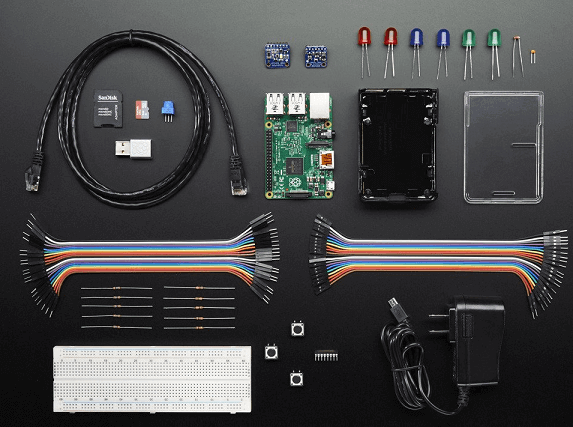
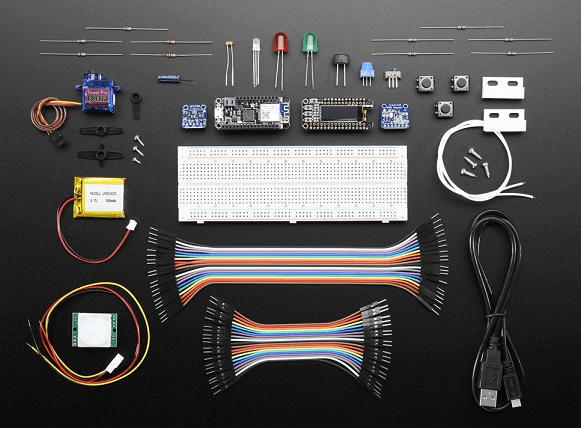
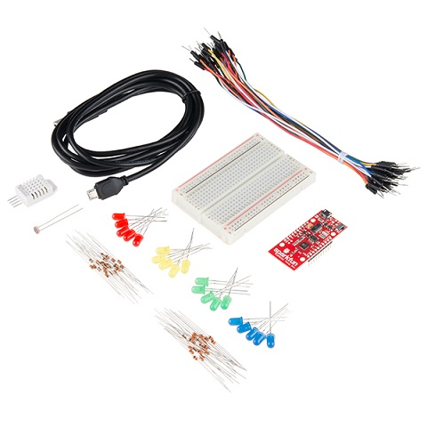

<properties 
pageTitle="Azure 开发人员中心：Azure IoT" 
description="" 
services="IoT" 
documentationCenter="Develop" 
authors="" 
manager="" 
editor="" />
<tags ms.service="IoT"
    ms.date=""
    wacn.date=""
    />

# Azure 初学者套件
立即采用套件（包括为“Azure Certified for IoT”的开发板、传感器和传送器）开始创新。简单的用户友好教程可帮助你使用 Azure IoT 将你的设备无缝连接到云。

##Adafruit Raspberry Pi 套件

由 Windows 10 提供支持，这台信用卡大小的计算机能够执行许多台式电脑能执行的操作，如电子表格、文字处理甚至是玩视频游戏。本套件为开始使用 Raspberry Pi 和 Azure IoT 提供了所有必需的传感器和组件。

[购买](https://www.adafruit.com/azure)  |   [入门](https://azure.microsoft.com/zh-cn/documentation/samples/iot-hub-c-raspberrypi-getstartedkit/)

##Adafruit Feather M0 套件

Feather 是 Adafruit 新的开发板，它就如其名称一样，非常轻薄。Adafruit 将 Feather 设计为便携式微控制器内核的一个新标准。这就是 Adafruit Feather M0 WiFi w/ATWINC1500 - 我们称之为“一体化”，可与 Arduino 兼容，具有高速、可靠的 WiFi，并且配置了内置 USB 和电池充电。

[购买](https://www.adafruit.com/azure)  |   [入门](https://azure.microsoft.com/zh-cn/documentation/samples/iot-hub-c-m0wifi-getstartedkit/)

##Adafruit Huzzah Feather ESP8266 套件

针对那些希望使用价格便宜、带有 ESP8266 WiFi 微控制器的新 Adafruit Feather HUZZAH 并且习惯使用该平台探索 Azure IoT 的人群而设计。不需要 Arduino 或其他微控制器。

[购买](https://www.adafruit.com/azure)  |   [入门](https://azure.microsoft.com/zh-cn/documentation/samples/iot-hub-c-huzzah-getstartedkit/)

##Seeed - Intel Edison 套件

针对专家决策者、企业家和一些工业的 IoT 应用程序而设计，Intel® Edison 计算模块在注重性能时对一系列的原型制作项目或商务投资提供简易的开发。

[购买](http://www.seeedstudio.com/depot/Grove-IoT-Developer-Kit-Microsoft-Azure-Edition-p-2631.html?ref=newInBazaar)  |   [入门](https://azure.microsoft.com/zh-cn/documentation/samples/iot-hub-node-intel-edison-getstartedkit/)

##SparkFun Thing Dev 套件

围绕 ESP8266 SOC 设计的 Thing Dev 开发板是一款经济高效并且能够支持 WiFi 的微控制器。本套件为开始使用 ThingDev 微控制器 和 Azure IoT 提供了所有必需的传感器和组件。

[购买](https://www.sparkfun.com/products/13799)  |   [入门](https://azure.microsoft.com/zh-cn/documentation/samples/iot-hub-c-thingdev-getstartedkit/)

##了解更多

- [物联网](/zh-cn/services/iot-hub/)    了解我们的全新 IoT 服务 Azure IoT 中心，连接物联网。
- [示例库](https://azure.microsoft.com/zh-cn/documentation/samples/?service=iot-hub)    发现将设备、传感器和云服务结合在一起的端到端示例。