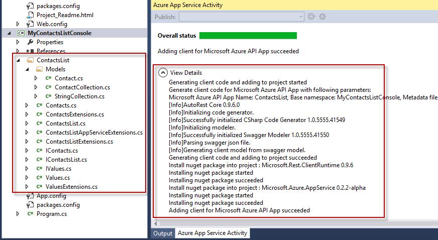

## 生成 API 应用客户端 

Visual Studio 中的 API 应用工具能更加轻松地生成可从桌面、应用商店和移动应用调用到 Azure API 应用的 C# 代码。

1. 在 Visual Studio 中，打开包含[创建 API 应用](/documentation/articles/app-service-api-dotnet-get-started/)主题中的 API 应用的解决方案。

2. 在“解决方案资源管理器”中，右键单击解决方案并选择“添加”>“新建项目”。

	

3. 在“添加新项目”对话框中，执行以下步骤：

	1. 选择“Windows 桌面”类别。
	
	2. 选择“控制台应用程序”项目模板。
	
	3. 为该项目命名。
	
	4. 单击“确定”以在现有解决方案中生成新的项目。
	
	

4. 右键单击新创建的控制台应用程序项目，然后选择“添加”>“Azure API 应用客户端”。

	
	
5. 在“添加 Azure API 应用客户端”对话框中，执行以下步骤：

	1. 选择“下载”选项。
	
	2. 在下拉列表中，选择前面创建的 API 应用。
	
	3. 单击**“确定”**。

	

	向导将下载 API 元数据文件并生成类型化接口，用于调用 API 应用。

	

	完成代码生成后，将在解决方案资源管理器中看到以 API 应用命名的新文件夹。此文件夹包含用于实现客户端模型和数据模型的代码。

	

6. 从项目根目录打开 **Program.cs**，并使用以下代码替换 **Main** 方法：

		static void Main(string[] args)
	    {
	        var client = new ContactsList();
	
	        // Send GET request.
	        var contacts = client.Contacts.Get();
	        foreach (var c in contacts)
	        {
	            Console.WriteLine("{0}: {1} {2}",
	                c.Id, c.Name, c.EmailAddress);
	        }
	
	        // Send POST request.
			client.Contacts.Post(new Models.Contact
		    {
		        EmailAddress = "lkahn@contoso.com",
		        Name = "Loretta Kahn",
		        Id = 4
		    });
	
	        Console.WriteLine("Finished");
	        Console.ReadLine();
	    }

## 测试 API 应用客户端

对 API 应用进行编码后，就可以测试代码了。

1. 打开“解决方案资源管理器”。

2. 右键单击上一节中创建的控制台应用程序。

3. 在控制台应用程序的上下文菜单中，选择“调试 > 启动新实例”。

4. 这时将打开一个控制台窗口并显示所有联系人。

	

5. 按 Enter 键以消除控制台窗口。

<!---HONumber=Mooncake_0919_2016-->