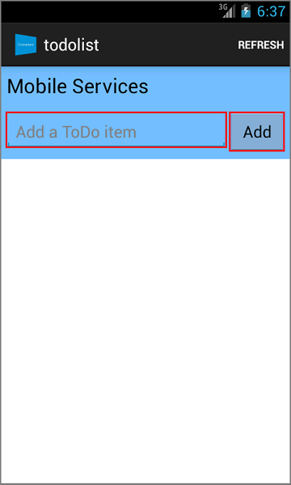

1. 访问 [Azure 门户预览]。依次单击“浏览全部”>“移动应用”> 刚创建的后端。在移动应用设置中，依次单击“快速启动”> “Android”。在“配置客户端应用程序”下，单击“下载”。这样可以为预配置为连接到你的后端的应用下载完整的 Android 项目。

2. 使用“导入项目（Eclipse ADT、Gradle 等）”打开使用“Android Studio”的项目。请确保使用此导入选项以避免任何 JDK 错误。

3. 按“运行‘应用’”按钮以生成项目，并在 Android 模拟器中启动应用。
4. 在应用程序中键入有意义的文本（例如“完成教程”），然后单击“添加”图标。这会将一个 POST 请求发送到之前部署的 Azure 后端。请求中的后端数据插入到 TodoItem SQL 表中，并将新存储项的相关信息返回到移动应用中。移动应用会在列表中显示此数据。
   
    

[Azure 门户预览]: https://portal.azure.cn/

<!---HONumber=Mooncake_1219_2016-->