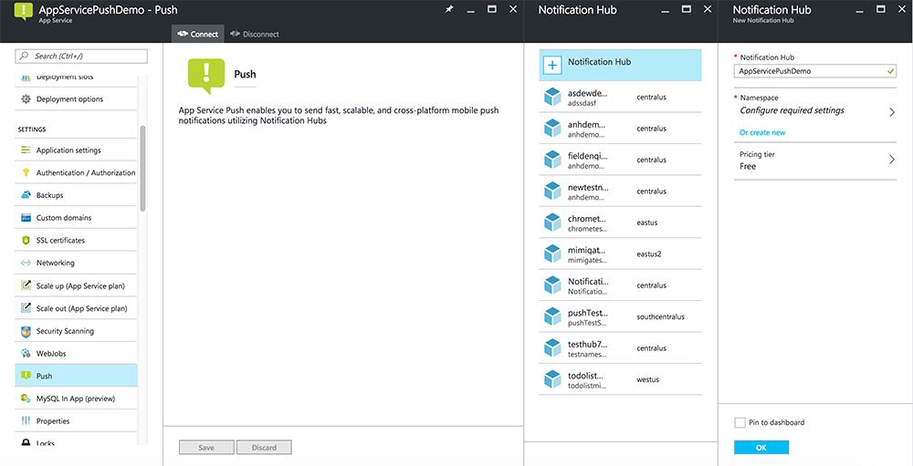

Azure 应用服务的移动应用功能使用 [Azure 通知中心]发送推送，因此会为移动应用配置通知中心。

1. 在 [Azure 门户]中，转到“应用服务”，然后单击应用后端。在“设置”下，单击“推送”。
2. 单击“连接”将通知中心资源添加到应用。可创建一个中心或连接到现有中心。
   
      

现在已将一个通知中心连接到移动应用后端项目。稍后会将此通知中心配置为连接到平台通知系统 (PNS) 以推送到设备。

[Azure 门户]: https://portal.azure.cn/
[Azure 通知中心]: /documentation/articles/notification-hubs-push-notification-overview/

<!---HONumber=Mooncake_0116_2017-->