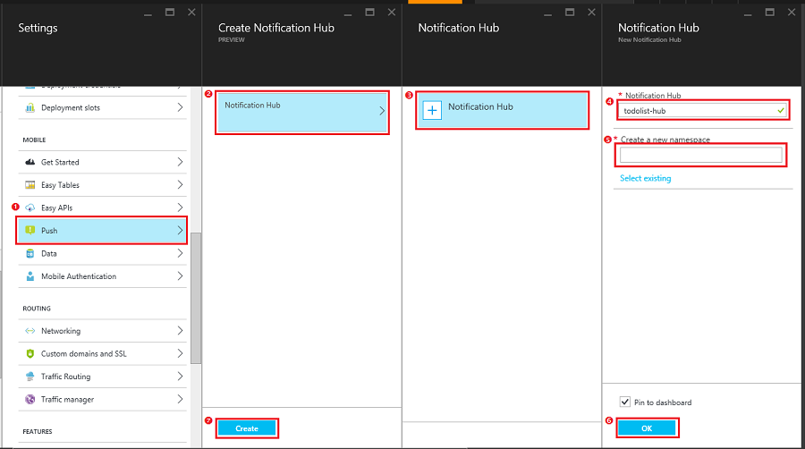

请按照以下步骤创建用于推送通知的新通知中心。如果已有通知中心，也可以将其连接到移动应用后端。

1. 在 [Azure 门户预览]中，依次单击“浏览”>“应用服务”，然后单击移动应用后端 >“所有设置”，然后在“移动”下，依次单击“推送”>“通知中心”。

2. 单击“+通知中心”，键入一个新“通知中心” 名称（可以与移动应用后端相同），键入新的命名空间名称或使用现有名称，然后单击“确定”，最后单击“创建”。

	

	这将创建新的通知中心并将其连接到移动应用。如果已有通知中心，可以选择将其连接到移动应用后端而不用创建一个新的。

现在已将一个通知中心连接到移动应用后端。稍后会将此通知中心配置为连接到将推送通知发送到本机设备的平台通知服务 (PNS)。

[Azure 门户预览]: https://portal.azure.cn/

<!---HONumber=Mooncake_0919_2016-->