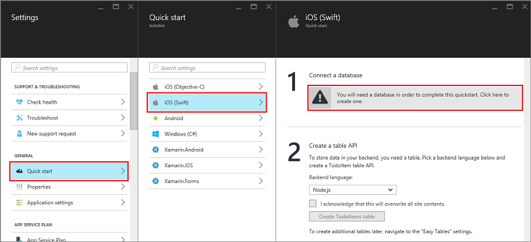

1. 在 [Azure 门户预览]登录。

2. 依次单击“+新建”>“Web + 移动”>“移动应用”，然后提供移动应用后端名称。

3. 对于“资源组”，选择现有资源组，或创建新组（使用与应用相同的名称。）
 
	可以选择其他应用服务计划或创建新的计划。有关应用服务计划以及如何在不同定价层和所需位置中创建新计划的详细信息，请参阅 [Azure App Service 计划深入概述](/documentation/articles/azure-web-sites-web-hosting-plans-in-depth-overview/)。

4. 对于“应用服务计划”，选择默认计划（[标准层](/pricing/details/app-service/)中）。还可以选择不同计划，或[创建一个新计划](/documentation/articles/azure-web-sites-web-hosting-plans-in-depth-overview/#create-an-app-service-plan)。应用服务计划的设置将确定与应用关联的[位置、功能、成本和计算资源](/pricing/details/app-service/)。

	做出有关计划的决定后，单击“创建”。这将创建移动应用后端。
	
6. 在新的移动应用后端的“设置”边栏选项卡中，依次单击“快速启动”>你的客户端应用平台 >“连接数据库”。

	

7. 在“添加数据连接”边栏选项卡中，依次单击“SQL 数据库” >“创建新数据库”，键入数据库“名称”，选择定价层，然后单击“服务器”。可以重复使用此新数据库。如果在同一位置已有数据库，则可选择“使用现有数据库”。由于带宽成本和更高的延迟，不建议使用位于不同位置的数据库。
 
    

8. 在“新服务器”边栏选项卡中，在“服务器名称”字段中键入唯一服务器名称，提供登录名和密码，勾选“允许 Azure 服务访问服务器”，单击“确定”。这将创建新数据库。

9. 回到“添加数据连接”边栏选项卡中，单击“连接字符串”，键入数据库的登录值和密码值，单击“确定”。稍等几分钟，等数据库署成功后再继续。

<!-- URLs. -->
[Azure 门户预览]: https://portal.azure.cn/

<!---HONumber=Mooncake_0919_2016-->