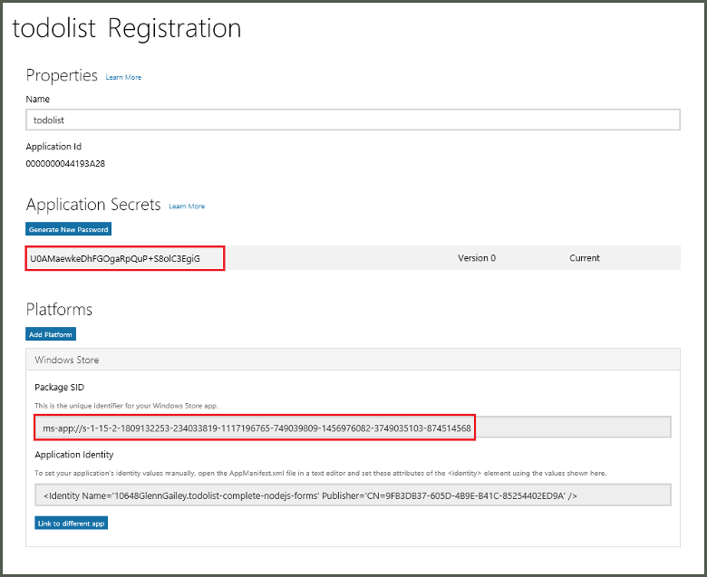

1. 在 Visual Studio 解决方案资源管理器中，右键单击 Windows 应用商店应用项目，单击“应用商店”>“将应用与应用商店关联”。

      

2. 在该向导中，单击“下一步”，然后使用你的 Microsoft 帐户登录。在“保留新应用名称”中键入应用的名称，然后单击“保留”。
3. 成功创建应用注册后，选择新应用名称，再依次单击“下一步”和“关联”。这会将所需的 Windows 应用商店注册信息添加到应用程序清单中。
4. 使用之前为 Windows 应用商店应用创建的相同注册，对 Windows Phone 应用商店应用项目重复步骤 1 和 3。
5. 浏览到 [Windows 开发人员中心](https://dev.windows.com/zh-CN/overview)，然后使用 Microsoft 帐户登录。单击“我的应用”中的新应用注册，然后展开“服务”>“推送通知”。
6. 在“推送通知”页中，在“Windows 推送通知服务(WNS)和 Microsoft Azure 移动应用”下面单击“Live Services 站点”。记下“应用程序密码”中的“包 SID”值和“当前”值。

      

    > [AZURE.IMPORTANT] 应用程序密钥和程序包 SID 是重要的安全凭据。请勿将这些值告知任何人或随你的应用程序分发它们。

<!---HONumber=Mooncake_0116_2017-->