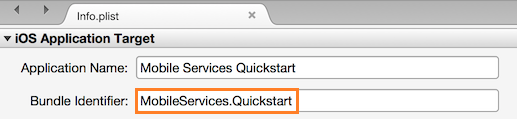
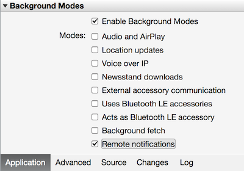

#### 在 Xamarin Studio 中配置 iOS 项目
1. 在 Xamarin.Studio 中，打开 **Info.plist**，然后使用前面随新应用 ID 创建的捆绑 ID 更新“捆绑标识符”。

      

2. 向下滚动到**后台模式**。选中“启用后台模式”框和“远程通知”框。

      

3. 在解决方案面板中双击项目以打开“项目选项”。
4. 在“生成”下面选择“iOS 捆绑签名”，并选择刚刚为此项目设置的相应标识和预配配置文件。

     

   这确保项目使用新配置文件进行代码签名。有关正式的 Xamarin 设备设置文档，请参阅 [Xamarin 设备设置]。

#### 在 Visual Studio 中配置 iOS 项目
1. 在 Visual Studio 中，右键单击项目，然后单击“属性”。
2. 在属性页中，单击“iOS 应用程序”选项卡，然后使用先前创建的 ID 更新“标识符”。

      

3. 在“iOS 捆绑签名”选项卡中，选择刚为此项目设置的相应的标识符和预配配置文件。

      

    这确保项目使用新配置文件进行代码签名。有关正式的 Xamarin 设备设置文档，请参阅 [Xamarin 设备设置]。
4. 双击 Info.plist 打开它，然后在“后台模式”下面启用“远程通知”。

[Xamarin 设备设置]: http://developer.xamarin.com/guides/ios/getting_started/installation/device_provisioning/

<!---HONumber=Mooncake_0116_2017-->