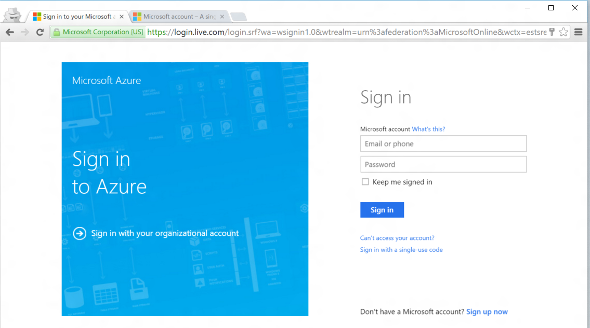

<!--
includes/azure-include-getting-started-v12portal-gettings-an-account.md

Latest Freshness check:  2016-04-11 , carlrab.

As of circa 2016-04-11, the following topics might include this include:
articles/sql-database/sql-database-get-started-tutorial.md

-->
## 使用订阅连接到 Azure 门户

若要连接到 Azure 门户，你必须有一个订阅。

### 获取新帐户

如果你目前没有 Azure 帐户，请单击以下链接之一来获取帐户：

- 获取 [1 元试用帐户](/pricing/1rmb-trial/)

###使用现有的帐户登录

使用[现有的订阅](https://account.windowsazure.cn/Home/Index)，遵循以下步骤连接到 Azure 门户。

1. 打开所选的浏览器并连接到 [Azure 门户](https://portal.azure.cn/)。

1. 登录到 [Azure 门户](https://portal.azure.cn/)。

1. 登录页出现时，请提供订阅的凭据

   
   

<!---HONumber=Mooncake_0425_2016-->