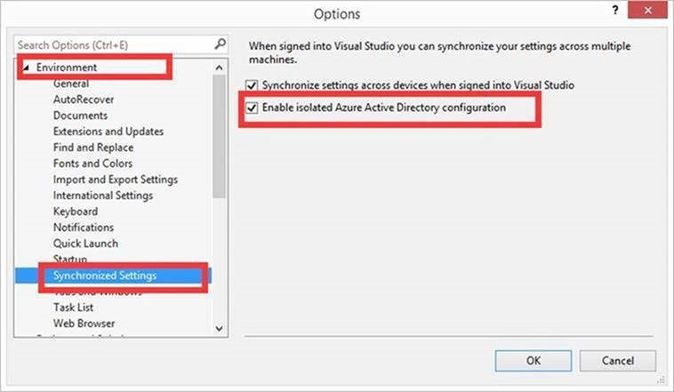

>[AZURE.NOTE] 想要在 Visual Studio 连接到 Azure 中国，可以按照 [Azure 应用程序开发说明 - 设置开发计算机](/documentation/articles/developerdifferences/#confdevcomp)描述的那样修改注册表来改变登录环境。
> 如果使用的是 Visual Studio 2015 update 2 或以上版本，也可以通过勾选“Enable isolated Azure Active Directory configuration”来添加 Azure 中国的登录环境。
> 