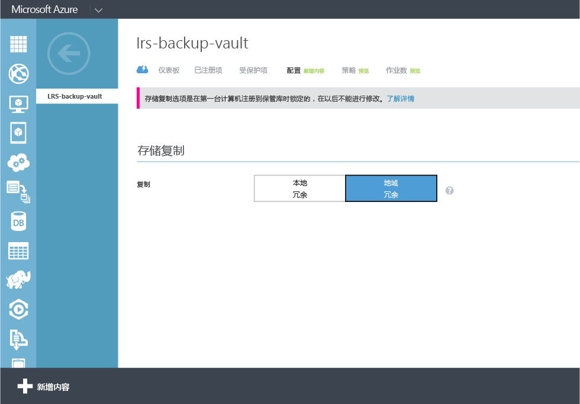
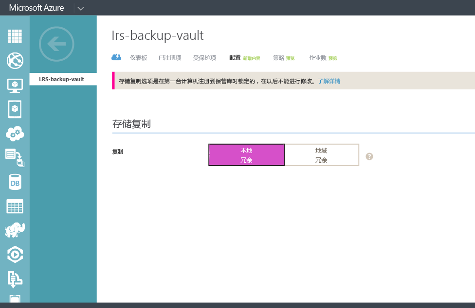

## 创建备份保管库
若要将文件和数据从 Windows Server 或 Data Protection Manager (DPM) 备份到 Azure 或者要将 IaaS VM 备份到 Azure，你必须在要存储数据的地理区域中创建备份保管库。

以下步骤将指导你完成创建用于存储备份的保管库。

1. 登录到[管理门户](https://manage.windowsazure.cn/)
2. 单击“新建”>“数据服务”>“恢复服务”->“备份保管库”，然后选择“快速创建”。

    

3. 对于“名称”参数，请输入一个友好名称以标识备份保管库。这必须是每个订阅的唯一名称。

4. 对于“区域”参数，请选择备份保管库的地理区域。所选项确定了备份数据要发送到的地理区域。选择靠近你所在位置的地理区域可以减少备份到 Azure 时的网络延迟。

5. 单击“创建保管库”完成该工作流。创建备份保管库可能需要一段时间。若要检查状态，可以监视门户底部的通知。

    

6. 在创建备份保管库后，将显示一条消息通知你已成功创建保管库。该保管库还会在恢复服务的资源中列出为“活动”。

    

### Azure 备份 - 存储冗余选项

>[AZURE.IMPORTANT] 确定存储冗余选项的最佳时机是在创建保管库之后、将任何计算机注册到保管库之前。将某个项注册到保管库后，存储冗余选项将会锁定且不能修改。

你的业务需求应确定 Azure 备份后端存储的存储冗余。如果你要使用 Azure 作为主要备份存储终结点（例如，你要从 Windows Server 备份到 Azure），应考虑选择（默认的）地域冗余存储选项。此选项显示在备份保管库的“配置”选项下。

#### 地域冗余存储 (GRS)。
GRS 维护你的数据的六个副本。使用 GRS 时，你的数据将在主区域内复制三次，并且还在离主区域数百英里的辅助区域中复制三次，从而提供最高级别的持久性。当主区域中发生故障时，Azure 备份会将数据存储在 GRS 中，从而确保你的数据在两个独立的区域中持久保存。

#### 本地冗余存储 (LRS)
本地冗余存储 (LRS) 保留数据的三个副本。LRS 将在单个区域中的单个设施内复制三次。LRS 可以保护你的数据免受普通的硬件故障损害，但无法保护你的数据免受整个 Azure 设施故障的损害。

如果使用 Azure 作为第三级备份存储终结点（例如，你正在使用 SCDPM 在本地创建本地备份复制，使用 Azure 满足长期数据保留需求），应考虑从备份保管库的“配置”选项中选择“本地冗余存储”。这可以降低在 Azure 中存储数据的成本，但提供的数据持久性更低，不过，对于第三级副本是可接受的。

<!---HONumber=Mooncake_0405_2016-->