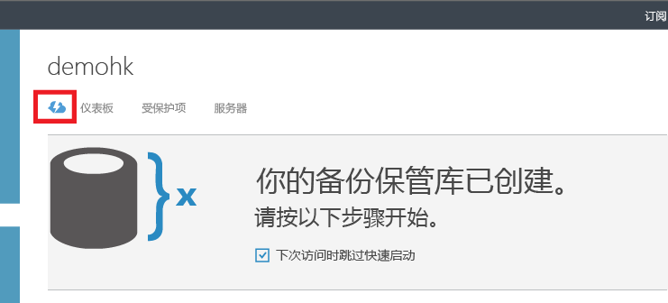
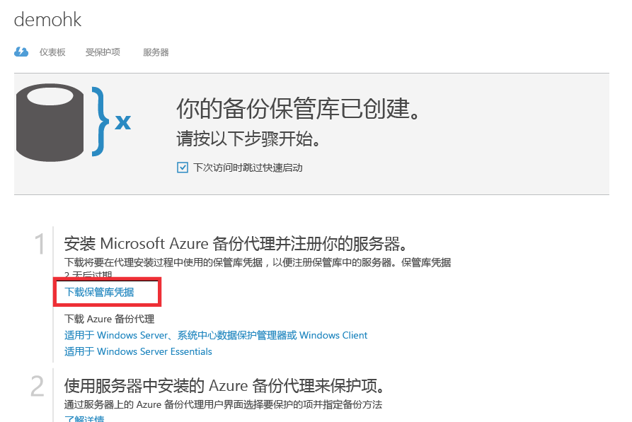

## 使用保管库凭据向 Azure 备份服务进行身份验证

在本地服务器（Windows 客户端、Windows Server 或 Data Protection Manager 服务器）将数据备份到 Azure 之前，需要使用备份保管库对服务器进行身份验证。身份验证是使用“保管库凭据”实现的。保管库凭据的概念类似于 Azure PowerShell 中使用的“发布设置”文件概念。

### 什么是保管库凭据文件？

保管库凭据文件是门户为每个备份保管库生成的证书。然后，门户会将公钥上载到访问控制服务 (ACS)。证书的私钥将提供给用户作为工作流的一部分，它被指定为计算机注册工作流的输入。当计算机向 Azure 备份服务中标识的保管库发送备份数据时，该证书将对计算机进行身份验证。

保管库凭据仅在注册工作流的过程中使用。用户需负责确保保管库凭据文件不会泄露。如果该文件落入恶意用户之手，他们可以使用保管库凭据文件将其他计算机注册到同一个保管库。但是，但是备份数据已使用属于客户的通行短语加密，因此现有的备份数据不会泄露。为了消除这种忧虑，保管库凭据设置为 48 小时后过期。你可以下载备份保管库的保管库凭据任意次数 - 但是，在运行注册工作流期间，只有最新的保管库凭据文件才适用。

### 下载保管库凭据文件

从 Azure 门户通过安全通道下载保管库凭据文件。Azure 备份服务并不知道证书的私钥，并且私钥不会保存在门户或服务中。使用以下步骤将保管库凭据文件下载到本地计算机。

1.  登录到[管理门户](https://manage.windowsazure.cn)
2.  在左侧导航窗格中单击“恢复服务”，然后选择已创建的备份保管库。单击云图标转到备份保管库的“快速启动”视图。

    

3.  在“快速启动”页上，单击“下载保管库凭据”。门户将生成可供下载的保管库凭据文件。

    

4.  门户将使用保管库名称和当前日期的组合生成保管库凭据。单击“保存”将保管库凭据下载到本地帐户的 downloads 文件夹，或者从“保存”菜单中选择“另存为”以指定保管库凭据保存到的位置。

### 注意
- 确保将保管库凭据保存可从计算机访问的位置。如果将它存储在文件共享/SMB 中，请检查访问权限。
- 保管库凭据文件仅在注册工作流中使用。
- 保管库凭据文件在 48 小时后过期，可从门户下载。
- 如有工作流方面的任何问题，请参阅 Azure 备份[常见问题](/documentation/articles/backup-azure-backup-faq/)。

<!---HONumber=76-->