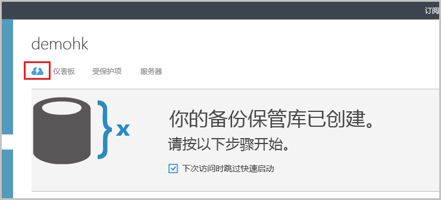
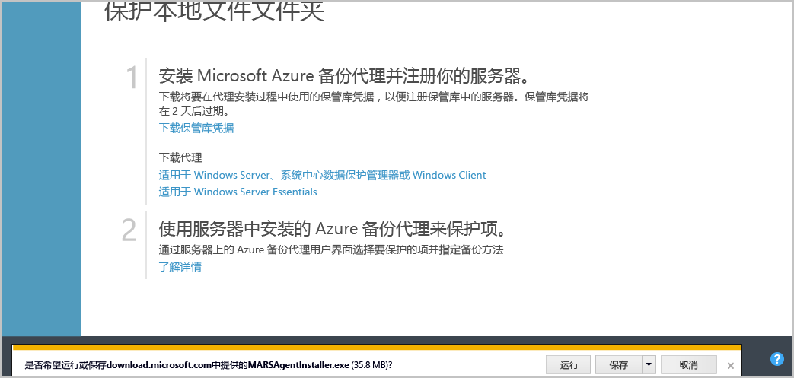
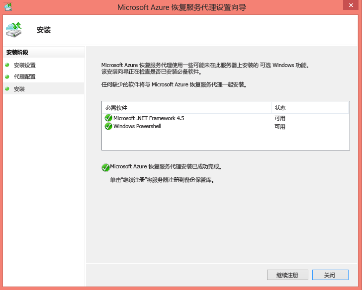
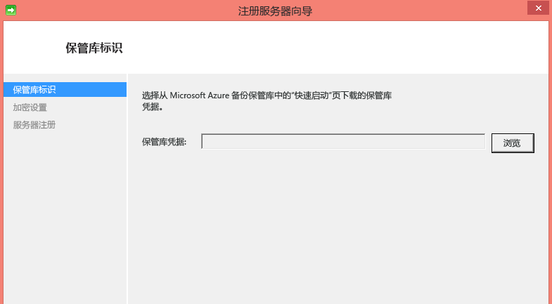
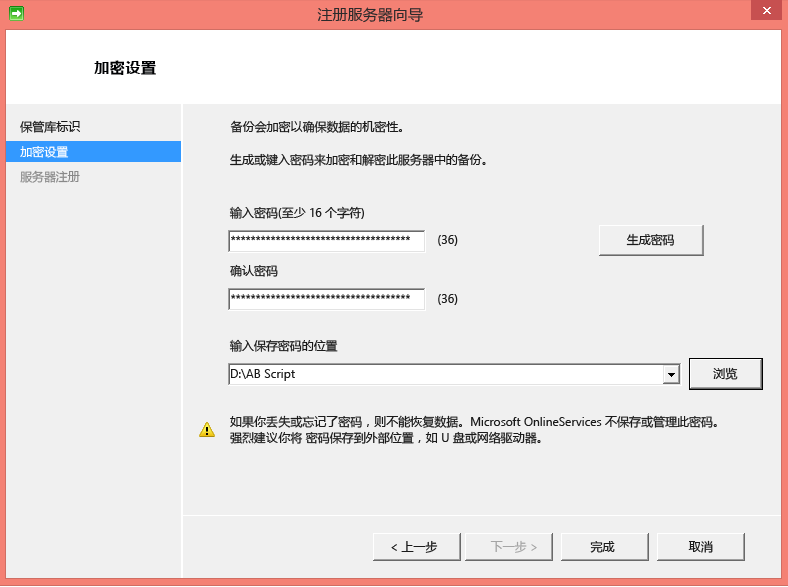
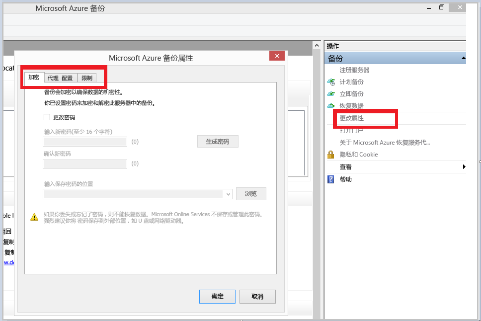
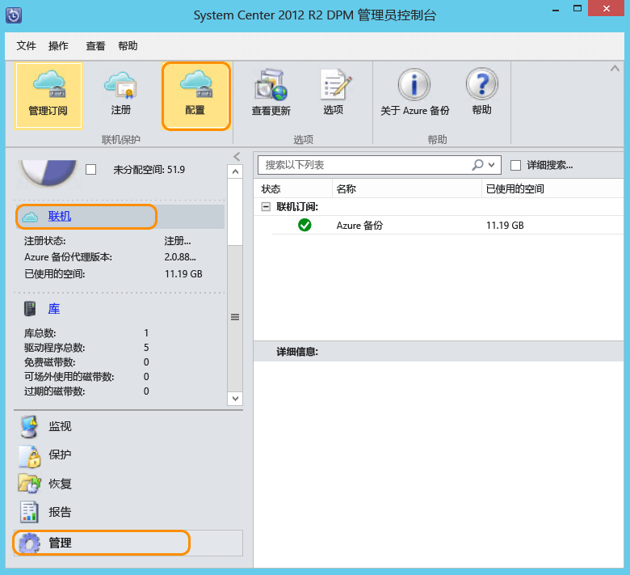

## 下载、安装和注册 Azure 备份代理

在创建 Azure 备份保管库后，应在每个 Windows 计算机（Windows Server、Windows 客户端、System Center Data Protection Manager 服务器或 Azure 备份服务器计算机）上安装代理，以便将数据和应用程序备份到 Azure。

1. 登录到[管理门户](https://manage.windowsazure.cn)

2. 单击“恢复服务”，然后选择你要向其注册服务器的备份保管库。随后将显示该备份保管库的“快速启动”页。

    

3. 在“快速启动”页上，单击“下载代理”下的“用于 Windows Server、System Center Data Protection Manager 或 Windows 客户端”选项。单击“保存”将安装文件复制到本地计算机。

    

4. 安装代理后，双击 MARSAgentInstaller.exe 以启动 Azure 备份代理的安装。选择代理所需的安装文件夹和临时文件夹。指定的缓存位置必须至少有备份数据的 5% 的可用空间。

5.	如果使用代理服务器连接到 Internet，请在“代理配置”屏幕中，输入代理服务器详细信息。如果使用已经过身份验证的代理，请在此屏幕中输入用户名和密码详细信息。

6.	Azure 备份代理将安装 .NET Framework 4.5 和 Windows PowerShell（如果尚未可用）以完成安装。

7.	安装代理后，单击“继续注册”按钮以继续运行工作流。

    

8. 在保管库凭据屏幕中，浏览到并选择前面下载的保管库凭据文件。

    

    保管库凭据文件只能生效 48 小时（从门户下载后算起）。如果此屏幕中显示任何错误（例如“提供的保管库凭据文件已过期”），请登录到 Azure 门户，并再次下载保管库凭据文件。

    确保将保管库凭据文件放置在安装应用程序可访问的位置。如果你遇到访问相关的错误，请将保管库凭据文件复制到此计算机中的临时位置，然后重试操作。

    如果遇到无效的保管库凭据错误（例如“所提供的保管库凭据无效”），则该文件已损坏，或者没有与恢复服务关联的最新凭据。请在从门户下载新的保管库凭据文件后重试该操作。如果用户在 Azure 门户中快速连续单击“下载保管库凭据”选项，则通常会出现此错误。在这种情况下，只有第二个保管库凭据文件有效。

9. 在“加密设置”屏幕中，你可以生成一个通行短语，或者提供一个通行短语（最少包含 16 个字符）。请记住将通行短语保存在安全位置。

    

    > [AZURE.WARNING]如果您丢失或忘记了通行短语，Microsoft 无法帮助您恢复备份的数据。加密通行短语由最终用户拥有，Microsoft 看不到最终用户所用的通行短语。请将该文件保存在安全位置，因为在恢复操作期间需要用到它。

10. 单击“完成”按钮后，计算机即会成功注册到保管库，现在，您可以开始备份到 Azure。

11. 单独使用 Azure 备份时，可以通过在 Azure 备份 mmc 管理单元中单击“更改属性”选项，来修改在注册工作流期间指定的设置。

    

    或者，在使用 Data Protection Manager 时，可以通过在“管理”选项卡下选择“联机”，单击“配置”选项来修改在注册工作流期间指定的设置。

    

<!---HONumber=Mooncake_0104_2016-->