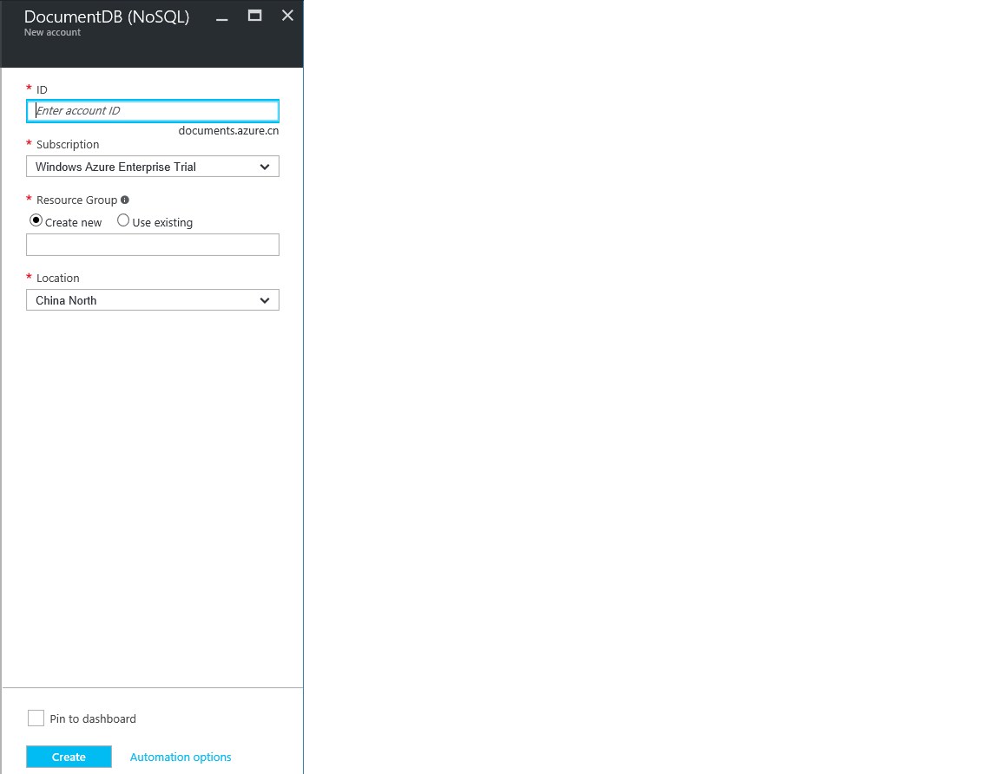
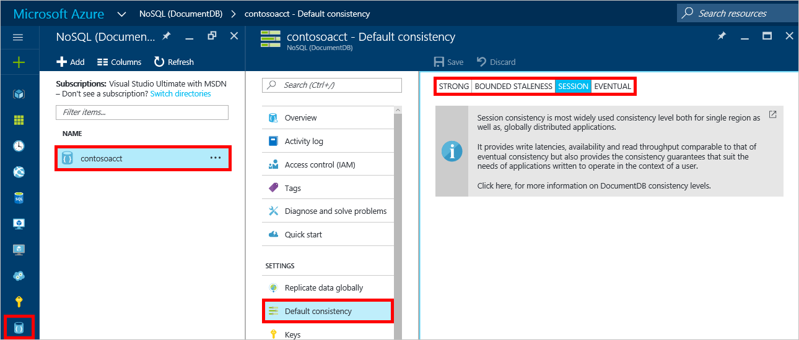

1. 在新窗口中，登录到 [Azure 门户预览](https://portal.azure.cn/)。
2. 在跳转栏中，依次单击“新建”、“数据库”，然后单击“NoSQL \(DocumentDB\)”。

	  

3. 在“新建帐户”边栏选项卡中，为 DocumentDB 帐户指定所需的配置。

	  

   * 在“ID”框中，输入一个名称用于标识 DocumentDB 帐户。对“ID”进行验证后，“ID”框中会出现一个绿色的复选标记。该“ID”值将成为 URI 中的主机名。“ID”只能包含小写字母、数字及“-”字符，且长度必须为 3 到 50 个字符。请注意，*documents.azure.com* 附加到所选择的终结点名称后面，该终结点成为 DocumentDB 帐户终结点。
   * 在“NoSQL API”框中，选择“DocumentDB”。
   * 对于“订阅”，请选择要用于 DocumentDB 帐户的 Azure 订阅。如果帐户只有一个订阅，则默认为选择该帐户。
   * 在“资源组”中，为 DocumentDB 帐户选择或创建资源组。默认创建新的资源组。有关详细信息，请参阅[使用 Azure 门户管理 Azure 资源](/documentation/articles/resource-group-portal/)。
   * 使用“位置”指定在其中托管 DocumentDB 帐户的地理位置。
4. 配置了新的 DocumentDB 帐户后，单击“创建”。若要检查部署状态，请查看“通知中心”。
   
	  

   
	  

5. 创建 DocumentDB 帐户之后，即可使用其默认设置。若要查看默认设置，请单击跳转栏上的“NoSQL \(DocumentDB\)”图标，并单击新帐户，然后在资源菜单中单击“默认一致性”。

	  

	DocumentDB 帐户的默认一致性设置为“会话”。通过选择其他可用一致性选项之一，可调整默认一致性。若要了解有关 DocumentDB 提供的一致性级别的详细信息，请参阅 [DocumentDB 中的一致性级别](/documentation/articles/documentdb-consistency-levels/)。

[How to: Create a DocumentDB account]: #Howto
[Next steps]: #NextSteps
[documentdb-manage]: /documentation/articles/documentdb-manage/

<!---HONumber=Mooncake_0109_2017-->