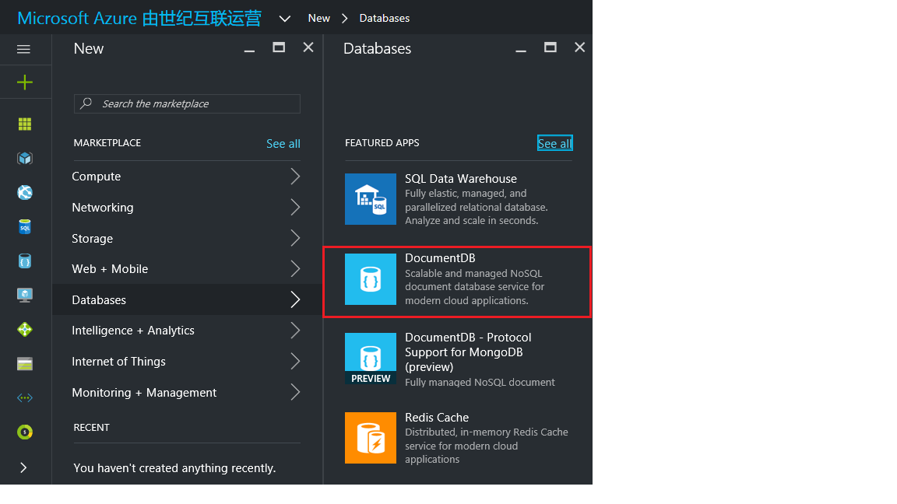

1.	登录在线 [Microsoft Azure 门户预览](https://portal.azure.cn/)。
2.	在跳转栏中，依次单击“新建”、“数据 + 存储器”、“Azure DocumentDB”。

	

3. 在“新建 DocumentDB 帐户”边栏选项卡中，为 DocumentDB 帐户指定所需配置。

	

	- 在“ID”框中，输入一个名称用于标识 DocumentDB 帐户。对“ID”进行验证后，“ID”框中会出现一个绿色的复选标记。该“ID”值将成为 URI 中的主机名。“ID”只能包含小写字母、数字及“-”字符，且长度必须为 3 到 50 个字符。请注意，documents.azure.com 会追加到所选择的终结点名称，其结果将成为 DocumentDB 帐户终结点。

	- 对于“订阅”，请选择要用于 DocumentDB 帐户的 Azure 订阅。如果帐户只有一个订阅，则默认情况下会选择该帐户。

	- 在“资源组”中，为 DocumentDB 帐户选择或创建资源组。默认情况下，会选择 Azure 订阅下的现有资源组。但是，可以选择创建要将 DocumentDB 帐户添加到其中的新资源组。有关详细信息，请参阅[使用 Azure 门户预览管理 Azure 资源](/documentation/articles/resource-group-portal/)。

	- 使用“位置”指定在其中托管 DocumentDB 帐户的地理位置。

4.	在配置了新 DocumentDB 帐户后，单击“创建”。可能需要几分钟来创建 DocumentDB 帐户。要检查状态，可以在启动板上监视进度。  
	

	或者，可以从通知中心监视进度。

	

	

5.	创建 DocumentDB 帐户之后，它便已准备就绪，可与在线门户预览中的默认设置结合使用。请注意，DocumentDB 帐户的默认一致性设置为“会话”。可以通过在顶部命令栏上单击“设置”图标，然后在“所有设置”边栏选项卡上的“功能”下单击“默认一致性”条目，来调整默认一致性设置。

    

    

[How to: Create a DocumentDB account]: #Howto
[Next steps]: #NextSteps
[documentdb-manage]: /documentation/articles/documentdb/documentdb-manage

<!---HONumber=Mooncake_0503_2016-->