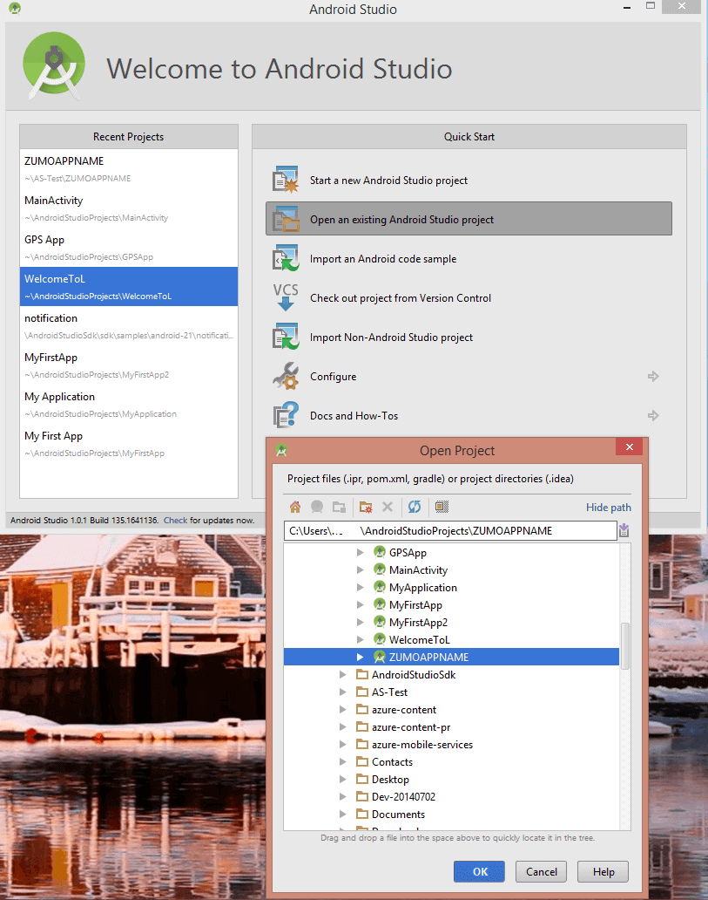

本教程基于 Android 应用 **GetStartedWithData**。此应用程序的 UI 与 Mobile Services Android 快速入门中生成的应用程序相同，不过，前者的一些项本地存储在内存中。你将添加所需的代码，以便将数据保存到存储空间。

1. 通过单击<a href="https://github.com/Azure/mobile-services-samples" target="blank">此处</a>，然后单击“下载 ZIP”，从 gitHub 下载示例存储库。

2. 解压缩下载的文件并记下其位置，或将其移到 Android Studio 项目目录中。

3. 打开 Android Studio。如果你正在使用不同的项目并且显示该项目，请关闭该项目（“文件”= >“关闭项目”）。

4. 选择“打开现有 Android Studio 项目”，浏览到该项目在 *GettingStartedWithData* 的 *AndroidStudio* 文件夹中位置，然后单击“确定”。

 	

	现在，你可以使用该项目。
 

<!---HONumber=71-->