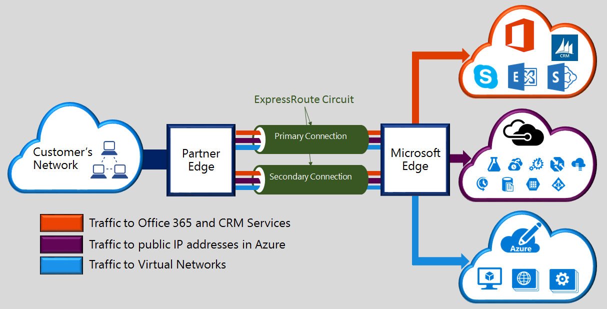

 ExpressRoute 可让你通过连接服务提供商所提供的专用连接，将本地网络扩展到 Azure 云。使用 ExpressRoute 可与 Azure 和 CRM Online 等云服务建立连接。可以从任意位置之间的 (IP VPN) 网络、点到点以太网或在共置设施上通过连接服务提供商的虚拟交叉连接来建立这种连接。ExpressRoute 连接不通过公共 Internet 。与通过 Internet 的典型连接相比，ExpressRoute 连接提供更高的可靠性、更快的速度、更低的延迟和更高的安全性。

  

<!---HONumber=Mooncake_0905_2016-->