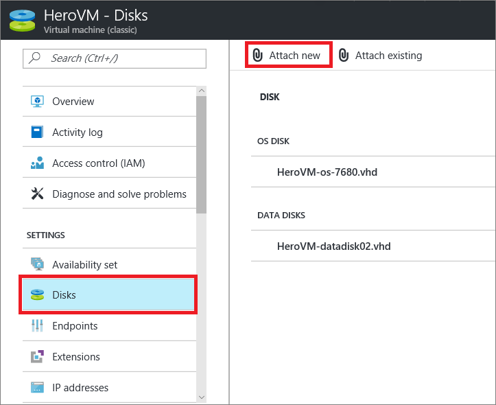
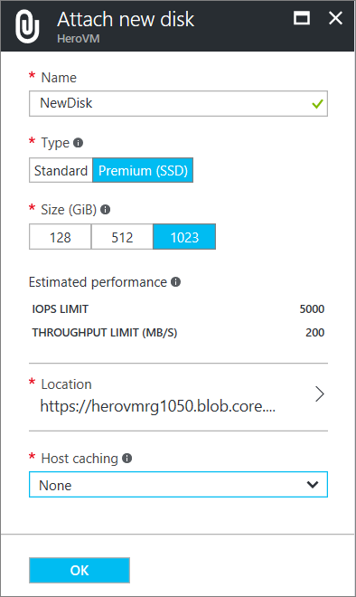
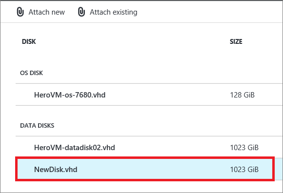
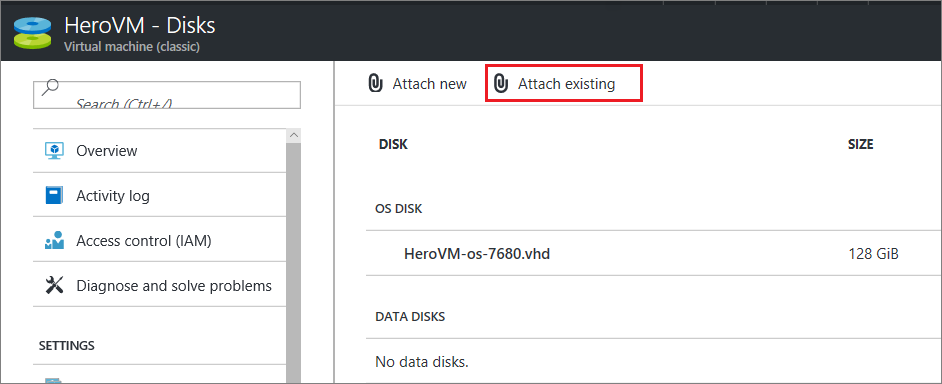
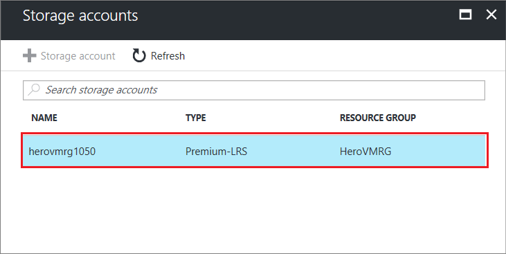
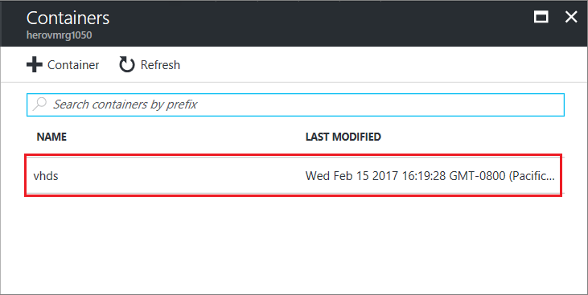
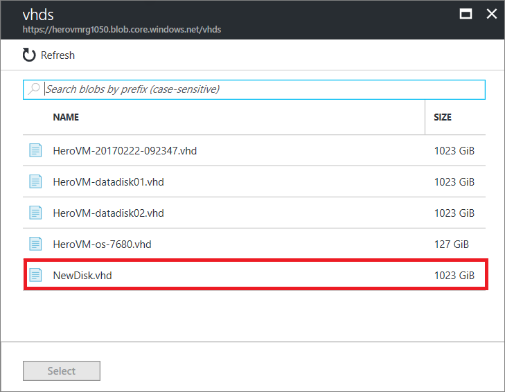
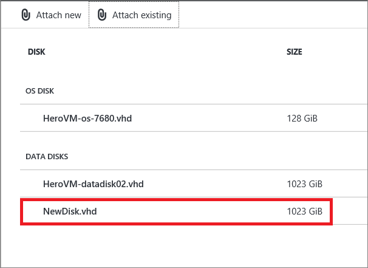

## 附加空磁盘
附加空磁盘是添加数据磁盘的简单方法，因为 Azure 将为你创建 .vhd 文件并将其存储在存储帐户中。

1. 单击“虚拟机(经典)”，然后选择相应的 VM。

2. 在“设置”菜单中，单击“磁盘”。

   

3. 在命令栏上，单击“附加新磁盘”。  
    将显示“附加新磁盘”对话框。

    

    填充以下信息：
    - 在“文件名”中，接受默认名称或为 .vhd 文件键入另一个名称。 数据磁盘使用自动生成的名称，即使你为 .vhd 文件键入另一个名称。
    - 选择数据磁盘的“类型”。 所有虚拟机都支持标准磁盘。 许多虚拟机还支持高级磁盘。
    - 选择数据磁盘的“大小(GB)”。
    - 对于“主机缓存”，请选择“无”或“只读”。
    - 单击“确定”完成。

4. 创建并附加数据磁盘后，它将列在 VM 的磁盘部分。

   

> [AZURE.NOTE]
> 添加数据磁盘后，需要登录到 VM 并初始化该磁盘，以便可以使用它。

## 如何：附加现有磁盘
附加现有磁盘需要存储帐户中具有可用的 .vhd。 可使用 [Add-AzureVhd](https://msdn.microsoft.com/zh-cn/library/azure/dn495173.aspx) cmdlet 将 .vhd 文件上载到存储帐户。 在创建并上载 .vhd 文件后，你可以将其附加到 VM。

1. 单击“虚拟机(经典)”，然后选择相应的虚拟机。

2. 在“设置”菜单中，单击“磁盘”。

3. 在命令栏上，单击“附加现有磁盘”。

    

4. 单击“位置”。 此时会显示可用的存储帐户。 接下来，从列出的存储帐户中选择适当的存储帐户。

    

5. 一个**存储帐户**包含一个或多个容器，容器中包含磁盘驱动器 (vhd)。 从列出的容器中选择适当的容器。

    

6. **vhd** 面板列出了保留在容器中的磁盘驱动器。 单击其中一个磁盘，然后单击“选择”。

    

7. 此时会再次显示“附加现有磁盘”面板，其位置中包含要添加到虚拟机的存储帐户、容器、所选硬盘 (vhd)。

    将“主机缓存”设置为“否”或“只读”，然后单击“确定”。

    