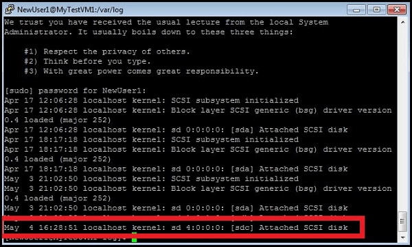
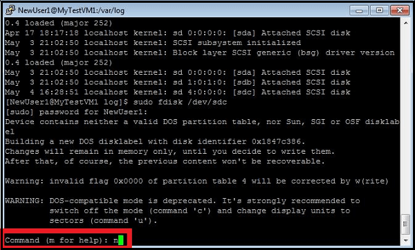

#如何将数据磁盘附加到虚拟机

- [概念](#concepts)
- [如何：附加现有磁盘](#attachexisting)
- [如何：附加空磁盘](#attachempty)
- [如何：在 Windows Server 2008 R2 中初始化新的数据磁盘](#initializeinWS)
- [如何：在 Linux 中初始化新的数据磁盘](#initializeinlinux)

##概念

您可以将数据磁盘附加到虚拟机以存储应用程序数据。数据磁盘是您可以使用自己的计算机在本地创建，或者使用 Azure 在云中创建的虚拟硬盘 (VHD)。您管理虚拟机中数据磁盘的方式与管理办公室中服务器的方式相同。

您可以使用管理门户将包含数据的数据磁盘上载和附加到虚拟机，还可以从虚拟机使用的同一存储帐户添加空磁盘。本文介绍了这些过程。若要附加位于其他存储帐户中的空磁盘，请使用 Azure PowerShell 模块中提供的 [Add-AzureDataDisk](http://msdn.microsoft.com/library/azure/dn495298.aspx) cmdlet。 若要下载该模块，请参阅 [下载](http://www.windowsazure.cn/zh-cn/downloads/?sdk=net)页。

添加磁盘时不会停止虚拟机。您可以附加到虚拟机中的磁盘数量是根据虚拟机的大小确定的。有关虚拟机和磁盘大小的信息，请参阅[针对 Azure 的虚拟机大小](http://msdn.microsoft.com/library/azure/dn197896.aspx)。

> [WACOM.NOTE]
> Azure 存储空间支持最大为 1 TB 的 Blob，其中可容纳最大虚拟大小为 999 GB 的 VHD。但是，如果您使用 Hyper-V 创建新的 VHD，则您指定的大小表示虚拟大小。若要在 Azure 中使用 VHD，请指定不超过 999 GB 的大小。

**数据磁盘对比资源磁盘**
数据磁盘驻留在 Azure 存储空间中并且可以用于持久存储文件和应用程序数据。

每个虚拟机还附加有一个临时的本地  *resource disk*。由于资源磁盘上的数据可能不能在重新引导后持久存在，因此它通常由在虚拟机中运行的应用程序和进程用于数据的短暂和临时存储。它还用来为操作系统存储页面文件或交换文件。

在 Windows 上，资源磁盘被标记为 **D:** 驱动器。在 Linux 上，资源磁盘通常由 Azure Linux 代理管理并且自动装载到 **/mnt/resource**（或 Ubuntu 映像上的 **/mnt**）。请参阅 [Azure Linux 代理用户指南](/zh-cn/documentation/articles/virtual-machines-linux-agent-user-guide/) 获取详细信息。

有关使用数据磁盘的更多信息，请参阅[管理磁盘和映像](http://msdn.microsoft.com/zh-cn/library/azure/jj672979.aspx)。

##如何：附加现有磁盘

1. 如果您尚未执行此操作，请登录到 [Azure 管理门户](http://manage.windowsazure.cn)。

2. 单击"虚拟机"，然后选择要向其附加磁盘的虚拟机。

3. 在命令栏中，单击"附加"，然后选择"附加磁盘"。

	

	将显示"附加磁盘"对话框。

	

3. 选择您要附加到虚拟机的数据磁盘。
4. 单击复选标记以将数据磁盘附加到虚拟机。
  
 
	虚拟机的仪表板中将列出该数据磁盘。

	

##如何：附加空磁盘

在创建并上载要用作空磁盘的 .vhd 文件后，您可以将其附加到虚拟机。使用 [Add-AzureVhd](http://msdn.microsoft.com/library/azure/dn495173.aspx) cmdlet 将 .vhd 文件上载到存储帐户。  

1. 单击"虚拟机"，然后选择要向其附加磁盘的虚拟机。

2. 在命令栏上，单击"附加"，然后选择"附加空磁盘"。

	

	将显示"附加空磁盘"对话框。

	

 
3. 在"文件名"中，接受自动生成的名称，或者输入要用于所存储的 VHD 文件的名称。从 VHD 文件创建的数据磁盘始终使用自动生成的名称。

4. 在"大小"中，输入数据磁盘的大小。 

5. 单击复选标记以附加空数据磁盘。

	虚拟机的仪表板中将列出该数据磁盘。

	

> [WACOM.NOTE] 
> 在添加数据磁盘后，您需要登录到虚拟机并初始化磁盘，然后虚拟机才能使用磁盘来存储数据。

##如何：在 Windows Server 中初始化新的数据磁盘

1. 使用[如何登录到运行 Windows Server 的虚拟机][logon]中列出的步骤连接到虚拟机。

2. 在登录之后，打开"服务器管理器"，在左侧窗格中展开"存储"，然后单击"磁盘管理"。

	

3. 右键单击"磁盘 2"，然后单击"初始化磁盘"。

	

4. 单击"确定"开始初始化过程。

5. 右键单击磁盘 2 的空间分配区域，单击"新建简单卷"，然后使用默认值完成该向导。
 

	

	磁盘现在处于联机状态且可以使用新的驱动器号。

	

##如何：在 Linux 中初始化新的数据磁盘

1. 使用[如何登录到运行 Linux 的虚拟机][logonlinux]中列出的步骤连接到虚拟机。

2. 在 SSH 窗口中，键入下面的命令，然后输入为管理虚拟机而创建的帐户的密码：

	`sudo grep SCSI /var/log/messages`

	您可以在所示消息中找到最后添加的数据磁盘的标识符。

	

3. 在 SSH 窗口中，键入下面的命令以新建设备，然后输入帐户密码：

	`sudo fdisk /dev/sdc`

	>[WACOM.NOTE] 此示例中，如果 /sbin 或 /usr/sbin 不在您的 `$PATH` 中，您在某些分发上可能需要使用  `sudo -i`。

4. 键入 **n** 以创建新分区。

	

5. 键入 **p** 将该分区设置为主分区，键入 **1** 将其设置为第一分区，然后键入 Enter 以接受柱面的默认值。

	

6. 键入 **p** 以查看有关分区磁盘的详细信息。

	

7. 键入 **w** 以写入磁盘的设置。

	

8. 您必须在新分区上创建文件系统。例如，键入下面的命令以创建文件系统，然后输入帐户密码：

	`sudo mkfs -t ext4 /dev/sdc1`

	

	>[WACOM.NOTE] 注意，在 SUSE Linux Enterprise 11 系统上，对于 ext4 文件系统仅提供了只读访问权限。对于这些系统，建议将新文件系统格式化为 ext3 而非 ext4。

9. 接下来，您必须有一个目录可用于装载新文件系统。例如，键入下面的命令来创建一个用于装载驱动器的新目录，然后输入帐户密码：

	`sudo mkdir /datadrive`

10. 键入下面的命令以安装驱动器：

	`sudo mount /dev/sdc1 /datadrive`

	数据磁盘现在可以作为 **/datadrive** 使用。

11. 将新驱动器添加到 /etc/fstab：

	若要确保在重新引导后自动重新装载驱动器，必须将其添加到 /etc/fstab 文件。此外，强烈建议在 /etc/fstab 中使用 UUID（全局唯一标识符）来引用驱动器而不是只使用设备名称（即 /dev/sdc1）。若要查找新驱动器的 UUID，可以使用 **blkid** 实用程序：
	
		`sudo -i blkid`

	输出与以下内容类似：

		`/dev/sda1: UUID="11111111-1b1b-1c1c-1d1d-1e1e1e1e1e1e" TYPE="ext4"`
		`/dev/sdb1: UUID="22222222-2b2b-2c2c-2d2d-2e2e2e2e2e2e" TYPE="ext4"`
		`/dev/sdc1: UUID="33333333-3b3b-3c3c-3d3d-3e3e3e3e3e3e" TYPE="ext4"`

	>[WACOM.NOTE] blkid 可能不是在所有情况下都需要 sudo 访问权限，不过，如果 /sbin 或 /usr/sbin 不在您的 `$PATH` 中，则在某些分发上使用  `sudo -i` 运行可能更为容易。

	**注意：**错误地编辑 /etc/fstab 文件可能会导致系统无法启动。如果无法确定，请参阅该分发的文档以获取有关如何正确编辑此文件的信息。此外，建议在编辑前先创建 /etc/fstab 文件的备份。

	使用文本编辑器，在 /etc/fstab 文件的末尾输入有关新文件系统的信息。在此示例中，我们将使用在之前的步骤中创建的新 **/dev/sdc1** 设备的 UUID 值并使用装载点 **/datadrive**：

		`UUID=33333333-3b3b-3c3c-3d3d-3e3e3e3e3e3e   /datadrive   ext4   defaults   1   2`

	另外，在基于 SUSE Linux 的系统上，您可能需要使用稍微不同的格式：

		`/dev/disk/by-uuid/33333333-3b3b-3c3c-3d3d-3e3e3e3e3e3e   /   ext3   defaults   1   2`

	如果还创建了其他数据驱动器或分区，您同样也需要分别将其输入到 /etc/fstab 中。

	现在，您可以通过简单地卸载并重新装载文件系统（即使用在之前的步骤中创建的示例装载点 `/datadrive`）来测试文件系统是否已正确装载： 

		`sudo umount /datadrive`
		`sudo mount /datadrive`

	如果第二个命令产生错误，请检查 /etc/fstab 文件的语法是否正确。

	>[WACOM.NOTE] 之后，在不编辑 fstab 的情况下删除数据磁盘可能会导致 VM 无法引导。如果这是一种常见情况，则请注意，大多数分发都提供了  `nofail` 和/或  `nobootwait` fstab 选项，这些选项使系统在磁盘不存在时也能引导。有关这些参数的详细信息，请查阅您的分发文档。

[logon]: /zh-cn/documentation/articles/virtual-machines-log-on-windows-server/
[logonlinux]: /zh-cn/documentation/articles/virtual-machines-linux-how-to-log-on/

<!--HONumber=41-->
