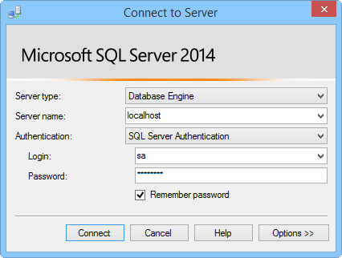

本部分说明如何安装 SQL Server Express、启用 TCP/IP、设置静态端口，以及创建可用于混合连接的数据库。

###安装 SQL Server Express

若要通过混合连接使用本地 SQL Server 或 SQL Server Express 数据库，需要在静态端口上启用 TCP/IP。SQL Server 上的默认实例使用静态端口 1433，而命名的实例则不使用该端口。因此，我们将安装默认实例。如果你已安装 SQL Server Express 的默认实例，则可以跳过本部分。

1. 若要安装 SQL Server Express，请运行下载的 **SQLEXPRWT\_x64\_ENU.exe** 或 **SQLEXPR\_x86\_ENU.exe** 文件。SQL Server 安装中心向导显示。
	
2. 选择“全新 SQL Server 独立安装或向现有安装添加功能”。按照说明操作，接受默认选项和设置，直到显示“实例配置”页。
	
3. 在“实例配置”页上选择“默认实例”，然后在“服务器配置”页上接受默认设置。

	>[AZURE.NOTE]如果你已安装 SQL Server 的默认实例，则可以跳到下一部分，为混合连接使用此实例。
	
4. 在“数据库引擎配置”页面上，在“身份验证模式”下选择“混合模式(SQL Server 身份验证和 Windows 身份验证)”并输入内置 **sa** 管理员帐户的安全密码。
	
	在本教程中，您将使用 SQL Server 身份验证。请确保记住您输入的密码，稍后将用到此密码。
	
5. 完成向导以完成安装。

###启用 TCP/IP 并设置静态端口

本部分使用随 SQL Server Express 一起安装的 SQL Server 配置管理器来启用 TCP/IP。

1. 遵循[针对 SQL Server 启用 TCP/IP 网络协议](http://technet.microsoft.com/zh-cn/library/hh231672%28v=sql.110%29.aspx)中的步骤启用对该实例的 TCP/IP 访问。

2. （可选）如果你无法使用默认实例，则必须遵循[配置服务器以侦听特定 TCP 端口](https://msdn.microsoft.com/zh-cn/library/ms177440.aspx)中的步骤，为实例设置一个静态端口。完成此步骤后，你将会使用定义的新端口而不是端口 1433 进行连接。

3. （可选）如果需要，请在防火墙中添加例外，以允许远程访问 SQL Server 进程 (sqlservr.exe)。

###在本地 SQL Server 实例中创建新数据库

1. 在 SQL Server Management Studio 中，连接至刚才安装的 SQL Server。（如果“连接到服务器”对话框没有自动显示，请导航至左侧窗格中的“对象资源管理器”，单击“连接”，然后单击“数据库引擎”。） 	

    
	
	对于“服务器类型”，请选择“数据库引擎”。对于“服务器名称”，可使用 **localhost** 或正装有 SQL Server 的计算机的名称。选择“SQL Server 身份验证”，然后提供前面创建的 sa 登录名的密码。
	
2. 若要使用 SQL Server Management Studio 新建数据库，请在“对象资源管理器”中右键单击“数据库”，然后单击“新建数据库”。
	
3. 在“新建数据库”对话框中键入 `OnPremisesDB`，然后单击“确定”。
	
4. 在“对象资源管理”中，如果展开“数据库”，你会看到新数据库已创建。

###创建新的 SQL Server 登录名并设置权限

最后，你要创建权限受限的新 SQL Server 登录名。Azure 服务将使用此登录名而不是内置 sa 登录名（对服务器拥有完全权限）连接到在本地 SQL Server。

1. 在 SQL Server Management Studio 对象资源管理器中，右键单击“OnPremisesDB”数据库，然后单击“新建查询”。

2.  将以下 TSQL 查询粘贴到查询窗口中。

		USE [master]
		GO
		
		/* Replace the PASSWORD in the following statement with a secure password. 
		   If you save this script, make sure that you secure the file to 
		   securely maintain the password. */ 
		CREATE LOGIN [HybridConnectionLogin] WITH PASSWORD=N'<**secure_password**>', 
			DEFAULT_DATABASE=[OnPremisesDB], DEFAULT_LANGUAGE=[us_english], 
			CHECK_EXPIRATION=OFF, CHECK_POLICY=ON
		GO
	
		USE [OnPremisesDB]
		GO
	
		CREATE USER [HybridConnectionLogin] FOR LOGIN [HybridConnectionLogin] 
		WITH DEFAULT_SCHEMA=[dbo]
		GO

		GRANT CONNECT TO [HybridConnectionLogin]
		GRANT CREATE TABLE TO [HybridConnectionLogin]
		GRANT CREATE SCHEMA TO [HybridConnectionLogin]
		GO  
   
3. 在上述脚本中，请将字符串 `<**secure_password**>` 替换为新 *HybridConnectionsLogin* 的安全密码。

4. **执行**该查询，以在本地数据库中创建新的登录名，并授予所需的权限。

<!---HONumber=71-->