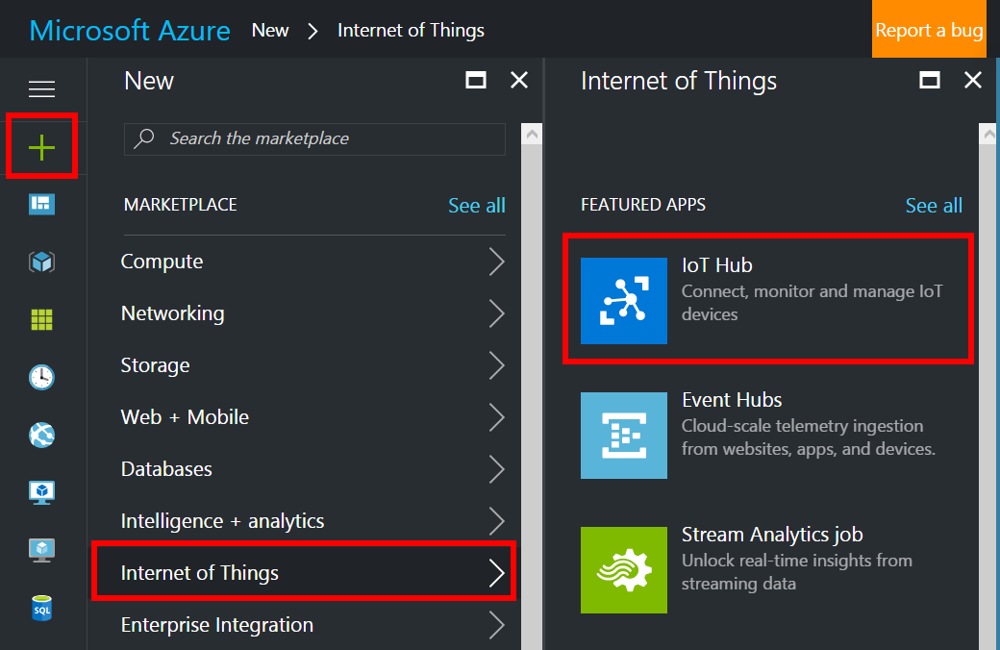
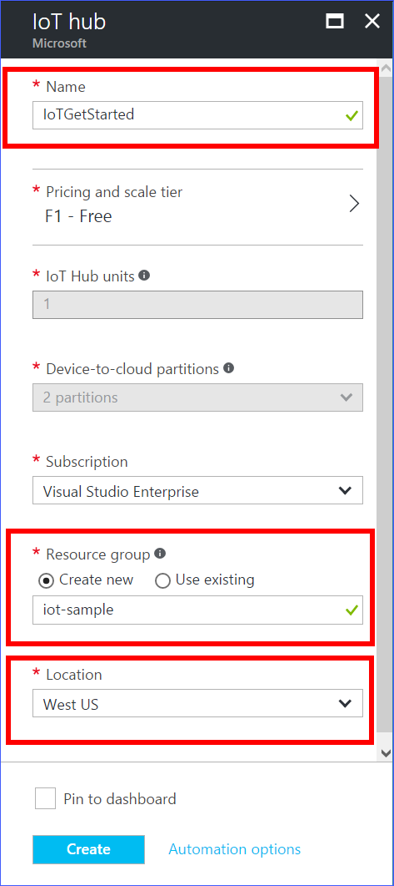
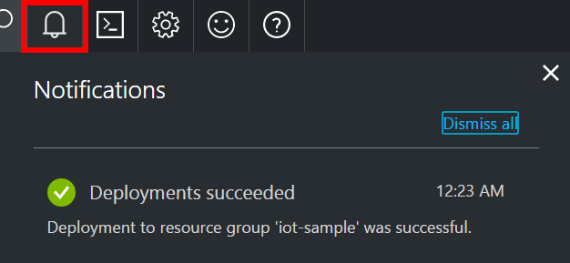
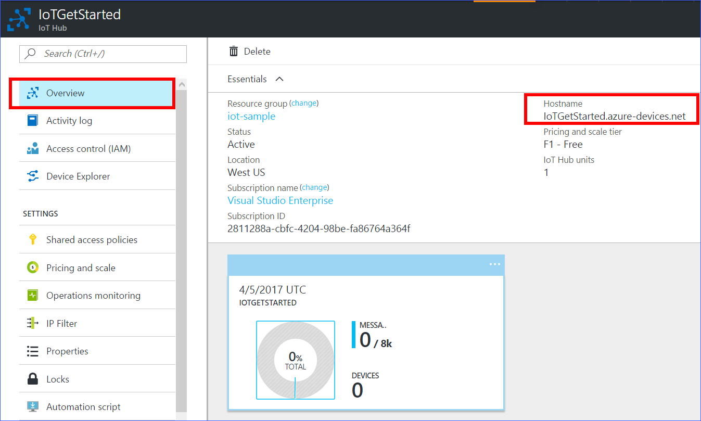
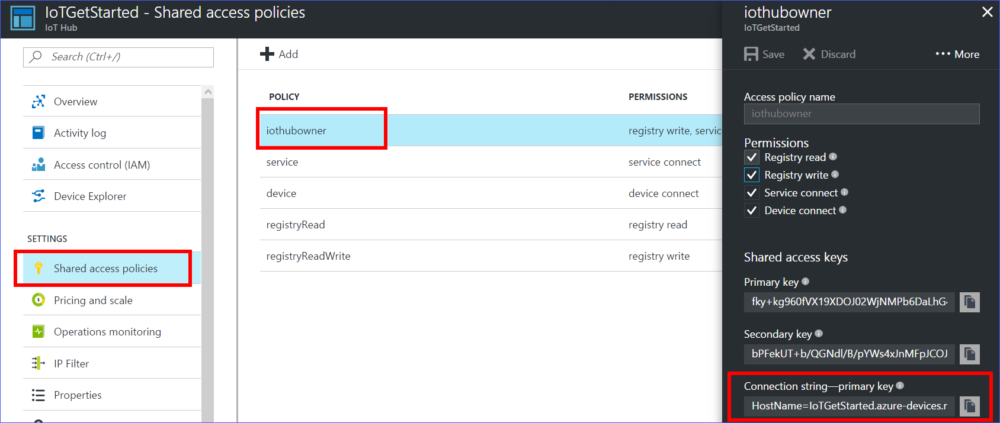
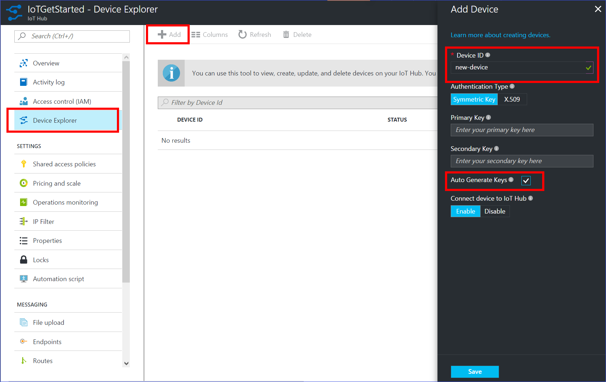
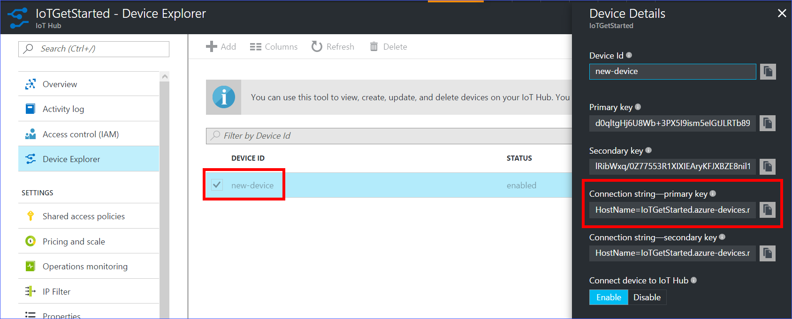

## 创建 IoT 中心

1. 在 [Azure 门户预览](https://portal.azure.cn/)中，依次单击“新建” > “物联网” > “IoT 中心”。

    
   
1. 在“IoT 中心”窗格中，输入 IoT 中心的以下信息：

    **名称**：它是 IoT 中心的名称。 如果输入的名称有效，将显示一个绿色复选标记。

    **定价和缩放级别**：选择免费的 F1 级别。 此选项对于本演示来说已足够。 请参阅[定价和缩放级别](/pricing/details/iot-hub/)。

    **资源组**：创建用于托管 IoT 中心的资源组，或使用现有的资源组。 请参阅[使用资源组管理 Azure 资源](/documentation/articles/resource-group-portal/)。

    **位置**：选择与创建的 IoT 中心最靠近的位置。

    **固定仪表板**：选中此选项可以方便地从仪表板访问 IoT 中心。

    

1. 单击“创建” 。 创建 IoT 中心可能需要几分钟时间。 可在“通知”窗格中查看进度。

    

1. 创建 IoT 中心后，请在仪表板中单击它。 记下“主机名”，然后单击“共享访问策略”。

    

1. 在“共享访问策略”窗格中单击“iothubowner”策略，然后复制并记下 IoT 中心的**连接字符串**。 有关详细信息，请参阅[控制对 IoT 中心的访问](/documentation/articles/iot-hub-devguide-security/)。

    

## 在 IoT 中心为设备进行设备注册

1. 在 [Azure 门户预览](https://portal.azure.cn/)中打开 IoT 中心。
1. 单击“设备资源管理器”。
1. 在“设备资源管理器”窗格中，单击“添加”将设备添加到你的 IoT 中心。

    **设备 ID**：新设备的 ID。

    **身份验证类型**：选择“对称密钥”。

    **自动生成密钥**：选中此字段。

    **将设备连接到 IoT 中心**：单击“启用”。

    

1. 单击“保存” 。
1. 创建设备后，在“设备资源管理器”窗格中打开设备。
1. 记下连接字符串的主密钥。

    