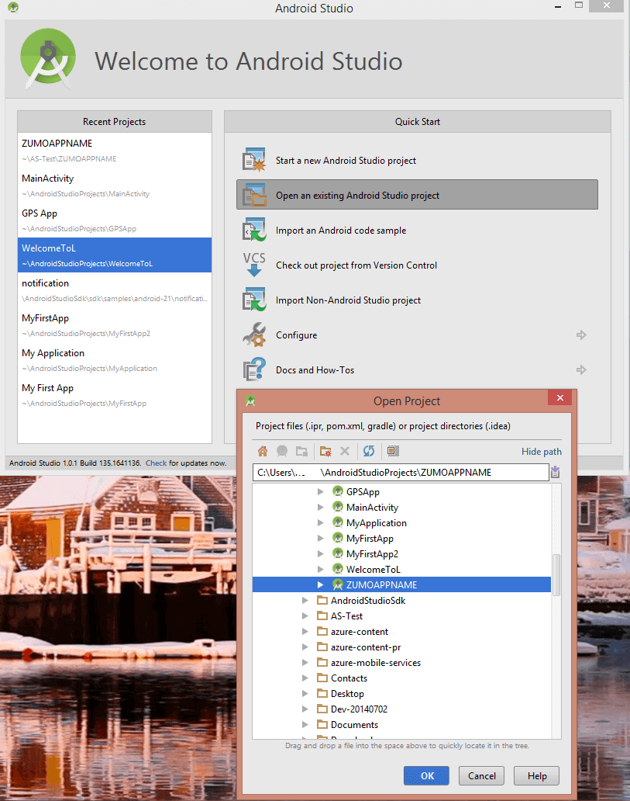

本教程的最后一个阶段是生成和运行你的新应用程序。

### 将项目载入 Android Studio 并同步 Gradle

1. 浏览到你保存压缩项目文件的位置，并在计算机上将这些文件展开到 Android Studio 项目目录。

2. 打开 Android Studio。如果你正在使用某个项目并且显示该项目，请关闭该项目（“文件”= >“关闭项目”）。

3. 选择“打开现有 Android Studio 项目”，浏览到该项目位置，然后单击“确定”。 这会加载项目并开始将它与 Gradle 同步。

 	

4. 等待 Gradle 同步活动完成。如果你看到“找不到目标”错误消息，则原因是 Android Studio 中使用的版本与示例的版本不匹配。解决此问题的最简单方法是单击错误消息中的“安装缺少的平台并同步项目”链接。你可能会收到其他版本错误消息，此时，你只需重复此过程，直到没有错误消息出现为止。
    - 如果你想要运行“最新最强”的 Android 版本，则可以使用另一种方法来解决此问题。可以将 *app* 目录中 *build.gradle* 文件内的 **targetSdkVersion** 更新为与你计算机上安装的版本匹配，若要检查版本，可以单击“SDK 管理器”图标并查看列出的版本。接下来，按“将项目与 Gradle 文件同步”。你可能会收到生成工具版本错误消息，请用相同的方法来修复。

### 运行应用

可以使用模拟器或实际设备运行应用。

1. 若要从设备运行应用，请使用 USB 电缆将设备连接到计算机。你必须[将设备设置为用于开发](https://developer.android.com/training/basics/firstapp/running-app.html)。如果你在 Windows 计算机上开发，则还必须下载并安装 USB 驱动程序。

2. 若要在 Android 模拟器中运行，必须至少定义一个 Android 虚拟设备 (AVD)。单击“AVD 管理器”图标可以创建和管理这些设备。

3. 在“运行”菜单中，单击“运行”以启动项目，然后从显示的对话框中选择一个设备或模拟器。

4. 显示应用时，请键入有意义的文本（例如 _Complete the tutorial_），然后单击“添加”。

   	

   	这样可向在 Azure 中托管的新移动服务发送 POST 请求。来自请求的数据被插入到 TodoItem 表。移动服务返回存储在表中的项，数据显示在列表中。

	> [AZURE.NOTE]你可以查看访问你的移动服务以查询和插入数据的代码，这些代码在 ToDoActivity.java 文件中。

8. 返回 Azure 经典门户，单击“数据”选项卡，然后单击“TodoItems”表。

   	

   	这使您可以浏览此应用插入表中的数据。

   	

<!---HONumber=Mooncake_0118_2016-->