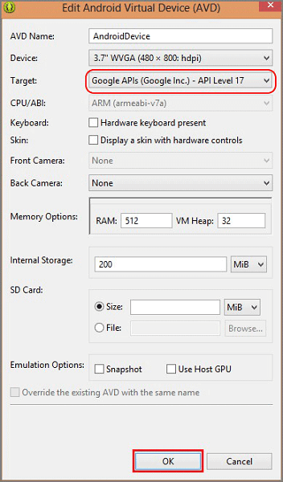

### 设置用于测试的 Android 模拟器
当你在模拟器中运行此应用程序时，请确保使用支持 Google API 的 Android 虚拟设备 (AVD)。

> [AZURE.IMPORTANT]为了接收推送通知，你必须在 Android 虚拟设备上设置 Google 帐户（方法如下：在模拟器中，导航到“设置”，然后单击“添加帐户”）。此外，请确保模拟器已连接到 Internet。

1. 从“工具”中，单击“打开 Android 模拟器管理器”，选择你的设备，然后单击“编辑”。

   	

2. 在“目标”中选择“Google API”，然后单击“确定”。

   	

3. 在顶部工具栏中，单击“运行”，然后选择你的应用。这将启动模拟器并运行该应用程序。

  应用将从 GCM 检索 *registrationId* 并注册到通知中心。

### 插入新项将生成一个通知

1. 在应用程序中键入有意义的文本（例如 _A new Mobile Services task_），然后单击“添加”按钮。

2. 从屏幕顶部向下轻扫，打开设备的通知中心以查看通知。

	
	

<!---HONumber=71-->