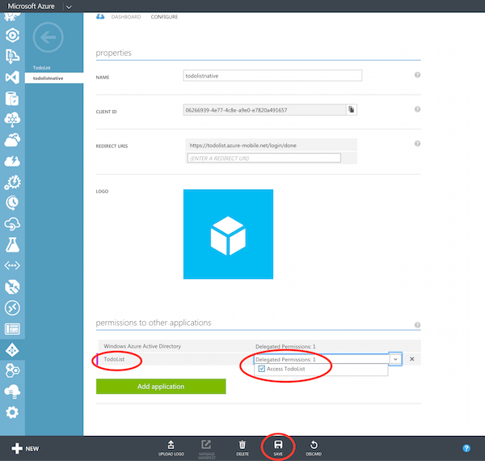

## 向 Azure Active Directory 注册您的客户端应用

1. 浏览到 [Azure 管理门户]中的 **Active Directory**，然后单击您的目录。

   

2. 单击顶部的**应用程序**选项卡，然后单击**添加**以添加应用。 

   

3. 单击**添加我的组织正在开发的应用程序**。

4. 在"添加应用程序"向导中，为应用程序输入**名称**，并单击**本机客户端应用程序**类型。然后单击以继续。

   

5. 在**重定向 URI** 框中，为您的移动服务输入 /login/done 端点。此值应类似于 [https://todolist.azure-mobile.cn/login/done](https://todolist.azure-mobile.cn/login/done)。

   

6. 单击本机应用程序的**配置**选项卡，并复制**客户端 ID**。稍后你将需要此项。

   

7. 将页面向下滚动到**其他应用程序的权限**部分，并为先前注册的移动服务应用程序授予完全访问权限。然后单击**保存**

   

现在，将在 AAD 中配置你的移动服务，以接收你的应用程序发出的单一登录请求。

[Azure 管理门户]: https://manage.windowsazure.cn/
