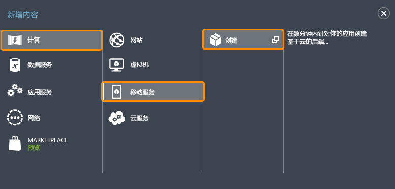
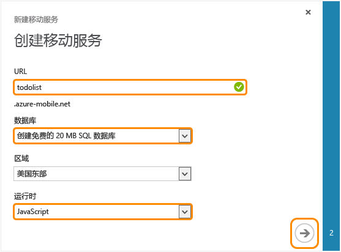
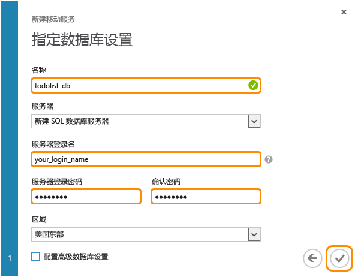

按照下列步骤操作以创建新的移动服务。

1.	登录到 [Azure 经典门户](https://manage.windowsazure.cn/)。在导航窗格的底部，单击“+新建”。展开“计算”和“移动服务”，然后单击“创建”。
	
	

	此时将显示“创建移动服务”对话框。

2.	在“创建移动服务”页中，选择“创建免费的 20 MB SQL 数据库”，选择“.NET”运行时，然后在“URL”文本框中键入新移动服务的子域名称。单击右箭头按钮转到下一页。

	

   	此时将显示“指定数据库设置”页。

	> [AZURE.NOTE] 在本教程中，您将创建新的 SQL 数据库实例和服务器。您可以重用此新数据库，并对其进行管理，如同任何其他 SQL 数据库实例一样。如果您在新移动服务的同一区域已经有了数据库，则可选择“使用现有数据库”，然后再选择该数据库。由于额外的带宽成本和更高的延迟，不建议使用位于不同区域的数据库。

3.	在“名称”中，键入新数据库的名称，然后键入“登录名”，也就是新的 SQL 数据库服务器的管理员登录名，键入并确认密码，然后单击勾选按钮完成该过程。
	

您现在已经创建了您的移动应用可以使用的新移动服务。

<!---HONumber=Mooncake_0118_2016-->