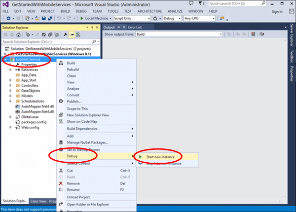
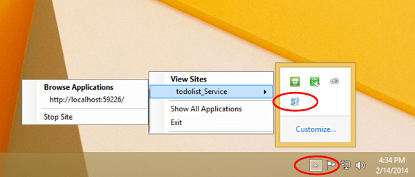

1. 在 Visual Studio 的 Solution Explorer 中，右键单击服务项目，然后单击“调试”上下文菜单下的“启动新实例”。

    

    Visual Studio 将打开服务的默认网页。默认情况下，Visual Studio 在 IIS Express 中本地托管您的移动服务。

2. 在 Windows 任务栏中右键单击 IIS Express 的托盘图标，然后验证你的移动服务是否已启动。

	 

3. 在 .NET 后端的启动页上，单击“尝试”。

    

    这显示 API 文档页，您可以将此页面用于测试移动服务。

	>[AZURE.NOTE]在本地运行时，无需进行身份验证就可以访问此页面。在 Azure 中运行时，您必须提供应用程序密钥作为密码（没有用户名）来访问此页面。

4. 单击 **GET 表 /todoitem** 链接。

	
   	
	这将显示 API 的 GET 响应页面。

5. 单击“尝试”，然后单击“发送”。
 
	

	这将 GET 请求发送到本地移动服务以返回 TodoItem 表中的所有行。因为初始程序对表设置种子值，所以在响应消息正文中返回两个 TodoItem 对象。有关初始程序的更多信息，请参阅[如何对 .NET 后端移动服务进行数据模型更改](/documentation/articles/mobile-services-dotnet-backend-how-to-use-code-first-migrations/)。

	

<!---HONumber=71-->