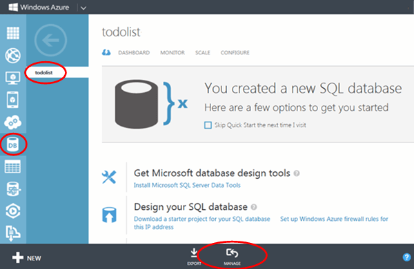

本教程的最后可选步骤是在与移动服务关联的 SQL Database 中检查和复审所存储的数据。 

1. 在 Azure 管理门户中，单击与移动服务关联的数据库对应的"管理"。
 
	

2. 在管理门户中，执行查询以查看 Windows Store 应用所做的更改。您的查询类似于以下查询，但是使用数据库名称而不是 <code>todolist</code>。

        SELECT * FROM [todolist].[todoitems]

    

	请注意，该表包含 Id、\__createdAt、\__updatedAt 和\__ Version 列。这些列支持脱机数据同步并在 [EntityData](http://msdn.microsoft.com/library/microsoft.windowsazure.mobile.service.entitydata.aspx) 基类中实施。有关更多信息，请参阅[脱机数据同步入门]。
