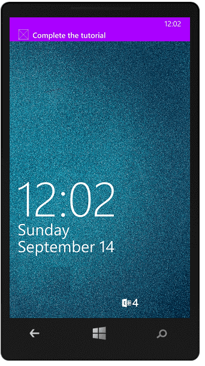


1. 右键单击 Windows Store 项目，单击**设为启动项目**，然后按 F5 键以运行 Windows Store 应用。
	
	该应用启动后，已注册该设备以接收推送通知。

2. 停止 Windows Store 应用并重复上一步以运行 Windows Phone Store 应用。

	此时，这两个设备会注册以接收推送通知。

3. 重新运行 Windows Store 应用，然后在**插入 TodoItem** 中键入文本，然后单击**保存**。

   	

   	请注意，完成插入后，Windows Store 和 Windows Phone 应用会从 WNS 收到一条推送通知。

   	

	即使在此应用未运行时，也在 Windows Phone 上显示此通知。

   	

