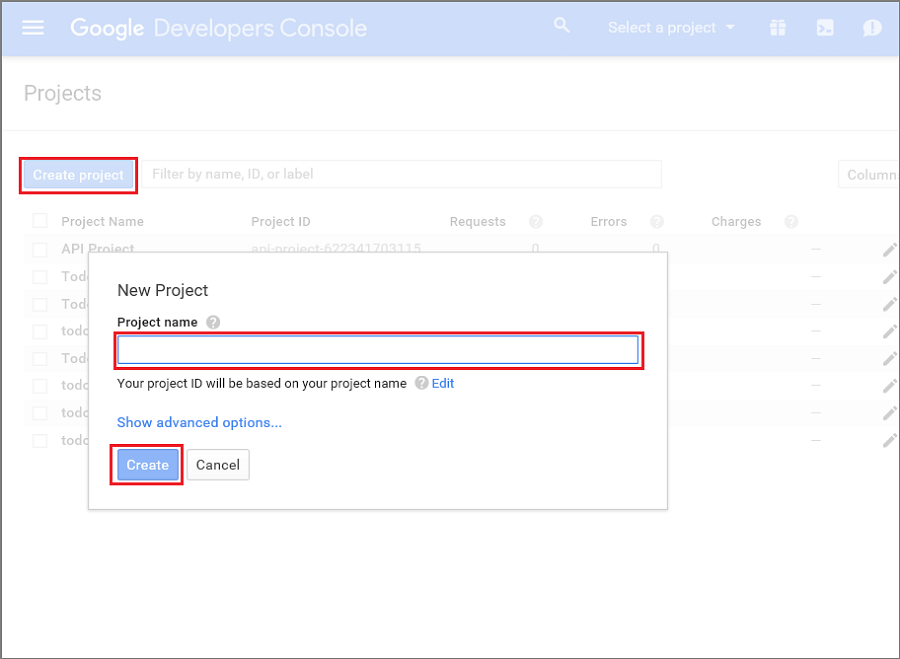
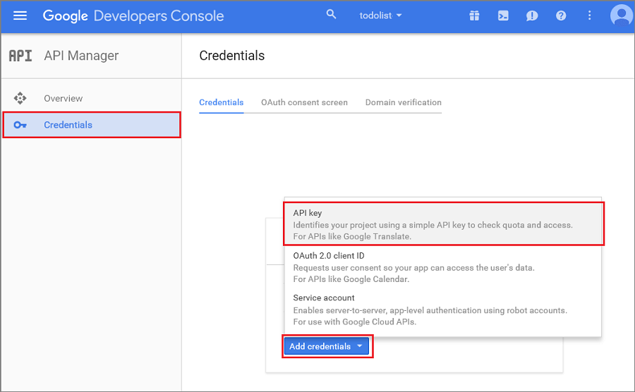

1. 导航到“[Google 云控制台](https://console.developers.google.com/project)”，然后使用你的 Google 帐户凭据登录。 
 
2. 单击“创建项目”，键入项目名称，然后单击“创建”。如果系统请求，请执行 SMS 验证，然后再次单击“创建”。

   	

	 键入新的**项目名称**，然后单击“创建项目”。

3. 记下“项目”部分中的项目编号。稍后你要将此值设置为客户端中的 *PROJECT\_ID* 变量。

4. 在项目仪表板中，单击“使用 Google API”>“Cloud Messaging for Android”，然后在下一页单击“启用 API”。

5. 在 API 管理器中，单击“凭据”>“添加凭据”>“API 密钥”。

   	

6. 在“创建新密钥”中，单击“服务器密钥”，键入密钥的名称，然后单击“创建”。

7. 记下“API 密钥”值。

	接下来，你将使用此 API 密钥值，让 Azure 对 GCM 进行身份验证并代表你的应用程序发送推送通知。

<!---HONumber=Mooncake_0118_2016-->