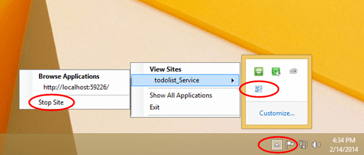


1. 如果移动服务当前在 IS Express 中运行，请务必停止移动服务。右键单击 IIS Express 托盘图标，然后单击移动服务的“停止”。

    

2. 在命令提示符窗口中，运行 **ipconfig** 命令，以查找您的工作站的有效本地 IP 地址。

    

3. 在 Visual Studio 中，打开 IIS Express 的 applicationhost.config 文件。此文件位于您的用户配置文件目录的以下子目录中。

        C:\Users<your profile name>\Documents\IISExpress\config\applicationhost.config

4. 配置 IIS Express 以允许向服务发出远程连接请求。为此，请在 applicationhost.config 文件中，查找你的移动服务的站点元素，并为使用你此前记下的 IP 地址的端口添加新的 `binding` 元素。然后保存 applicationhost.config 文件。

    已更新的站点元素应该如下所示：

        <site name="todolist_Service(1)" id="2">
            <application path="/" applicationPool="Clr4IntegratedAppPool">
                <virtualDirectory path="/" physicalPath="C:\Archive\GetStartedDataWP8\C#\todolist_Service" />
            </application>
            <bindings>
                <binding protocol="http" bindingInformation="*:58203:localhost" />
                <binding protocol="http" bindingInformation="*:58203:192.168.137.72" />
            </bindings>
        </site>

5. 打开 Windows 防火墙控制台，并创建新的端口规则以允许连接到端口。有关创建新的 Windows 防火墙端口规则的详细信息，请参阅[如何添加新的 Windows 防火墙端口规则]。

    >[AZURE.NOTE]如果您的测试计算机已加入域，则可按照域策略来控制防火墙例外。在这种情况下，您需要联系域管理员，为计算机上的端口获取豁免。

    现在，您应该已经配置为使用托管移动服务的 IIS Express 来进行测试。

    >[AZURE.NOTE]在本地完成服务测试之后，应该删除您创建的 Windows 防火墙规则。

<!-- URLs. -->
[如何添加新的 Windows 防火墙端口规则]:  http://go.microsoft.com/fwlink/?LinkId=392240
<!---HONumber=71-->