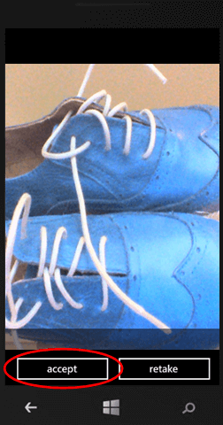

## 更新快速启动客户端应用以捕获和上载图像

在本部分中，你将更新来自[移动服务入门]教程的项目，以便拍摄照片并将它们上载到 Azure Blob 存储。为了捕获图像，本教程使用来自 `Microsoft.Phone.Tasks` 命名空间的 [CameraCaptureTask]。此类可在 Windows Phone 设备上启动相机 UI，以拍摄照片并自动将图像保存到 Windows Phone 设备上的“本机照片”。如果你不希望将图像保存到“本机照片”，请改用 `Microsoft.Devices` 命名空间中的 [PhotoCamera] 类。

1. 在 Visual Studio 的解决方案资源管理器中，在项目下展开“属性”。然后打开 WMAppManifest.xml 文件，并通过在“功能”选项卡上单击“ID\_CAP\_ISV\_CAMERA”来启用相机。关闭文件以保存您的更改。

   	

   	这样可以确保您的应用能够使用连接到计算机的相机。应用第一次运行时，将请求用户允许对相机进行访问。

2. 打开 MainPage.xaml 文件，将名为 **ContentPanel** 的 **Grid** 元素替换为以下代码：

        <!--ContentPanel - place additional content here-->
        <Grid x:Name="ContentPanel" Grid.Row="1" Margin="12,0,12,0">
            <Grid.RowDefinitions>
                <RowDefinition Height="Auto" />
                <RowDefinition Height="Auto" />
                <RowDefinition Height="Auto" />
                <RowDefinition Height="Auto" />
                <RowDefinition Height="Auto" />
                <RowDefinition Height="*" />
            </Grid.RowDefinitions>
            <Grid.ColumnDefinitions>
                <ColumnDefinition Width="2*" />
                <ColumnDefinition Width="2*" />
            </Grid.ColumnDefinitions>
            <TextBlock Grid.Row="0" Grid.ColumnSpan="2" Text="Enter some text below, click Capture Image to add a captured image. Then click Save to insert a new TodoItem item into your database" TextWrapping="Wrap" Margin="12"/>
            <TextBox Grid.Row="1" Grid.ColumnSpan="2" Name="TextInput" Text="" />
            <Button Name="ButtonCaptureImage" Grid.Row="2" Click="ButtonCaptureImage_Click">Capture Image</Button>
            <Button Grid.Row ="2" Grid.Column="1" Name="ButtonSave" Click="ButtonSave_Click">Save</Button>
            <TextBlock Grid.Row="3" Grid.ColumnSpan="2" Text="Click refresh below to load the unfinished TodoItems from your database. Use the checkbox to complete and update your TodoItems" TextWrapping="Wrap" Margin="12" />
            <Button Grid.Row="4" Grid.ColumnSpan="2" Name="ButtonRefresh" Click="ButtonRefresh_Click">Refresh</Button>
            <phone:LongListSelector Grid.Row="5" Grid.ColumnSpan="2" Name="ListItems">
                <phone:LongListSelector.ItemTemplate>
                    <DataTemplate>
                        <StackPanel Orientation="Vertical">
                            <CheckBox Name="CheckBoxComplete" IsChecked="{Binding Complete, Mode=TwoWay}" Checked="CheckBoxComplete_Checked" Content="{Binding Text}" Margin="10,5" VerticalAlignment="Center"/>
                            <Image Name="ImageUpload" Source="{Binding ImageUri, Mode=OneWay}" MaxHeight="150"/>
                        </StackPanel>
                    </DataTemplate>
                </phone:LongListSelector.ItemTemplate>
            </phone:LongListSelector>
        </Grid>

   	这样可以添加一个新按钮，以启动 [CameraCaptureTask] 并将图像添加到 **ItemTemplate**，同时将其绑定源设置为 Blob 存储服务中已上载图像的 URI。

3. 打开 MainPage.xaml.cs 项目文件并添加以下 **using** 语句：
	
		using Microsoft.Phone.Tasks;
		using System.IO;
		using Microsoft.WindowsAzure.Storage.Auth;
		using Microsoft.WindowsAzure.Storage.Blob;
    
4. 在 MainPage.xaml.cs 项目文件中，通过添加以下属性来更新 TodoItem 类：

        [JsonProperty(PropertyName = "containerName")]
        public string ContainerName { get; set; }
		
        [JsonProperty(PropertyName = "resourceName")]
        public string ResourceName { get; set; }
		
        [JsonProperty(PropertyName = "sasQueryString")]
        public string SasQueryString { get; set; }
		
        [JsonProperty(PropertyName = "imageUri")]
        public string ImageUri { get; set; } 

5. 在 MainPage.xaml.cs 项目文件中，更新 MainPage 类。添加以下代码，以声明 [CameraCaptureTask] 以及将引用已捕获图像的流对象：

        // Using the CameraCaptureTask to allow the user to capture a todo item image //
        CameraCaptureTask cameraCaptureTask;
		
        // Using a stream reference to upload the image to blob storage.
        Stream imageStream = null;

6. 在 MainPage.xaml.cs 项目文件中，更新 MainPage 类。添加以下代码以更新构造函数，从而创建 CameraCaptureTask，并为已完成事件添加事件处理程序：

        // Constructor
        public MainPage()
        {
            InitializeComponent();
			
            cameraCaptureTask = new CameraCaptureTask();
            cameraCaptureTask.Completed += cameraCaptureTask_Completed;
        }
		
        void cameraCaptureTask_Completed(object sender, PhotoResult e)
        {
            imageStream = e.ChosenPhoto;
        }

7. 在 MainPage.xaml.cs 项目文件中，更新 MainPage 类。添加以下代码，它可显示相机 UI，让用户能够在单击“捕获图像”按钮时捕获图像：

        private void ButtonCaptureImage_Click(object sender, RoutedEventArgs e)
        {
            cameraCaptureTask.Show();
        }

8. 在 MainPage.xaml.cs 项目文件中，更新 MainPage 类。将现有的  `InsertTodoItem` 方法替换为以下代码：
 
        private async void InsertTodoItem(TodoItem todoItem)
        {
            string errorString = string.Empty;            
			
            if (imageStream != null)
            {
                // Set blob properties of TodoItem.
                todoItem.ContainerName = "todoitemimages";
                todoItem.ResourceName = Guid.NewGuid().ToString() + ".jpg";
            }                       
			
            // Send the item to be inserted. When blob properties are set this
            // generates an SAS in the response.
            await todoTable.InsertAsync(todoItem);  
			
            // If we have a returned SAS, then upload the blob.
            if (!string.IsNullOrEmpty(todoItem.SasQueryString))
            {
                // Get the URI generated that contains the SAS 
                // and extract the storage credentials.
                StorageCredentials cred = new StorageCredentials(todoItem.SasQueryString);
                var imageUri = new Uri(todoItem.ImageUri);
				
                // Instantiate a Blob store container based on the info in the returned item.
                CloudBlobContainer container = new CloudBlobContainer(
                    new Uri(string.Format("https://{0}/{1}",
                        imageUri.Host, todoItem.ContainerName)), cred);                
				
                // Upload the new image as a BLOB from the stream.
                CloudBlockBlob blobFromSASCredential =
                    container.GetBlockBlobReference(todoItem.ResourceName);
                await blobFromSASCredential.UploadFromStreamAsync(imageStream);
				
				// When you request an SAS at the container-level instead of the blob-level,
				// you are able to upload multiple streams using the same container credentials.

                imageStream = null;
            }              
			
            // Add the new item to the collection.
            items.Add(todoItem);
            TextInput.Text = "";
        }

	这段代码可向移动服务发送插入新 TodoItem 的请求，包括图像文件名。响应包含 SAS，用于将图像插入 Blob 存储中，还包含用于数据绑定的图像的 URI。

最后一个步骤是测试应用并验证上载是否成功。
		
## 测试在您的应用中上载图像

1. 在 Visual Studio 中，您可以按 F5 键，在模拟器中测试应用，或使用实际目标设备进行测试。

2. 在文本框中输入一些文本，然后单击“捕获图像”。

   	

  	这样可以显示相机的拍照 UI。 

3. 单击手机上的图像或快照按钮可拍摄图片。
  
   	

4. 单击“接受”以接受图像并退出相机 UI。

    

5. 单击“保存”以插入新项并上载图像。

	

6. 新项和已上载图像都显示在列表视图中。

	

   >[AZURE.NOTE]新项的 <code>imageUri</code> 属性绑定到<strong>图像</strong>控件时，将从 Blob 存储服务自动下载图像。

[移动服务入门]: /zh-cn/documentation/articles/mobile-services-windows-phone-get-started
[CameraCaptureTask]: http://msdn.microsoft.com/zh-cn/library/windowsphone/develop/microsoft.phone.tasks.cameracapturetask(v=vs.105).aspx
[PhotoCamera]: http://msdn.microsoft.com/zh-cn/library/windowsphone/develop/microsoft.devices.photocamera(v=vs.105).aspx

<!---HONumber=71-->