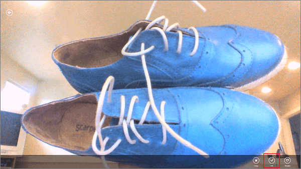

## 更新快速启动客户端应用以捕获和上载图像

1. 在 Visual Studio 中，打开 Package.appxmanifest 文件，并在“功能”选项卡中启用“网络摄像机”和“麦克风”功能。

   	
 
   	这样可以确保您的应用能够使用连接到计算机的相机。应用第一次运行时，将请求用户允许对相机进行访问。

1. 打开 MainPage.xaml 文件，并将第一个 **Task** 元素之后紧邻的 **StackPanel** 元素替换为以下代码：

        <StackPanel Orientation="Horizontal" Margin="72,0,0,0">
            <TextBox Name="TextInput" Margin="5" MaxHeight="40" MinWidth="300"></TextBox>
            <Button Name="btnTakePhoto" Style="{StaticResource PhotoAppBarButtonStyle}"
                    Click="OnTakePhotoClick" />
            <Button Name="ButtonSave" Style="{StaticResource UploadAppBarButtonStyle}" 
                    Click="ButtonSave_Click"/>
        </StackPanel>

2. 将 **DataTemplate** 中的 **StackPanel** 元素替换为以下代码：

        <StackPanel Orientation="Vertical">
            <CheckBox Name="CheckBoxComplete" IsChecked="{Binding Complete, Mode=TwoWay}" 
                        Checked="CheckBoxComplete_Checked" Content="{Binding Text}" 
                        Margin="10,5" VerticalAlignment="Center"/>
            <Image Name="ImageUpload" Source="{Binding ImageUri, Mode=OneWay}"
                    MaxHeight="250"/>
        </StackPanel> 

   	这样可将图像添加到 **ItemTemplate**，并将其绑定源设置为 Blob 存储服务中已上载图像的 URI。

3. 打开 MainPage.xaml.cs 项目文件并添加以下 **using** 语句：
	
		using Windows.Media.Capture;
		using Windows.Storage;
		using Windows.UI.Popups;
		using Microsoft.WindowsAzure.Storage.Auth;
		using Microsoft.WindowsAzure.Storage.Blob;
    
4. 在 TodoItem 类中，添加以下属性：

        [JsonProperty(PropertyName = "containerName")]
        public string ContainerName { get; set; }
		
        [JsonProperty(PropertyName = "resourceName")]
        public string ResourceName { get; set; }
		
        [JsonProperty(PropertyName = "sasQueryString")]
        public string SasQueryString { get; set; }
		
        [JsonProperty(PropertyName = "imageUri")]
        public string ImageUri { get; set; } 

   	>[AZURE.NOTE]若要将新属性添加到 JavaScript 后端移动服务中的 TodoItem 对象，你必须在你的移动服务中启用动态架构。启用动态架构时，新列自动添加到映射到这些新属性的 TodoItem 表。有关 .NET 后端移动服务的更多信息，请参阅[如何对 .NET 后端移动服务进行数据模型更改](/documentation/articles/mobile-services-dotnet-backend-how-to-use-code-first-migrations/)。

5. 在 MainPage 类中，添加以下代码：

        // Use a StorageFile to hold the captured image for upload.
        StorageFile media = null;
		
		private async void OnTakePhotoClick(object sender, RoutedEventArgs e)
		{
			// Capture a new photo or video from the device.
			CameraCaptureUI cameraCapture = new CameraCaptureUI();
			media = await cameraCapture
				.CaptureFileAsync(CameraCaptureUIMode.PhotoOrVideo);
        }

  	这段代码显示用于拍摄图像的相机界面，并将图像保存到存储文件。

6. 将现有的  `InsertTodoItem` 方法替换为以下代码：
 
        private async void InsertTodoItem(TodoItem todoItem)
        {
            string errorString = string.Empty;
			
            if (media != null)
            {
                // Set blob properties of TodoItem.
                todoItem.ContainerName = "todoitemimages";
                todoItem.ResourceName = media.Name;
            }
			
            // Send the item to be inserted. When blob properties are set this
            // generates an SAS in the response.
            await todoTable.InsertAsync(todoItem);
			
            // If we have a returned SAS, then upload the blob.
            if (!string.IsNullOrEmpty(todoItem.SasQueryString))
            {
                // Get the URI generated that contains the SAS 
                // and extract the storage credentials.
                StorageCredentials cred = new StorageCredentials(todoItem.SasQueryString);
                var imageUri = new Uri(todoItem.ImageUri);
				
                // Instantiate a Blob store container based on the info in the returned item.
                CloudBlobContainer container = new CloudBlobContainer(
                    new Uri(string.Format("https://{0}/{1}",
                        imageUri.Host, todoItem.ContainerName)), cred);

                // Get the new image as a stream.
                using (var fileStream = await media.OpenStreamForReadAsync())
                {                   					
                    // Upload the new image as a BLOB from the stream.
                    CloudBlockBlob blobFromSASCredential =
                        container.GetBlockBlobReference(todoItem.ResourceName);
                    await blobFromSASCredential.UploadFromStreamAsync(fileStream.AsInputStream());
                }
				
				// When you request an SAS at the container-level instead of the blob-level,
				// you are able to upload multiple streams using the same container credentials.
            }
			
            // Add the new item to the collection.
            items.Add(todoItem);
        }

	这段代码可向移动服务发送插入新 TodoItem 的请求，包括图像文件名。响应包含 SAS，用于将图像插入 Blob 存储中，还包含用于数据绑定的图像的 URI。

最后一个步骤是测试应用并验证上载是否成功。
		
## 测试在你的应用程序中上载图像

1. 在 Visual Studio 中，按 F5 键运行应用程序。

2. 在“插入 TodoItem”下的文本框中输入文本，然后单击“照片”。

   	

  	这样可以显示相机的拍照 UI。

3. 单击图像以拍摄照片，然后单击“确定”。
  
   	

4. 单击“上载”可插入新项并上载图像。

	

5. 新项和已上载图像都显示在列表视图中。

	

   	>[AZURE.NOTE]新项的 <code>imageUri</code> 属性绑定到<strong>图像</strong>控件时，将从 Blob 存储服务自动下载图像。

<!---HONumber=74-->