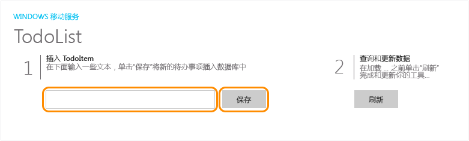


1. 按 F5 键以重新构建项目并启动 Windows Store 应用。

2. 在应用中的**插入任务**中键入有意义的文本（例如 *完成教程*），然后单击**保存**。

	

	这样可向在 Azure 中托管的新移动服务发送 POST 请求。

3. 停止调试并将通用 Windows 解决方案中的默认启动项目更改为 Windows Phone Store 应用，然后再次按 F5。

	
	
	请注意，在应用启动之后会从移动服务加载上一步中保存的数据。
