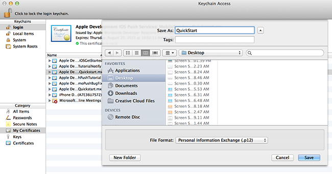

##生成证书签名请求文件

Apple 推送通知服务 (APNS) 使用证书对推送通知进行身份验证。请遵照这些说明来创建用于发送和接收通知的所需推送证书。有关这些概念的详细信息，请参阅 [Apple Push Notification 服务](http://go.microsoft.com/fwlink/p/?LinkId=272584)文档。

生成证书签名请求 (CSR) 文件，Apple 将使用该文件生成签名的推送证书。

1. 在 Mac 上，运行 Keychain Access 工具。可以从启动板上的“Utilities”（实用工具）或“Other”（其他）文件夹中打开该工具。

2. 单击“Keychain Access”，展开“Certificate Assistant”（证书助理），然后单击“Request a Certificate from a Certificate Authority...”（从证书颁发机构请求证书...）。

  	

3. 选择你的“User Email Address”（用户电子邮件地址）和“Common Name”（公用名），确保已选择“Saved to disk”（保存到磁盘），然后单击“Continue”（继续）。将“CA Email Address”（CA 电子邮件地址）字段保留空白，因为它不是必填字段。

  	

4. 在“Save As”（另存为）中为证书签名请求 (CSR) 文件键入一个名称，在“Where”（位置）中选择一个位置，然后单击“Save”（保存）。

  	

  	此操作会将 CSR 文件保存到选定位置；默认位置是桌面。请记住为此文件选择的位置。

接下来，你将要向 Apple 注册你的应用程序、启用推送通知并上载这个导出的 CSR 以创建一个推送证书。

##为推送通知注册应用程序

若要将推送通知发送到 iOS 应用程序，你必须向 Apple 注册应用程序，还要注册推送通知。

1. 如果你尚未注册应用程序，请导航到 Apple 开发人员中心的 <a href="http://go.microsoft.com/fwlink/p/?LinkId=272456" target="_blank">iOS 设置门户</a>，使用 Apple ID 登录，单击“Identifiers”（标识符），然后单击“App IDs”（应用程序 ID），最后单击“+”符号以注册新的应用程序。

   	

2. 更新新应用的以下三个字段，然后单击“Continue”（继续）：

	* **Name（名称）**：在“App ID Description”（应用 ID 说明）部分的“Name”（名称）字段中为应用键入一个描述性名称。
	
	* **Bundle Identifier（捆绑标识符）**：在“Explicit App ID”（显式应用 ID）部分下，使用[应用分发指南](http://go.microsoft.com/fwlink/?LinkId=613485)中所述的 `<Organization Identifier>.<Product Name>` 格式输入“Bundle Identifier”（捆绑标识符）。使用的“Organization Identifier”（组织标识符）和“Product Name”（产品名称）必须与你在创建 XCode 项目时要使用的组织标识符与产品名称匹配。在下面的屏幕截图中，*NotificationHubs* 用作组织标识符，*GetStarted* 用作产品名称。如果确保这些信息与你要在 XCode 项目中使用的值匹配，则就可以在 XCode 中使用正确的发布配置文件。
	
	* **Push Notifications（推送通知）**：在“App Services”（应用服务）部分中选中“Push Notifications”（推送通知）选项。

	

   	此时将会生成你的应用程序 ID 并请求你确认信息。单击“Submit”（提交）。

    

   	当你单击**提交**, 你会看见 **注册完成** 界面, 如下所示. 单击**完成**.

    

3. 在开发人员中心的“App IDs”（应用 ID）下，找到你刚刚创建的应用 ID，然后单击其所在行。

   	

   	单击应用程序 ID 会显示应用程序详细信息。单击底部的“Edit”（编辑）按钮。

   	

4. 滚动到屏幕底部并单击“Development Push SSL Certificate”（开发推送 SSL 证书 ）部分下的“Create Certificate...”（创建证书...）按钮。

   	

   	将显示“Add iOS Certificate”（添加 iOS 证书）助手。

    > [AZURE.NOTE]本教程使用开发证书。注册生产证书时使用相同的过程。你只需确保在发送通知时使用相同的证书类型。

5. 单击“Choose File”（选择文件），浏览到你在第一个任务中创建的 CSR 文件保存到的位置，然后单击“Generate”（生成）。

  	

6. 门户创建证书之后，请单击“Download”（下载）按钮，然后单击“Done”（完成）。

  	

   	随后将会下载签名证书并将其保存到计算机上的 Downloads 文件夹。

  	

    > [AZURE.NOTE]默认情况下，下载的文件（开发证书）名为 **aps\_development.cer**。

7. 双击下载的推送证书 **aps\_development.cer**。

   	将在 Keychain 中安装新证书，如下所示：

   	

    > [AZURE.NOTE]证书中的名称可能不同，但将以 **Apple Development iOS Push Services:** 作为前缀。

8. 在 Keychain Access 中，右键单击你在“Certificates”（证书）类别中创建的新推送证书。单击“Export”（导出），为文件命名，选择“.p12”格式，然后单击“Save”（保存）。

	

	记下导出的 .p12 证书的文件名和位置。它将用于启用 APNS 身份验证。

	>[AZURE.NOTE]本教程将创建 QuickStart.p12 文件。你的文件名和位置可能不同。

##为应用程序创建配置文件

1. 返回 <a href="http://go.microsoft.com/fwlink/p/?LinkId=272456" target="_blank">iOS 设置门户</a>，选择“Provisioning Profiles”（设置配置文件），选择“All”（全部），然后单击“+”按钮创建一个新的配置文件。此时会启动“Add iOS Provisiong Profile”（添加 iOS 设置配置文件）向导

   	

2. 选择“Development”（开发）下的“iOS App Development”（iOS 应用程序开发）作为设置配置文件类型，然后单击“Continue”（继续）。

3. 接下来，从“App ID”（应用程序 ID）下拉列表中选择你刚刚创建的应用程序 ID，然后单击“Continue”（继续）。

   	

4. 在“Select certificates”（选择证书）屏幕中，选择你经常用于代码签名的开发证书，然后单击“Continue”（继续）。这不是你刚刚创建的推送证书。

   	

5. 接下来，选择要用于测试的“Devices”（设备），然后单击“Continue”（继续）。

   	

6. 最后，在“Profile Name”（配置文件名称）中为配置文件选取一个名称，并单击“Generate”（生成）。

   	

7. 创建新的预配配置文件后，请单击下载该文件，并将其安装在你的 Xcode 开发计算机上。然后单击“Done”（完成）。

   	

<!---HONumber=Mooncake_1207_2015-->