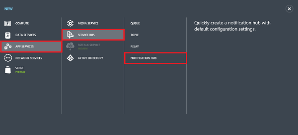
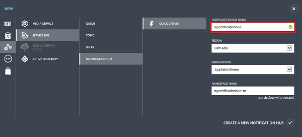
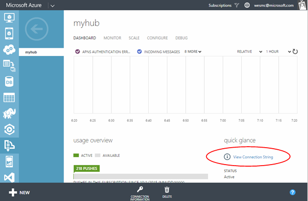
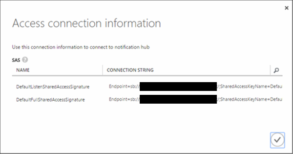

1. 登录到 [Azure 管理门户](https://manage.windowsazure.cn/)，然后单击屏幕底部的“+新建”。

2. 依次单击“应用程序服务”、“服务总线”、“通知中心”、“快速创建”。

   	

3. 输入“通知中心名称”。选择所需的“区域”和“订阅”。
 
	如果已有想在其中创建中心的服务总线命名空间，请选择你的“命名空间名称”。否则，可以使用根据中心名称创建的默认“命名空间名称”，前提是该命名空间名称可用。

	单击“创建新通知中心”。

   	

4. 一旦创建了命名空间和通知中心，就会显示你在服务总线中的命名空间。单击刚刚在其中创建中心的命名空间（通常为 ***通知中心名称*-ns**）。

5. 在你的命名空间页面上，单击顶部的“通知中心”选项卡，然后单击你刚刚创建的通知中心。这将打开新通知中心的仪表板。

6. 在新中心的仪表板上，单击“查看连接字符串”。记下两个连接字符串。你稍后将使用这些字符串。

   	

	

<!---HONumber=Mooncake_1207_2015-->