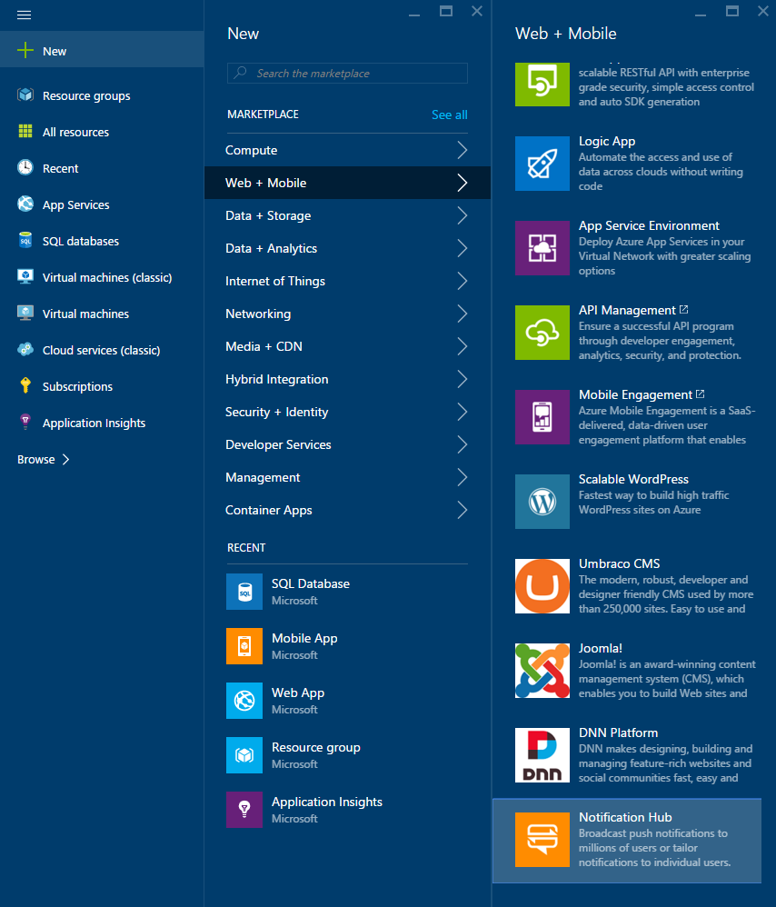
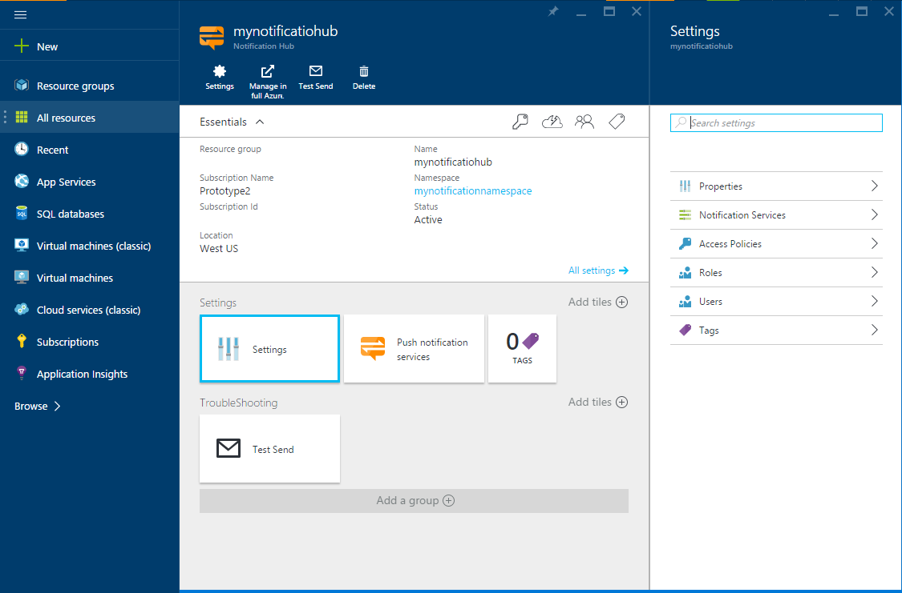

1. 登录到 [Azure 门户](https://portal.azure.cn)，然后单击屏幕底部的“+新建”。

2. 依次单击“新建”、“Web + 移动”、“通知中心”、“快速创建”。

   	

3. 确保在“通知中心”字段指定一个唯一的名称。选择所需的“区域”、“订阅”和“资源组”（如果已经有一个）。
 
	如果你已经有想在其中创建中心的服务总线命名空间，则通过“命名空间”字段中的“选择现有”选项来选择它。否则，可以使用根据中心名称创建的默认名称，前提是该命名空间名称可用。

	一旦准备就绪后，单击“创建”。

   	

4. 创建命名空间和通知中心后，就将进入相应的门户页。

   	
       
5. 单击“设置”和“访问策略”，记下都提供给你的两个连接字符串，随后将需要它们来处理推送通知。

   	

<!---HONumber=Mooncake_0405_2016-->