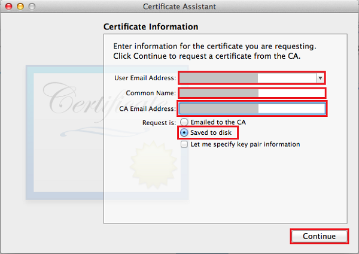

若要通过 Apple Push Notification 服务 (APNS) 为应用注册推送通知，必须在 Apple 开发人员门户上为项目创建新的推送证书、应用 ID 和预配配置文件。你的应用可以使用应用 ID 中包含的配置设置来发送和接收推送通知。这些设置包括发送和接收推送通知时，在 Apple Push Notification 服务 (APNS) 上进行身份验证所需的推送通知证书。有关这些概念的详细信息，请参阅 [Apple Push Notification 服务](http://go.microsoft.com/fwlink/p/?LinkId=272584)文档。

#### 为推送证书生成证书签名请求文件

这些步骤将引导你创建证书签名请求。此请求可让你生成用于 APNS 的推送证书。

1. 在 Mac 上，运行 Keychain Access 工具。可以从启动板上的“Utilities”（实用工具）或“Other”（其他）文件夹中打开该工具。

2. 单击“Keychain Access”，展开“Certificate Assistant”（证书助理），然后单击“Request a Certificate from a Certificate Authority...”（从证书颁发机构请求证书...）。

  	

3. 选择你的“User Email Address”（用户电子邮件地址）和“Common Name”（公用名），确保已选择“Saved to disk”（保存到磁盘），然后单击“Continue”（继续）。将“CA Email Address”（CA 电子邮件地址）字段保留空白，因为它不是必填字段。

  	

4. 在“Save As”（另存为）中为证书签名请求 (CSR) 文件键入一个名称，在“Where”（位置）中选择一个位置，然后单击“Save”（保存）。

  	

  	此操作会将 CSR 文件保存到选定位置；默认位置是桌面。请记住为此文件选择的位置。

#### 为推送通知注册应用程序

在 Apple 中为你的应用程序创建新的显式应用 ID，并对其进行配置以便推送通知。

1. 导航到 Apple 开发人员中心的 [iOS 预配门户](http://go.microsoft.com/fwlink/p/?LinkId=272456)，使用 Apple ID 登录，单击“Identifiers”（标识符），然后单击“App IDs”（应用程序 ID），最后单击“+”符号以注册新的应用程序。

   	

2. 更新新应用的以下三个字段，然后单击“Continue”（继续）：

	* **Name（名称）**：在“App ID Description”（应用 ID 说明）部分的“Name”（名称）字段中为应用键入一个描述性名称。
	
	* **Bundle Identifier（捆绑标识符）**：在“Explicit App ID”（显式应用 ID）部分下，使用[应用分发指南](https://developer.apple.com/library/mac/documentation/IDEs/Conceptual/AppDistributionGuide/ConfiguringYourApp/ConfiguringYourApp.html#//apple_ref/doc/uid/TP40012582-CH28-SW8)中所述的 `<Organization Identifier>.<Product Name>` 格式输入“Bundle Identifier”（捆绑标识符）。此标识符必须与应用的 XCode 或 Xamarin 项目中使用的标识符匹配。
	 
	* **Push Notifications（推送通知）**：在“App Services”（应用程序服务）部分中选中“Push Notifications”（推送通知）选项。

	

3.	在“Confirm your App ID”（确认你的应用 ID）屏幕上检查设置，确认后，请单击“Submit”（提交）

4. 	提交新应用 ID 后，你将会看到“Registration complete”（注册已完成）屏幕。单击“Done”（完成）。

5. 在开发人员中心的“App IDs”（应用 ID）下，找到你刚刚创建的应用 ID，然后单击其所在行。单击应用 ID 行会显示应用详细信息。单击底部的“Edit”（编辑）按钮。

6. 滚动到屏幕底部并单击“Development Push SSL Certificate”（开发推送 SSL 证书 ）部分下的“Create Certificate...”（创建证书...）按钮。

   	

   	此时将显示“Add iOS Certificate”（添加 iOS 证书）助手。

    > [AZURE.NOTE]本教程使用开发证书。注册生产证书时使用相同的过程。你只需确保在发送通知时使用相同的证书类型。

7. 单击“Choose File”（选择文件），浏览到推送证书 CSR 保存到的位置。然后单击“Generate”（生成）。

  	

8. 门户创建证书之后，请单击“Download”（下载）按钮。

  	

   	随后将会下载签名证书并将其保存到计算机上的 Downloads 文件夹。

  	

    > [AZURE.NOTE]默认情况下，下载的文件（开发证书）名为 **aps\_development.cer**。

9. 双击下载的推送证书 **aps\_development.cer**。将在 Keychain 中安装新证书，如下所示：

   	

    > [AZURE.NOTE]证书中的名称可能不同，但将以 **Apple Development iOS Push Services:** 作为前缀。

10. 在 Keychain Access 中，右键单击你在“Certificates”（证书）类别中创建的新推送证书。单击“Export”（导出），为文件命名，选择“.p12”格式，然后单击“Save”（保存）。

	记住导出的 .p12 推送证书的文件名和位置。稍后你要在 Azure 经典管理门户中将它上载，以使用它来启用 APNS 身份验证。

#### 为应用程序创建配置文件

1. 返回 <a href="http://go.microsoft.com/fwlink/p/?LinkId=272456" target="_blank">iOS 设置门户</a>，选择“Provisioning Profiles”（设置配置文件），选择“All”（全部），然后单击“+”按钮创建一个新的配置文件。此时会启动“Add iOS Provisiong Profile”（添加 iOS 设置配置文件）向导

   	

2. 选择“Development”（开发）下的“iOS App Development”（iOS 应用程序开发）作为设置配置文件类型，然后单击“Continue”（继续）。

3. 接下来，从“App ID”（应用程序 ID）下拉列表中选择你刚刚创建的应用程序 ID，然后单击“Continue”（继续）。

   	

4. 在“Select certificates”（选择证书）屏幕中，选择用于代码签名的开发证书，然后单击“Continue”（继续）。这是一个签名证书，而不是你刚刚创建的推送证书。

   	

5. 接下来，选择要用于测试的“Devices”（设备），然后单击“Continue”（继续）。

   	

6. 最后，在“Profile Name”（配置文件名称）中为配置文件选取一个名称，并单击“Generate”（生成）。

   	

<!---HONumber=Mooncake_0104_2016-->